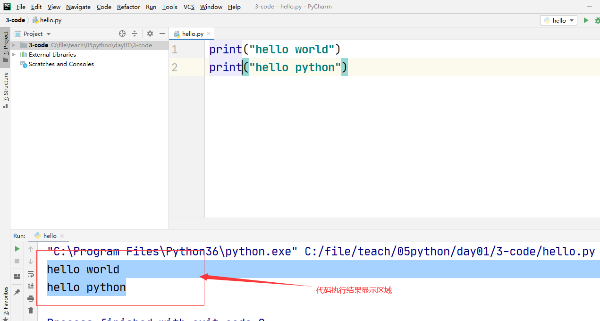

# 第一个python代码

- python源程序

  - python就是存放python代码的文本文件
  - 扩展名必须以.py结尾

- 演练步骤

  - 找到自己电脑中一个目录c:\file目录
  - 在file目录下新建了一个文本文件hello.py
  - 用记事本打开这个文件文件,如果以下内容

  ```python
  print("hello world")
  print("hello python")
  ```

  - 保存退出
  - 打开cmd

  

  

  - 在命令行输入python hello.py

  

  


# 在pycharm中运行python程序

- 运行python有两种方式
  - 命令行通过 python python源程序方式运行
- 直接在pycharm中运行

## 第一个pycharm程序演练

- 启动pycharm
  - 在启动界面里选择create new project




## 在pycharm中运行多个py文件的注意项


# 注释

- 单行注释
  - `# 注释内容`
- 多行注释

```sql
'''
注释内容
注释内容
'''
```

> 在pycharm中可以用ctrl + / 快速注释一行代码


# 算数运算符

- +
- -
- *乘
- /除
- //取整除
- %取余数
- **幂(次方)

```python
print(3 + 2)
print(3 - 2)
print(3 * 2)
print(3 / 2)
print(3 // 2)
print(3 % 2)
print(3 ** 2)


```

> python中字符串需要用引号引起来
>
> 数字不需要引号

- 字符串可以和一个整数相乘
  - 字符串重复整数次数

```python
print("hello" * 3)
```

## 运算符优先级

- **最高
- `* / // %`
- `+ -`最低
- 可以通过括号改变优先级

```python
print((3 + 2) * 5)
```

# 变量

- 在计算机语言中可变的量
- 变量在使用前必须先定义赋值

```python
变量名 = 值
```

```python
# 定义了一个变量名叫name,值为字符串张三
name = "张三"
# 定义了一个变量名叫age 值为数字26
age = 26

print(name)  # 如果print里面写的是变量名,那么输出的是变量的值
print(age)
```

## 超市买苹果变量演练

```python
price = 8.5
weight = 7.5
money = price * weight
print(money)
```

## 超市买苹果-够10斤,减5块

```python
price = 8.5
weight = 10
money = price * weight
# 变量定义之后,再=号赋值,只是改变变量的值而已
money = money - 5  # 改变了money变量 的值
print(money)
```

## 课堂练习-算数运算符

```python
a = 12
b = 3
print(a + b)
print(a - b)
print(a * b)
print(a / b)
print(a // b)
print(a % b)
print(a ** b)
```

## 课堂练习-变量a和b的值交换

```python
# 交换a和b的值
a = 10
b = 20
c = a
a = b
b = c
print(a, b)  # 如果一个print输出两个变量的值,两个变量需要用逗号分隔
```

## 变量名命名规则

- 可以使用字母数字和下划线
- 不能用纯数字
- 不能以数字开头
- 不能用特殊符号
- 不能用python的关键字

```python
name = '妲己'
age = 25
name_age = "妲己25"
# 3name = "妲己"  错误的变量名
_name = "妲己"

name = 25
age = "妲己"
```

## 显示python关键字

- 先用import导入keyword

```python
# 显示python关键字
import keyword
print(keyword.kwlist)
```

## 变量命名习惯

- 习惯不是python语言强制的,只是习惯而已
- 多个单词
- 习惯一:
  - 都用小写字母,单词和单词之间用下划线连接
- 习惯二小驼峰:
  - 第二个单词首字母大写
- 习惯三大驼峰
  - 所有单词首字母大写

```python
first_name = "张三" # 所有字母都小写
firstName = "张三" # 小驼峰,只有第二个单词首字母大写
FirstName = "张三" # 大驼峰, 每个单词首字母都大写
# 变量名不会所有字母都大写, FIRSTNAME
```

# python的数据类型

- 数字型
  - 整数int
  - 浮点数float
  - 布尔bool
    - True(真)
    - False(假)
- 非数字型
  - 字符串str(string)
  - 列表list
  - 元组tuple
  - 集合set
  - 字典dict(dictionary)
- None
  - 首字母是大写的N
  - 空

```python
a = 10 # int
b = 3.5 # float
c = False # bool
d = True # bool
e = "aaaaaa"   # str
```

```python
name = "小明"
age = 18
sex = "男"
height = 1.75
isStudent = True
print(name, age, sex, height, isStudent)
```

> 变量赋值的时候,等号右边是什么数据类型, 变量就是什么数据类型


# 数字型变量计算

- 数字型变量可以直接使用算数运算符计算
- 布尔类型
  - True代表1
  - False代表0

```python
i = 10
f = 10.5
b = True

print(i + f)
print(i + b)
print(i - b)

```

# 字符串的计算

- 字符串 + 字符串
  - 两个字符串拼接成一个字符串
- 字符串 * 数字
  - 字符串重复整数的次数
- 字符串不能用-,/和其他计算操作

```python
str1 = "你好"
str2 = "python"
str3 = str1 + str2
print(str3)
str3 = str1 * 5
print(str3)
# str3 = str1 - str2 字符串和字符串不能减
```


# 字符串和整数的区别

- 一个数字如果用引号引起来,这就不是数字了,而是一个字符串

```python
a = 10   # 数字10
b = "10"   # 这个地方不是整数10, 是一个字符串 有一个字符是1 还有一个字符是0
c = 1
d = "1"
print(a + c)
print(b + d)
```

# 不同数据类型转化

- 转化为字符串
  - str(要转化的变量或者值)
- 转化为整数
  - int(要转化的变量或者值)
- 转化为浮点数
  - float(要转化的变量或者值)

```python
a = 10
b = "1"
# 要把b转化成int,与a相加
print(a + int(b))
# 要把a转化为str,与b相加
print(str(a) + b)
c = "你好"
# print(a + int(c)) # 如果c不能转化,那么代码会报错
d = "3.5"
print(a + float(d))
```

## 课堂练习-类型转化

```python
a = "123"
b = 456
print(a + str(b))
print(int(a) + b)
```

## 课堂练习-四舍五入

```python
# 如何把一个float类型的小数点去掉只保留整数
# f = 3.5
# a = int(f)  # 只要把一个浮点数用int()转化为一个整数,那么小数点就没了
# print(a)
a = 5
b = 2
# 2.5 + 0.5 = 3
print(int(a / b + 0.5))

a = 10
b = 3
# 3.333333 + 0.5 = 3.83333333333
print(int(a / b + 0.5))

a = 11
b = 2
# 5.5 + 0.5 = 6
print(int(a / b + 0.5))

# 任意两个数字除,结果加0.5,最后只保留整数位,就是对一个小数四舍五入取整的结果
```


# input函数

- input可以用户通过键盘给一个变量输入值
- 语法

```python
变量名 = input("提示文字")
```

```python
name = input("请输入")  # 当代码执行到input就停止了,等待用户通过键盘输入
print(name)
# 如果用户通过键盘输入了tom,那么name变量的值就是tom
name = input("请再次输入")
print(name)
```

- 用input输入的任何数字也都是字符串,而不是数字

```python
age = input("请输入")
print(age + "1")
# 如果用户输入的是25,其实是字符串"25"
```


## 转化input输入的结果

- 只要把input输入的结果用数据类型转化的方式int(), float()即可

```python
# a = input("请输入第一个数字")
# b = input("请输入第二个数字")
# print(int(a) + int(b))
# 上面代码和下面代码执行结果是一样的
a = int(input("请输入第一个数字"))
b = int(input("请输入第二个数字"))
print(a + b)
```


## 超市买苹果-增强版

```python
price = float(input("请输入苹果的单价"))
weight = float(input("请输入购买重量"))
money = price * weight
print(money)
```

# 格式化字符串

- 在python字符串中如果有%,这个字符串就叫格式化字符串
- %d 要格式化的是一个整数
  - %05d 整数位数固定5位,如果不足5位,左补0
- %f 要格式化的是一个浮点数
  - %.2f  保留小数点后2位
- %s 要格式化的是一个字符串
- %% 要输出一个%

## 格式化字符串主要功能

- 把多个字符串以及数字拼接到一起

- 语法

  ```python
  print("格式化字符串" % (变量1, 变量2, .....))
  ```

  ```python
  name = "张三"
  age = 20
  print("姓名" + name + ", 年龄" + str(age) + "岁")
  # 这两个print输入的结果是一样的
  print("姓名%s, 年龄%d岁" % (name, age))
  print("姓名%s, 年龄%d岁, %%, %%s" % (name, age))
  ```

  ```python
  f = 3.14
  str1 = "圆周率是"
  print(str1 + str(f))
  print("%s%.2f" % (str1, f))
  a = 10
  print("变量a的值是%05d" % a)
  ```

  

- 格式化字符串的功能

  - 只是把字符串和字符串以及数字和其他类型通过print拼接成一个字符串显示出来而已

## 格式化字符串-名片

```python
company = input("请输入公司名称")
name = input("请输入姓名")
tel = input("请输入电话号码")
mailbox = input("请输入邮箱地址")
print("*" * 20)
print("公司名称:%s" % company)
print("姓名:%s" % name)
print("电话:%s" % tel)
print("邮箱:%s" % mailbox)
print("*" * 20)


```

## 课堂练习-格式化字符

```python
# 定义字符串变量 name = “小明”，输出: 我的名字叫小明，请多多关照！
name = "小明"
print("我的名字叫%s，请多多关照！" % name)
# 2. 定义整数变量 num = 1，输出: 我的学号是 000001
num = 1
print("我的学号是 %06d" % num)
# 3. 定义⼩数 price = 8.5、 weight = 5 ，输出：苹果单价 8.5 元／⽄，购买了 5.00 ⽄，需要支付 42.50 元
price = 8.5
weight = 5
print("苹果单价 %.1f元／⽄，购买了 %.2f ⽄，需要支付 %.2f 元" % (price, weight, price * weight))
# 4. 定义⼀个⼩数 scale = 10.01 ，输出: 数据是 10.01%
scale = 10.01
print("数据是 %.2f%%" % scale)
```


# 多条print输出到一行

- print函数默认会自动输出一个回车换行,所以如果有多条print函数,会在多行输出
- 去掉print后面默认的回车换行

```python
print("要输出的字符串", end="")
```

```python
print("hello")  # print在输出之后,会自动添加一个回车换行
print("world")
print("hello", end="") # print输出之后,不会自动添加回车换行
print("world")
```

# 转义字符

- 有些字符,不方便通过键盘输入
- 常见的转义字符
  - `\\`
  - `\n`
  - `\t`
  - `\"`
  - `\'`
- 如果在字符串前面加r,代表字符串不转义

```python
print("我\t你")
print("我\n你")
print("我\\你")
print("我\"你")
print("我\'你")
print(r"我\n你")
```

