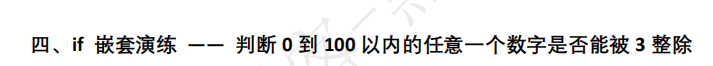

# 判断的定义

- 如果条件满足,就做一件事情,如果条件不满足,就做另一件事情或者什么也不做
  - 条件只有满足和不满足两个结果

# 比较运算符

- `>`大于
- `>=`大于等于
- `<`小于
- `<=`小于等于
- `==`等于
  - =在python中是变量赋值使用的,判断是否相等用==
- `!=`不等于


# if基本语法

```python
if 条件:
    条件成立要执行的代码
```

```python
a = 10
if a < 3:
    print("你好")  # 这个print和if是一个代码块
print("hello") # 这里的print和上面的if没有关系
```


# pass占位符

- 在写python程序的时候,有时候必须写代码,不写语法报错,但又不知道该写什么,就可以用pass占位符

```python
a = 10
if a > 5:
    pass
print("hello")
```

# if演练

```python
age = int(input("请输入年龄"))
if age >= 18:
    print("可以嗨皮")
print("程序结束")
```

## 课堂练习-判断除数是否为0

```python
# num1通过input输入的数字
# num2通过input输入的数字
num1 = int(input("请输入num1的值"))
num2 = int(input("请输入num2的值"))
# 如果num2不等于0,计算num1 除以num2的结果
if num2 != 0:
    print(num1 / num2)

```

## 课堂练习-计算器

```python
num1 = int(input("请输入num1的值"))
num2 = int(input("请输入num2的值"))
a = input("请输入a的值")
if a == "+":
    print(num1 + num2)
if a == "-":
    print(num1 - num2)
if a == "*":
    print(num1 * num2)
if a == "/":
    print(num1 / num2)
```

# if双分支

- 条件成立执行一件是事情,条件不成立执行另外一件事情
- 语法

```python
if 条件:
    条件成立执行的代码
else:
    条件不成立执行的代码
# if和else要对齐, else必须放到if后面,不能单独使用
```


```python
age = int(input("请输入年龄"))
if age >= 18:
    print("可以进网吧嗨皮")
else:
    print("回家写作业")
```


```python
num1 = int(input("请输入num1的值"))
# 如何判断一个整数是否为偶数,可以和2取余数,如果余数为0就是偶数,否则为奇数
if num1 % 2 == 0:
    print("偶数")
else:
    print("奇数")
```


```python
num1 = int(input("请输入num1的值"))
# 判断num1是否为正数 只要num1大于等于0就是正数
if num1 >= 0:
    print("正数")
else:
    print("负数")
```

# 逻辑运算符

- and
  - 条件1 and 条件2
  - 两个条件必须同时满足
- or
  - 条件1 or 条件2
  - 两个条件只要有一个满足即可
- not
  - not 条件
  - 条件求反


```python
name = "小明"
age = 6
if name == "小明" and age > 20:
    print("通过")
else:
    print("不通过")
```


```python
name = "小"
age = 30
if name == "小明" or age > 20:
    print("通过")
else:
    print("不通过")
```


```python
name = "小"
if not name == "小明":
    print("通过")
else:
    print("不通过")
```


```python
a = int(input("请输入一个数字"))
# 判断一个数字是否在0到120之间 ,这个数字要大于等于0 并且小于等于120
if a >= 0 and a <= 120:
    print("在0到120之间")
else:
    print("不在0到120之间")
```


```python
name = input("请输入账号")
passwd = input("请输入密码")
if name == "itcast" and passwd == "123456":
    print("通过登录")
else:
    print("登录失败")
```


# if多分支

- 有多个条件,不同的条件要执行不同的代码
- 语法

```python
if 条件1:
    条件1满足执行的代码
elif 条件2:
    条件2满足执行的代码
elif 条件3:
    条件3满足执行的代码
else:
    以上条件都不满足,执行的代码
# elif和else要和if对齐,elif和else都需要写在if后面
```


```python
hday = input("请输入今天是什么日子")

if hday == "情人节":
    print("买玫瑰")
elif hday == "平安夜":
    print("吃大餐")
elif hday == "生日":
    print("吃蛋糕")
else:
    print("去上班")


```


```python
age = int(input("请输入年龄"))
if age < 10 and age > 0:
    print("小孩")
elif age >= 10 and age < 20:
    print("小朋友")
elif age >= 20 and age < 30:
    print("年轻人")
elif age >= 30 and age < 50:
    print("中年人")
elif age >= 50:
    print("老年人")
else:
    print("年龄不对")

```


## 课堂练习-判断正负数-0排除

```python
a = int(input("请输入一个整数"))
if a > 0:
    print("正数")
elif a == 0:
    print("不是正数也不是负数")
else:
    print("负数")
```


# if嵌套

- 一个if语句里面还可以有其他的if语句
- 语法

```python
if 条件:
    if 条件:
        要执行代码
    else:
        要执行代码
else:
    要执行代码
# 只有最外面的if条件满足,才会执行嵌套在里面的if语句
```



```python
a = int(input("请输入一个数字"))
# 判断0到100之内,任意一个数字是否能被3整数
# 首先需要判断这个数字是否在0到100之内
# 如果一个数字大于0,并且小于100,就是在0到100之内
if a > 0 and a < 100:
# 如果条件满足,再判断是否能被3整除
# 一个数字和3取余数,如果余数为0,代表可以被3整除
    if a % 3 == 0:
        print("能被3整除")
    else:
        print("不能被3整数")
else:
    print("不在0到100之间")
```

## 课堂练习


```python
name = input("请输入姓名")
if name == "tom":
    age = int(input("请输入年龄"))
    if age >= 30:
        print("大叔")
    else:
        print("小弟")
else:
    print("姓名错误")
```

## 课堂练习-计算器加强

```python
num1 = int(input("请输入num1的值"))
num2 = int(input("请输入num2的值"))
a = input("请输入a的值")
if a == "+":
    print(num1 + num2)
elif a == "-":
    print(num1 - num2)
elif a == "*":
    print(num1 * num2)
elif a == "/":
    if num2 != 0:
        print(num1 / num2)
    else:
        print("除数不能为0")
else:
    print("a的值必须为+-*/")
```


# 运算符

- 算数运算符

- 比较运算符

- 逻辑运算符

- 赋值运算符

  ```txt
  =
  a += 1   a = a + 1  +=中间没有空格
  a -= 1   a = a - 1
  a *= 1   a = a * 1
  a /= 1   a = a / 1
  a //= 3  a = a // 3
  a %= 3   a = a % 3
  a **= 3  a = a ** 3
  ```

  ```python
  a = 10  # =赋值运算符
  a += 1 #a = a + 1
  print(a)
  b = 5
  b -= 2 #b = b - 2
  print(b)
  c = 5
  c *= 2 #c = c * 2
  print(c)
  
  ```

  

- 运算符优先级

- 

算数运算符优先级最高

比较运算符

赋值运算符

逻辑运算符最低

小括号优先级最高

```python
a = 4 + 5 * 2 > 3
print(a)
a = 4 + 5 * (2 > 3)
print(a)
```

# 生成随机数

- 第一步导入一个叫random模块
- 第二步调用randint函数

```python
import random
# 要定义一个变量,来存放随机数
a = random.randint(1, 5) # 会生成从1到5之间的一个随机的整数(包含1和5)
print(a)
a = random.randint(10, 20) # 生成从10到20之间的随机数,包含10和20
print(a)
```

- randint函数说明
  - random.randint(a, b)
  - a和b是两个整数,代表要生成的随机数的范围,a为开始范围,b为终止范围

## 随机数生成飞机坦克大炮

```python
# 1代表坦克
# 2代表飞机
# 3代表大炮
import random
a = random.randint(1, 3)
if a == 1:
    print("坦克")
elif a == 2:
    print("飞机")
else:
    print("大炮")
```


# if综合应用


```python
# 1:石头
# 2:剪刀
# 3:布
# 石头赢剪刀  1赢2
# 剪刀赢布    2赢3
# 布赢石头    3赢1
# 人通过键盘输入数字1或者2或者3
# 电脑随机产生数字1或者2或者3
# 比较胜负
import random
# pc代表电脑要出的拳,可能是1,可能2或者3
pc = random.randint(1, 3)
# player代表人要出的拳,可能是1或者2或者3
player = int(input("请输入1或者2或者3"))
if (pc == 1 and player == 2) or (pc == 2 and player == 3) or (pc == 3 and player == 1):
    print("电脑出了%d, 我出了%d电脑赢了" % (pc, player))
elif (pc == player):
    print("电脑出了%d, 我出了%d, 平局" % (pc, player))
else:
    print("电脑出了%d, 我出了%d,我赢了" % (pc, player))
```

## 猜拳游戏改进版

```python
# 1:石头
# 2:剪刀
# 3:布
# 石头赢剪刀
# 剪刀赢布
# 布赢石头
# 人通过键盘输入石头,剪刀,和布
# 电脑随机产生数字1或者2或者3
# 如果电脑产生数字1,那么就要转化为石头
# 如果电脑产生数字2,那么就要转化为剪刀
# 如果电脑产生数字3,那么就要转化为布

# 比较胜负
import random
# pc代表电脑要出的拳,可能是1,可能2或者3
pc = random.randint(1, 3)
# 需要把数字1,2,3转化为对应的字符串
# 变量a存放数字转化为字符串的结果
a = None
if pc == 1:
    a = "石头"
elif pc == 2:
    a = "剪刀"
else:
    a = "布"

# player代表人要出的拳,可能是石头或者剪刀或者布
player = input("请输入石头或者剪刀或者布")

if (a == "石头" and player == "剪刀") or (a == "剪刀" and player == "布") or (a == "布" and player == "石头"):
    print("电脑出了%s, 我出了%s, 电脑赢了" % (a, player))
elif (a == player):
    print("电脑出了%s, 我出了%s, 平局" % (a, player))
else:
    print("电脑出了%s, 我出了%s, 我赢了" % (a, player))
```

