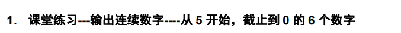
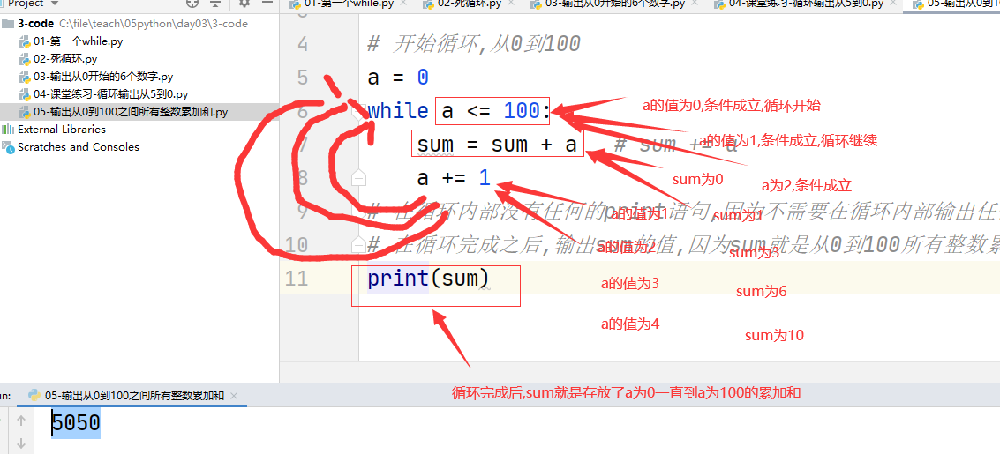

# 程序的三种结构

- 顺序,代码自上而下执行
- 分支,根据条件有选择的执行特定代码
- 循环,根据条件循环执行特定代码


```python
# print("hello world")
# print("hello world")
# print("hello world")
a = 0
while a < 3:
    print("hello world")
    a += 1
```


如果要输出的是100个hello world,该怎么做?

```python
a = 0
while a < 100:
    print("hello world")
    a += 1
```

# while基本语法

- 语法

```python
while 条件:
    要循环执行的代码
# 如果条件成立,那么循环执行,如果条件不成立,那么循环终止
```


# 死循环

- 程序应该避免出现死循环

```python
a = 0
while a < 3:
    print("hello world")
# a的值永远不会变,所以循环条件永远成立
```


# 循环的计数习惯

- 人类计数习惯从1开始
- 程序计数习惯从0开始,除非有明确的要求,可以不从0开始,否则一定要从0开始计数


```python
a = 0
while a < 6:
    print(a)
    a += 1

```


## 课堂练习




```python
a = 5
while a >= 0:
    print(a)
    a -= 1
```


# 循环计数

- 循环在程序中经常用到的功能是循环计数
- 先在循环开始之前定义一个变量,用来存放计算结果
- 在循环内部对这个变量进行计算
- 循环完成后,输出这个变量的值


```python
# 定义一个变量,来存放累加的和
sum = 0

# 开始循环,从0到100
a = 0
while a <= 100:
    sum = sum + a   # sum += a
    a += 1
# 在循环内部没有任何的print语句,因为不需要在循环内部输出任何数字
# 在循环完成之后,输出sum的值,因为sum就是从0到100所有整数累加的和
print(sum)
```





```python
sum = 0

a = 300
while a <= 415:
    sum += a
    a += 1

print(sum)
```


# break终止循环

- break必须放到循环内部
- 如果循环遇到break,立刻终止
- 一般在循环内部通过if的条件,来执行break,某一个条件成立的时候来break


```python
a = 0
while a < 10:
    print(a)
    if a == 3:
        break  # break执行,循环不在执行了  # break由于是在if语句里面,所以要缩进两次
    a += 1
# break之后,代码到这里了
```


```python
a = 0
while a < 100000000:
    str1 = input("请输入一个字符串")
    if str1 == "exit":
        break
    print(str1)
    a += 1
```


# 人造死循环

- 代码中循环开始的时候不知道循环次数,可以使用人造死循环
- 在人造死循环内部,一定要有if结合break来退出循环的机制

```python
# 如果while后面的条件为True,这个while就是一个人为的循环
# 循环内部一定要有if结合break来让循环退出的机制
while True:
    str1 = input("请输入一个字符串")
    if str1 == "exit":
        break
    print(str1)
```

# continue

- 循环一旦遇到continue就不在执行continue下面的循环代码了,而是直接返回到循环开始判断条件
- continue一定是放到if后面,

```python
a = 0
while a < 5:
    a += 1
    if a == 3:
        continue
    print(a)
```

- 使用continue一定要注意,因为使用不当很容易成死循环

```python
a = 0
while a < 5:
    if a == 3:
        continue  # a等于3的时候,就再也没机会执行a += 1这个代码了
    print(a)
    a += 1
```


```python
# a还是一个循环计数器
# b决定了循环的最大次数
a = 0
b = int(input("请输入b的值"))

while a < b:
    print("*")
    a += 1
    if a >= 20: # 不管b的值多大,一旦a到了20,循环就退出
        break
```


- 再讲一次


```python
# 如果输出3行星号
# a = 0
# b = 3
# while a < b:
#     print("*")
#     a += 1
# 如果b的值不是代码写死的,是通过input输入的
a = 0
b = int(input("请输入b的值"))  # 假设用户输入了数字10
while a < b:
    print("*")
    a += 1   # 在循环内部,a的值一直在变化,但b的值从来不变
    if a >= 20:
        break
```


# 循环嵌套

- 一个循环语句里面还有其他的循环语句
- 语法

```python
while 条件:
    while 条件
    	代码
        
```

```python
# ***
# ***

# 一个print只输出一个星号, 如何输出连续的三个星号
num1 = 0
while num1 < 2:  # 外循环一共循环2次,每次外循环的时候,内循环循环3次
    a = 0
    while a < 3:
        print("*", end="")
        a += 1
    print()  # 输出一个空的回车换行
    num1 += 1
print("end")


```


# 循环嵌套输出三角形

```python
# 一个print只能输出一个星号
# *
# **
# ***
num1 = 0
while num1 < 3:
    a = 0
    while a <= num1:
        print("*", end="")
        a += 1
    print()
    num1 += 1
```


```python

num1 = 0
while num1 < 5:
    a = 0
    while a <= num1:
        print("*", end="")
        a += 1
    print()
    num1 += 1
```


## 输出数字三角形


```python

num1 = 0
while num1 < 5:
    a = 0
    while a <= num1:
        print(a + 1, end="")
        a += 1
    print()
    num1 += 1
```


# for循环

- for主要是用于遍历字符串
- 字符串中有几个字符,for就会循环几次
- 语法

```python
for 变量名 in 字符串:
    循环代码
```

```python
# for主要用于遍历,字符串中有几个字符,for就会循环几次
# 这个for循环了5次,因为str1这个字符串中有5个字符
str1 = "hello"
for n in str1:   # n是自己定义的一个变量
    print("*")
    print(n)
# 第一次循环的时候n的值是h
# 第二次循环的时候n的值是e
# 第三次循环的时候n的值是l
# 第四次循环的时候n的值是l
# 第五次循环的时候n的值是o
```


```python
str1 = "hello itcast"
sum = 0 # 存放计算结果
for n in str1:
    sum += 1  # 每循环一次sum的值就加1,结果是for循环几次,sum的值就是几

print(sum)
```

# while和for的不同

- while用在指定次数的循环
- for主要用在遍历
- while和for可以互换

# range函数

- 生成指定范围的一个数字序列
- 语法

```python
range(start, stop, step)
start代表范围的开始值
stop代表范围的结束值,但不包含stop
step步长,可以为负数,正数代表升序范围,负数代表降序范围
```

```python
range(1, 5, 1)   # 生成1, 2, 3, 4
range(1, 5)   # 生成1, 2, 3, 4
range(1, 6, 2)   # 生成1, 3, 5
range(6, 2, -1)  # 6, 5, 4, 3
range(6, 2, -2)   # 6, 4
```

## 用for实现指定次数的循环(用for替换while)

```python
for 变量名 in range(开始值,结束值, 步长):
    执行代码
```

```python
# a = 0
# while a < 10:
#     print(a)
#     a += 1
for a in range(0, 10):  # for用于遍历,所以这里遍历的是一个范围,a就是范围中每个数字
    print(a)
```


```python
# 外循环循环了5次
# 内循环循环了5次
# 内循环的print("*", end="")
# 每次内循环完成外循环都有个print()
for a in range(0, 5):
    for b in range(0, 5):
        print("*", end="")
    print()
```


# 课堂练习

```txt
用for循环
计算从50到124之间所有偶数的累加和
包含50也包含124
```

```python
# 在循环外,先定义一个变量存放累加和
# 在循环内,计算
# 循环完成后,输出这个变量的计算结果
sum = 0
for n in range(50, 125, 2):
    sum += n
print(sum)
```

