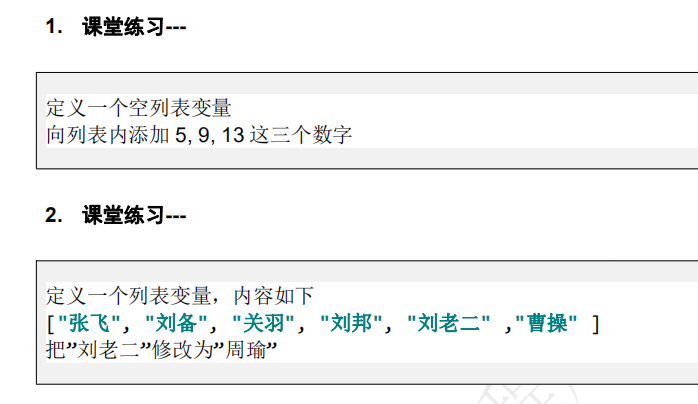
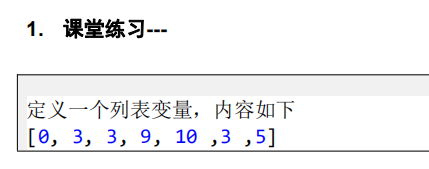
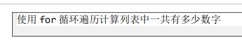
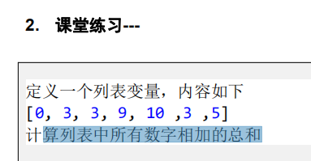
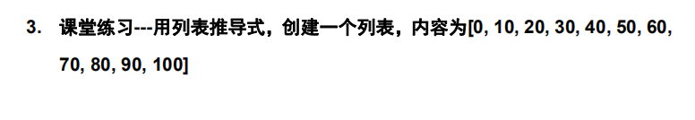
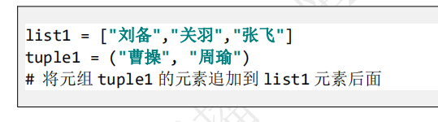

# 列表的定义和使用

- 列表用[]定义
- 列表中多个成员用逗号分隔
- 列表可以使用[索引]方式访问指定的成员
  - 第一个成员的索引编号是0
  - 不能访问不存在的索引编号

```python
# list1是列表变量名, 列表中有三个成员
list1 = ['关羽', '曹操', '刘备']
print(list1[0])
print(list1[1])
print(list1[2])
print(list1[3])  # 显示第四个成员, 如果显示一个列表没有的成员,会出错
```

# 空列表

- 通过[]定义一个空的列表

```python
list2 = []   # 定义了一个空列表变量叫list2
print(list2[0])  # 对于空列表,不能访问成员
```

# 查看列表所有方法

- dir(列表变量名)

```python
print(dir(list1))
```

# 列表常用方法

## insert

- insert作用是在列表指定位置插入指定的值
- 语法

```python
insert(位置索引, 要插入的值)
```

```python
list1 = ['刘备', '关羽', '张飞']
list1.insert(1, '吕布')
print(list1)
```

## append

- append作用是列表最后位置添加成员
- 语法

```python
append(要添加成员的值)
```

## extend

- 把一个列表的成员追加到指定列表的后面
- 语法

```python
extend(列表变量名)
```

```python
list1 = ['刘备', '关羽', '张飞']
list1.insert(1, '吕布')
list1.append("曹操")
print(list1)
list2 = ['周瑜', '孙权']
list1.extend(list2)  # 把list2的所有成员,追加到list1的后面
print(list1)

```

## 修改列表成员的值

- 语法

```python
列表变量名[索引] = 值
```

```python
list1[1] = '许褚'  # 修改第二个成员的值
```

## 删除成员值

- 语法

```python
del(列表变量[索引])
```

```python
del(list1[4])
```

- 语法

```python
remove(要删除的值)
```

```python
list1.remove('张飞')
```

- 语法

```python
pop()   # 删除列表中最后一个成员
```

```python
list1.pop()
```

- 语法

```python
pop(索引)  # 删除指定索引的值,功能与del类似
```

```python
list1.pop(0)  # 删除索引为0的成员
```

- 语法

```python
clear() # 	清空列表
```

```python
list1.clear()
```

## 统计相同成员数量

- 语法

```python
count(值)  # 如果有多个值,返回值的数量,如果没有值,返回0
```

```python
list1.count('刘备')
```

## 返回指定值在列表中的索引编号

- 语法

```python
index(指定的值, 起始位置)   # 如果不写起始位置,默认为0, 指定的值一定要存在,不然报错
```

```python
list1.index('刘备')
```

## 排序

- 语法

```python
sort()   # 对列表成员从小到大排序
```

```python
list1.sort()
```

- 语法

```python
sort(reverse=True) # 对列表成员从大到小排序
```

```python
list1.sort(reverse=True)
```

## 逆置

- 语法

```python
reverse()  # 把列表所有成员顺序颠倒
```

```python
list1.reverse()
```


```python
list1 = ['刘备', '关羽', '张飞']
list1.insert(1, '吕布')
list1.append("曹操")
print(list1)
list2 = ['周瑜', '孙权']
list1.extend(list2)  # 把list2的所有成员,追加到list1的后面
print(list1)
list1[1] = '许褚'  # 修改第二个成员的值
print(list1)
del(list1[4])
print(list1)
list1.remove('张飞')
print(list1)
list1.pop()
print(list1)
list1.pop(0)  # 删除索引为0的成员
print(list1)
list1.clear()
print(list1)

list1 = ['刘备', '关羽', '张飞', '刘备', '关羽']
print(list1.count('刘备'))
print(list1.count('张飞'))
print(list1.count('吕布'))
print(list1.index('刘备'))
list1 = [4, 3, 1, 56, 12, 67]
# list1.sort()
# list1.sort(reverse=True)
list1.reverse()
print(list1)

```



```python
# 练习一
list1 = []
list1.append(5)
list1.append(9)
list1.append(13)
print(list1)
list2 = ['张飞', '刘备', '关羽', '刘邦', '刘老二', '曹操']
list2[4] = '周瑜'
print(list2)
```


# for遍历列表

- 语法

```python
for 变量名 in 列表:
    代码
列表中有多少成员,for就会循环多少次
变量名代表for每次循环的时候,得到的列表成员的值
```

```python
list1 = ['张飞', '刘备', '关羽']
for n in list1:   # 这个for循环会循环三次,因为list1中有三个成员
    print(n)

# for第一次循环的时候n的值为'张飞'
# for第二次循环的时候n的值为'刘备'
# for第三次循环的时候n的值为'关羽'

```





```python
list1 = [0, 3, 3, 9, 10, 3, 5]
sum = 0
for n in list1:
    sum += 1
print(sum)
```



```python
list1 = [0, 3, 3, 9, 10, 3, 5]
sum = 0
for n in list1:
    sum += n
print(sum)
```

# 拆包

- 语法

```python
变量1, 变量2, 变量n = 列表变量
# 等号左边和变量数量要和等号右边的列表中成员数量一致
```

```python
list1 = ['关羽', '张飞', '刘备']
# a = list1[0]
# b = list1[1]
# c = list1[2]
a, b, c = list1   # 等号左边的变量数量要和等号右边的列表成员数量匹配
print(a, b, c)
```

# 列表推导式

- 作用就是来快速的生成成员数量庞大的列表
- 语法

```python
列表变量名 = [x for x in range(开始值,结束值,步长)]
列表变量名 = [x for x in range(开始值,结束值,步长) if 条件]
```

```python
list1 = [x for x in range(0, 10)]
print(list1)
list1 = [x for x in range(0, 100)]
print(list1)
list1 = [x for x in range(5, 20, 3)]
print(list1)
list1 = [x for x in range(30, 5, -1)]
print(list1)
list1 = [x for x in range(6, -10, -2)]
print(list1)
list1 = [x for x in range(0, 10) if x % 2 == 0]
print(list1)
```



```python
list1 = [x for x in range(0, 101, 10)]
print(list1)
list1 = [x for x in range(0, 101) if x % 10 == 0]
print(list1)
```

# for遍历列表,处理列表成员为不同数据类型的情况

- 当列表中成员数据类型不统一,但又要在for中通过一条代码来处理不同类型的数据,需要把数据做一个强转

```python
list1 = ['张飞', 3, 4.5, '曹操']
a = 1
for n in list1:
    print("列表第%d个成员的值是%s" % (a, str(n)))
    a += 1

sum = 0
list1 = [56, '32', 45, '6']
for n in list1:
    sum += int(n)
print(sum)
```

## 课堂练习-写代码判断列表中名字为三个字的人有几个

```python
list1 = ['张三', '李四', '刘老二', '王麻子', '王达成', '隔壁老王']
# 写代码判断列表中名字为三个字的人有几个

# 思路,首先得把每个名字遍历一遍
num1 = 0   # 存放名字为3个字的出现次数
for n in list1:  # n是列表中的每个成员,list1中有几个成员循环几次
    sum = 0
    for a in n:  # a是字符串n中的每个字符,n中有几个字符for循环几次
        sum += 1
    if sum == 3:
        num1 += 1
print(num1)
# 只要知道sum出现3有几次,就是这个答案

# 第一次循环n是张三
# 第二次循环n是李四
# 第三次循环n是刘老二
# 第四次循环n是王麻子
# 第五次循环n是隔壁老王
# n = "刘二"
# sum = 0
# for a in n:
#     sum += 1
# print(sum)

```

# 公共方法

## len

- 返回非数字类型成员个数
  - len(字符串) -- 返回字符串中字符的数量
  - len(列表) -- 返回的是列表中成员的数量

```python
list1 = [4, 2, 5, 3]
print(len(list1))
str1 = "hello"
print(len(str1))
list1 = ['刘备','关羽','张飞']
print(len(list1))
# 如果len里面放的是列表,返回列表成员的个数
# 如果len里面放的是字符串,返回字符串中字符的个数
```

## max

- 返回列表中的最大值

```python
max(列表)   -- 列表中最大的值
max(字符串)  -- 返回字符串中ASCII最大的那个字符
```

```python
list1 = [54, 12, 78, 123, 77]
print(max(list1))
str2 = "hellaz"
print(max(str2))
```

## min

- 返回列表中的最小值

```python
min(列表)   -- 列表中最小的值
min(字符串)  -- 返回字符串中ASCII最小的那个字符
```

```python
list1 = [54, 12, 78, 123, 77]
print(min(list1))
str2 = "hellaz"
print(min(str2))
```


## in

- 判断指定的值是否在列表中存在

```python
指定的值 in 列表
# 这个操作对字符串同样有效
```

## not in

- 判断指定的值是否不在列表中

```python
指定的值 not in 列表
# 这个操作对字符串同样有效
```

```python
list3 = [4, 6, 1, 23]
if 4 in list3:
    print("有4")

if 5 not in list3:
    print("没有5")

str3 = "hello"
if "a" in str3:
    print("有a")

if "b" not in str3:
    print("没有b")
```


## 课堂练习-公共方法

```python
list1 = ['张飞', '刘备', '关羽', '刘邦', '刘老二', '曹操']
if "刘备" in list1:
    list1.remove("刘备")
print(list1)

list2 = [3, 5, 67, 2, 34, 12, 5, 11]
# 求列表的平均值
# 求平均值就是先求和,然后除以成员数量
sum = 0
for n in list2:
    sum += n
print(sum / len(list2))
```

# 元组的定义

- 元组可以理解为一个只读的列表
- 成员不能修改,不能添加,不能删除的列表
- 语法

```python
tuple1 = ('刘备', '关羽', '张飞') # 定义了一个元组,有三个成员
tuple2 = ()  # 定义了一个空元组
tuple3 = ('刘备', )  # 如果元组中只有一个值,那么后面必须写逗号
tuple4 = '刘备', '关羽', '张飞'  # 定义了一个元组,有三个成员
tuple5 = '刘备',  # 如果元组中只有一个值,那么后面必须写逗号
tuple6 = "刘备"  # 定义的不是元组,是字符串
tuple7 = ("刘备")  # 定义的不是元组,是字符串
print(tuple1)
print(tuple2)
print(tuple3)
print(tuple4)
print(tuple5)
print(tuple6)
print(tuple7)
```

- 用小括号来定义元组
- 小括号也可以省略
- 如果元组中只有一个成员,那么成员后必须写一个逗号

## 元组的常用方法

- 元组[索引]
  - 得到元组指定索引的值
  - 但不能修改指定索引的值
- count
- index
- 公共方法
  - len
  - min
  - max
  - in
  - not in
- 只要不涉及到修改成员的值,所有列表适用的方法,元组都通用

```python
tuple1 = ('刘备', '关羽', '张飞')
a = tuple1[1]
print(a)
# tuple1[1] = '曹操'  # 元组的值不能修改
print(tuple1.count('刘备'))
print(tuple1.index('刘备'))
tuple2 = (4, 6, 1, 67, 100)
print(len(tuple2))
print(max(tuple2))
print(min(tuple2))
if 3 in tuple2:
    print("3在元组tuple2中")
```

## for遍历元组的方法

- for遍历元组的语法与遍历列表是一样

```python
for 变量名 in 元组名:
    代码
```

```python
tuple1 = ('张三', '李四', 4, 12)
for n in tuple1:
    print(n)
```

## 元组和列表的转化

- 元组转列表
  - list(元组)
- 列表转元组
  - tuple(列表)

```python
list1 = [1,2, 4, 2]
tuple1 = tuple(list1)   # 把list1转化为元组类型
print(tuple1)
tuple2 = (3, 6, 12, 100)
list2 = list(tuple2)   # 把元组tuple2转化为列表
print(list2)
```

## 课堂练习



```python
list1 = ['刘备', '关羽', '张飞']
tuple1 = ('曹操',  '周瑜')
list1.extend(tuple1)   # 改变的是list1,tuple1没有改变
print(list1)
print(tuple1)
list1[3] = '张三'
print(list1)
print(tuple1)
```


# 课堂练习

- 把元组放到列表前面

```python
list1 = ['刘备', '关羽', '张飞']
tuple1 = ('曹操',  '周瑜')
# list1.insert(0, tuple1)
# print(list1)
# for n in tuple1:
#     list1.insert(0, n)
# print(list1)
# for第一次循环的时候,n的值是曹操
# insert的时候,曹操是第一个成员
# for第二次循环的时候,n的值是周瑜
# insert的时候,周瑜是第一个成员

# 第一次循环的时候,把n放到0这个位置
# 第二次循环的时候,把n放到1这个位置
a = 0
for n in tuple1:
    list1.insert(a, n)
    a += 1
# 第一次循环a的值为0insert(0, 曹操)
# 第二次循环a的值为1insert(1, 周瑜)
print(list1)
```

