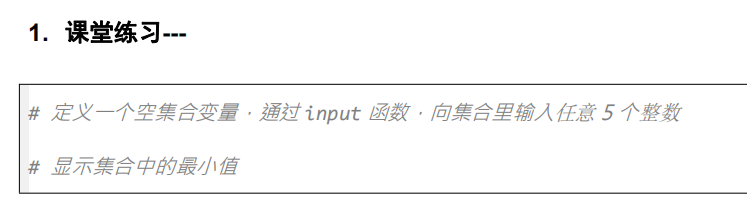
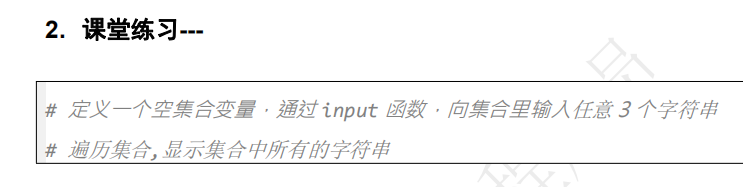
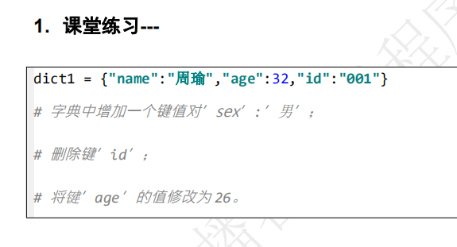
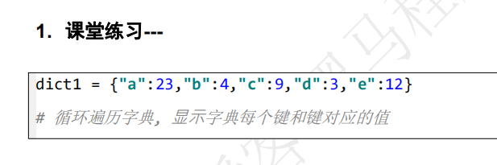
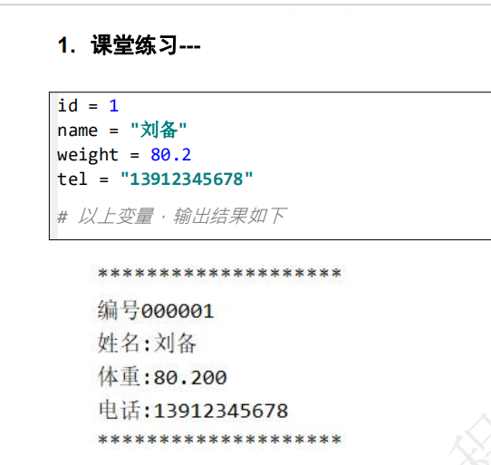

# 集合的定义

- 定义集合用{}
- 定义空集合用set()
- 集合与列表的区别
  - 集合中所有成员是无序的,列表中所有成员是有序的
  - 集合中成员的值不能重复,列表中成员的值可以重复

```python
set1 = {'刘备', '关羽', '张飞'} # 定义了一个集合变量set1
set2 = set()   # 定义一个空集合set2
set3 = {'刘备', '关羽', '刘备'}
print(set1)
print(set2)
print(set3)
```

# 集合常用操作

- add添加值
  - 集合变量.add(值)
- pop删除一个值
  - 集合变量.pop()
- remove删除指定的值
  - 集合变量.remove(值)
- clear删除所有值
  - 集合变量.clear()

```python
set1 = {'刘备', '关羽', '张飞'} # 定义了一个集合变量set1
set2 = set()   # 定义一个空集合set2
set3 = {'刘备', '关羽', '刘备'}
print(set1)
print(set2)
print(set3)

set1.add('曹操')
print(set1)
# set1.pop()
print(set1)
set1.remove('刘备')
print(set1)
set1.clear()
print(set1)
```



```python
set1 = set()
a = 0
while a < 5:
    set1.add(int(input("请输入一个整数")))
    a += 1
print(min(set1))
```

# 循环遍历集合

- 语法

```python
for n in 集合变量:
    循环中的代码
```

```python
set1 = {'刘备', '关羽', '张飞'}
for n in set1:
    print(n)
# 这个for循环3次
# 第一次循环的时候n是刘备或者...
# 第二次循环的时候n是...
# 第三次循环的时候n是...
# 不管顺序是否对,但遍历的结果,总是能把集合中每个成员都显示出来
```



```python
set1 = set()
a = 0
while a < 3:
    set1.add(input("请输入字符串"))
    a += 1

for n in set1:
    print(n)
```

# 字典的定义

- 用{}定义
- 用{}定义一个空字典
- 一个字典中可以存放多个键值对
  - 键key,一个字典中键不能重复
  - 值value
  - 键和值用冒号分隔
- 字典和集合的区别
  - 集合里面只有值
  - 字典里面是键值对

```python
dict1 = {"name":"刘备", "age":20, "sex":"男"}
dict2 = {}  # 定义了一个空字典
```


# 新增或者修改键值对

- 字典[键] = 值
  - 如果键存在,就是修改值
  - 如果键不存在,就是新增键值对

```python
dict1 = {"name":"刘备", "age":20, "sex":"男"}
dict1["name"] = "关羽"  # 修改键name对应的值
print(dict1)
dict1["class"] = '1班'   # 新增一个键值对,键为class,值为1班
print(dict1)
```

# 删除键值对

- pop(键)

```python
dict1.pop('name')   # 删除name键,一旦键被删除,对应的值也同时被删除
```

# 清空

- clear()

```python
dict1.clear()
```

# 得到键对应的值

- 变量名 = 字典[键]
  - 把键对应的值赋值给指定的变量

```python
a = dict1["age"]  # 得到键对应的值
```

```python
dict1 = {"name":"刘备", "age":20, "sex":"男"}
dict1["name"] = "关羽"  # 修改键name对应的值
print(dict1)
dict1["class"] = '1班'   # 新增一个键值对,键为class,值为1班
print(dict1)
dict1.pop('name')   # 删除name键,一旦键被删除,对应的值也同时被删除
print(dict1)
# dict1.clear()
print(dict1)
a = dict1["age"]  # 得到键对应的值
print(a)
b = dict1["sex"]  # 得到键sex对应的值
print(b)
```



```python
dict1 = {"name":"周瑜", "age":32, "id":"001"}
dict1["sex"] = "男"
dict1.pop("id")
dict1["age"] = 26
print(dict1)
```

# 遍历字典

- 语法

```python
for n in 字典:
    代码
# n是键
```

```python
dict1 = {"name":"刘备", "age":20, "sex":"男"}
for n in dict1:
    print(n, dict1[n])   # dict1[n]意思就是得到键n对应的值
    #直接写n代表输出键,dict1[n]代表输出键对应的值

# for循环3次
# n代表键,第一次循环n的值是name,第二次循环n是age,第三次循环n是sex
# 如何在for循环中输出值?
```

# 通过items遍历字典

- 字典.items()返回一个包含键和值的元组

```python
dict1 = {"name":"刘备", "age":20, "sex":"男"}
# for n in dict1.items():
#     print(n)
# 一旦使用了字典的items方法,n就是一个包含了键和值的元组
# n就是一个包含了两个成员的元组,第一个成员是键,第二个成员是值
# for循环了3次
# 第一次n = ('name', '刘备')
# 第二次n = ('age', 20)
# 第三次n = ('sex', '男')

# for n in dict1.items():
#     a, b = n  # 对一个元组进行拆包
#     print(a, b)

for a, b in dict1.items():  # a就是键,b就是键对应的值
    print(a, b)
```



```python
dict1 = {"a":23, "b":4, "c":9, "d":3, "e":12}
for n in dict1:
    print(n, dict1[n])
print("------------------")
for a, b in dict1.items():
    print(a, b)
```

# 课堂练习-显示值9对应的键名

```python
dict1 = {"a":23, "b":4, "c":9, "d":3, "e":12}
# 思路
# 遍历字典,在遍历的时候,检查值是否为9,如果是9,显示9对应的键
for n in dict1:
    if dict1[n] == 9:
        print(n)  # 如果条件成立,那么就显示n,就是是值9对应的键
```


# 字符串中的引号

- 在字符串中如果包含单引号,那么字符串用双引号引起来
- 在字符串中如果包含双引号,那么字符串用单引号引起来
- 如果字符串不包含引号,那么双引号单引号引字符串无所谓
- 如果字符串同时包含单引号和双引号,必须用转义字符的方式实现

```python
str1 = "我\"你"
print(str1)
str1 = '我"你'
print(str1)
str2 = '我\'你'
print(str2)
str2 = "我'你"
print(str2)
str3  = "我你"
str4  = '我你'
str5 = "我\'你\"他"
print(str5)

```

# 通过[索引]访问字符串中的指定位置字符

- 字符串[索引]
  - 第一个字符的索引编号为0
- 只能得到指定位置的字符,不能修改指定位置的字符

```python
str1 = "hello python"
a = str1[0]  # a就是字符串str1的第一个字符
print(a)
a = str1[3]  # a是字符串str1的第四个字符
print(a)
# str1[0] = "b" 不能通过[索引]的方式修改字符串中具体字符的值
# 字符串更像一个由字符构成的元组
```


# 遍历字符串

- 语法

```python
for n in 字符串:
    代码
```

```python
str1 = "我爱python"
for n in str1:
    print(n)
```


# 字符串常用方法

## 得到字符串指定位置的字符

- 字符串[索引]
  - 第一个字符的索引为0
  - 最后一个字符的索引为-1

```python
str1 = "abcdefg"
print(str1[3])
print(str1[-1])
print(str1[-3])
```

## 判断字符串是否由纯字母组成

- isalpha()
  - 如果条件成立,返回True,否则返回False

```python
str1 = "abcde123fg"
print(str1[3])
print(str1[-1])
print(str1[-3])
if str1.isalpha():
    print("字符串都是由字母构成的")
```

## 判断字符串是否由纯数字组成

- isdigit()
  - 如果字符串是纯数字组成,返回True,否则返回False

```python
str2 = "1234ab5"
if str2.isdigit():
    print("str2是由纯数字组成的")
```

## 课堂练习

```python
# a = int(input("请输入一个整数"))
# b = int(input("请输入一个整数"))
str1 = input("请输入一个整数") # 不要着急转int,转int前先判断能不能转
str2 = input("请输入一个整数") # 不要着急转int,转int前先判断能不能转
if str1.isdigit() and str2.isdigit():
    a = int(str1)
    b = int(str2)
    print(a + b)
else:
    print("老实点,小心挨打")

# 如果用户老老实实,输入的是整数,就计算两个整数的相加结果
# 如果用户不老实,输入的是不是整数,就显示"老实点,小心挨打"
```

## islower

- 判断字符串是否全部由小写字母构成

## isupper

- 判断字符串是否全部由大写字母构成

```python
str1 = "aaaaAbbbcc"
if str1.islower():
    print("str1全部使用小写字母构成")

str2 = "ABaCDE"
if str2.isupper():
    print("str2全部都是大写字母构成")
```


## find

- 查找子串在字符串中的位置
- 找不到返回-1,找到返回子串的位置

```python
str1 = "hello python"
a = str1.find("python")
print(a)
a = str1.find("asffsf")
print(a)
```

## replace

- 替换子串

```python
str1 = "hello python"
a = str1.find("python")
print(a)
a = str1.find("asffsf")
print(a)
str2 = str1.replace("python", "world")
# 并不是str1改变了,是把str1中的python变为world给str2了
# str1的值并没有改变
print(str2)
```

## count

- 查找子串出现次数
- 找到返回次数
- 找不到返回0

```python
str3 = "hello world hello python"
a = str3.count("hello")
print(a)
a = str3.count("a")
print(a)
```

## upper

- 把字符串中的小写字母改成大写字母

## lower

- 把字符串中的大写字母改成小写字母

## swapcase

- 把字符串中大小写字母反转

```python
str1 = "AbCdEf"
str2 = str1.upper()  # str1的值并没有改变,str2是改变后的结果
print(str2)
str2 = str1.lower()
print(str2)
str2 = str1.swapcase()
print(str2)
```

## lstrip

- 去除左侧空格

## rstrip

- 去除右侧空格

## strip

- 去除左右两侧空格

```python
str1 = "  aaaaaaaaa    "
str2 = str1.lstrip()
print(str2)
str2 = str1.rstrip()
print("'%s'" % str1)
print("'%s'" % str2)
str2 = str1.strip()
print("'%s'" % str2)
```

## split

- 根据子串拆分字符串
- 拆分后的结果,放到一个列表中

```python
str1 = "aaaa_bbbb_eeee_hello"
list1 = str1.split("_") # 拆分之后,list1有四个成员,每个成员类型是字符串
print(list1)
str2 = "123@4567@000"
list2 = str2.split("@")
print(list2)
```


## 课堂练习-字符串中所有数字求和

```python
str1 = "123 98 234 23 345"
# 思路,先把str1中每个数字分隔出来
list1 = str1.split(" ")
# 遍历列表,计算和
sum = 0
for n in list1:
    sum += int(n)    # n的类型为字符串,所以需要转化为int
print(sum)
```

## 去除字符串中间空格

```python
str1 = "aaa   bbbbb     eeee     aaaaaa   bbbb"
str2 = str1.replace(" ", "")
print(str2)
```

# 格式化字符串

- %x意思是把一个十进制数按照十六进制方式显示,abcdef用小写表示
- %X意思是把一个十进制数按照十六进制方式显示,ABCDEF用大写表示

```python
print("%x" % 9)
print("%x" % 10)  # 十进制的10就是十六进制的a
print("%x" % 16)  # 十进制的16就是十六进制的???
print("%x" % 15)  # 十进制的15就是十六进制的???
# 0 1 2 3 4 5 6 7 8 9 a b c d e f 10 11 12 13 ...
print("%X" % 10)
```

```python
str1 = "我是%s, 年龄是%d" % ("小明", 20)  # 把格式化字符串的结果,放到str1这个变量里面去
print(str1)
```



```python
id = 1
name = '刘备'
weight = 80.2
tel = '13912345678'
print("*" * 20)
print("编号%06d" % id)
print("姓名:%s" % name)
print("体重:%.3f" % weight)
print("电话:%s" % tel)
print("*" * 20)
```

# 切片

- 只要可以使用[索引]访问成员的数据类型,都可以使用切片
- [开始索引:结束索引:步长]
  - 包含开始索引
  - 不包含结束索引
  - 省略开始索引,默认从0开始
  - 省略结束索引,默认到最后
  - 省略步长,默认步长为1

```python
str1 = "abcdefg"
str2 = str1[2:4:1]
print(str2)
str2 = str1[:4:1]
print(str2)
str2 = str1[2::1]
print(str2)
str2 = str1[2:4:]
print(str2)
```

## 列表切片

```python
list1 = ["刘备", "关羽", "张飞", "赵云", "马超"]
list2 = list1[2:4:]
print(list2)
list2 = list1[::2]
print(list2)
```


## 字符串切片案例

```python
str1 = "我爱python"
str2 = str1[2:6]
print(str2)

str2 = str1[2:]
print(str2)

str2 = str1[:6]
print(str2)

str2 = str1[:]
print(str2)

str2 = str1[::2]
print(str2)

str2 = str1[1::2]
print(str2)

str2 = str1[2:-1]
print(str2)

str2 = str1[-2:]
print(str2)

str2 = str1[::-1]
print(str2)
```


## 课堂练习-列表以及成员都逆置

```python
# ['刘备', '诸葛亮', '曹操', '周瑜', '关羽']
# 作业,把列表中个成员名字逆序
# 把列表中也逆序
list1 = ['刘备', '诸葛亮', '曹操', '周瑜', '关羽']
list1 = list1[::-1]   # 把列表中的成员逆置
# print(list1)
# 列表中每个字符串也要逆置
# 思路,遍历列表,在遍历出来每个字符串后,把每个字符串逆置
index = 0   # 定义了一个变量叫index,值为0
for n in list1:
    str1 = n[::-1]  # str1就是n颠倒后的结果
    list1[index] = str1  
    # 第一次循环的时候index的值为0,所以相当于list1[0] = str1
    # 第二次循环的时候index的值为1,所以相当于list1[1] = str1
    index += 1
print(list1)

```

## 索引为一个变量的用例

- 列表,或者元组,或者字符串都经常用[索引]的方式访问成员
- [索引]可以是一个具体的数字,也可以是一个变量

```python
a = 1
列表[a] = '张三'   # 相当于列表[1] = '张三'
```

```python
list1 = ['刘备', '关羽', '张飞']
list1[0] = '曹操'
print(list1)

list1[1] = '周瑜'
print(list1)
index = 2
list1[index] = '马超'
print(list1)
# 列表[索引] = 值 修改列表指定成员的值
# 索引可以是一个具体的数字,也可以是一个变量
index = 0
list1[index] = '张三'
print(list1)

```


# 多维列表

- 一个列表的成员,又是一个列表,这种列表就是多维列表

```python
list1 = ['张飞', '刘备', '关羽']
# list1是一个一维的列表,有三个成员,分别为'张飞', '刘备', '关羽'三个字符串
list2 = [['张飞', '刘备', '关羽'], ['曹操', '周瑜', '孙权']]
# list2是一个二维列表,有两个成员
# 第一个成员也是一个列表['张飞', '刘备', '关羽']
# 第二个成员也是一个列表['曹操', '周瑜', '孙权']
a = list2[1]  # a是什么, a是一个列表['曹操', '周瑜', '孙权']
print(a)
print(a[1])  # 显示列表a的第二个成员
```

