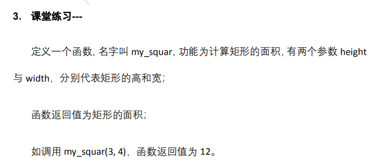

# 函数简介

- 封装代码,提高代码的重用性
- <font color=red>函数先定义,然后再调用</font>

- 函数的定义
  - 把代码封装到函数内部
- 函数的调用
  - 执行函数内部封装的代码

# 函数定义和调用的语法

- 定义

```python
def 函数名():
    函数内部封装的代码
# 函数名的命名规则与变量名命名规则一致
```

- 调用

```python
函数名()
```


```python
# 这里只是定义了一个函数,名叫hello
# 定义函数的时候,函数内部的代码并不会执行
def hello():
    print("hello world")
    print("hello world")
    print("hello world")

# 调用函数
# 只有调用函数的时候,函数内部的代码才回真正执行
hello()
```


- 定义函数和调用函数的说明


```python
def my_func1():
    print("*" * 20)

my_func1()
```


# 函数的参数

- 函数的主要功能是封装代码
- 一个已经定义完成函数,不应该在去修改函数内部的定义代码
- 可以通过函数的参数,实现函数代码的灵活功能
- 语法

```python
def 函数名(参数1, 参数2, .....):
    函数内部封装代码

函数名(参数1对应的值, 参数2对应的值, .......)
# 调用的时候和定义函数的时候,参数的数量要一一对应
```

```python
# def my_sum():
#     a = 5
#     b = 6
#     print(a + b)
# 函数一旦定义完成,就不会再次修改函数内部代码
# my_sum()
def my_sum(a, b):
    print(a + b)
# 函数在定义的时候,有几个参数,调用的时候就要对应几个值
my_sum(5, 6)   # 把5赋值给my_sum函数的a参数,把6赋值给my_sum函数的b参数
```


# 形参与实参

- 形参
  - 定义函数的时候,括号里面的参数
  - 形参必须是变量
- 实参
  - 调用函数的时候,括号里面的参数
  - 实参可以是常量
  - 实参可以是变量
  - 实参可以是表达式
- 定义函数的时候,形参有值吗?
  - 定义函数的时候,形参没有值,只是一个变量名
  - 只要调用函数的时候,通过实参把值实时赋值给形参


```python
def my_func2(num1):  # 定义函数的时候,形参没有值
    print("*" * num1)

my_func2(10)
my_func2(5)
```


# 函数的返回值

- 有时候,函数并不是要显示什么内容,而是要把一个值返回给调用者, 比如python自带的len函数就是这样的

- 函数内容通过return返回给调用者一个值
- return后面可以是常量,也可以是变量,还可以是表达式

```python
# # 我们没有使用过函数 带返回值
# print("hello python")
# # 对于没有返回值的函数,调用方法,直接函数名(参数)
# # len是有返回值的函数
# a = len("hello python")  # 会把一个值返回给调用者
# print(a)
# print(len("hello python"))

def my_sum(a, b):
    return a + b   # 把a + b 的结果,返回给调用者

num1 = my_sum(2, 3)  # 这里就是调用my_sum函数,所以num1得到了函数的返回值
print(num1)
print(my_sum(5, 6))
```


```python
def my_max(num1, num2):
    if num1 > num2:
        return num1
    else:
        return num2

a = my_max(50, 6)
print(a)
```


```python
def my_func1(start, stop):
    sum = 0
    a = start
    while a <= stop:
        sum += a
        a += 1
    return sum

num1 = my_func1(4, 10)
print(num1)

```


```python
def cir(r):
    pai = 3.14
    return pai * r ** 2

print(cir(10))
print(cir(15))
a = cir(20) + cir(30)
print(a)
```

- return的意义
  - 需求不停的变化,但函数一旦定义函数内部的代码不应该因为需求改变而改变
  - 所以要把因为需求而改变的代码放到函数之外,函数之内代码函数定义完不改变




```python
def my_squar(height, width):
    return height * width

a = my_squar(3, 4) # 定义一个变量a,得到调用my_squar函数的返回值
print(a)
```


```python
def my_func(num1, num2):
    if num1 % num2 == 0:
        return True
    else:
        return False

print(my_func(8, 4))
print(my_func(9, 4))
```


# 函数的嵌套

- 一个函数内部又调用了另一个函数

```python
# 一个函数里面又调用另一个函数
def test1():
    print("我是test1")

def my_func():
    print("我是my_func")

def test2():  # 如果不调用test2函数,那么test1和my_func都不执行
    test1()  # test2内部调用了test1
    my_func()

test2()  # 程序第一条执行的语句

```


# 变量作用域

- 局部变量
  - 函数内部定义的变量就是局部变量
  - 局部变量只能在函数内部使用
  - 不同的函数局部变量名字可以相同
- 全局变量
  - 函数外部定义的变量就是全局变量
  - 全局变量在所有函数内部也可以使用
  - 局部变量能解决的问题,不要通过全局变量解决, 尽量少定义全局变量


# 局部变量作用范围

- 局部变量从调用函数的时候开始在内存出现,函数调用完毕,局部变量从内存消失
- 如果一个函数内部定义了局部变量,但这个函数没有被调用,那么局部变量也不在内存中存在

```python
def my_func1():
    a = 1  # a是一个局部变量,只属于my_func1函数
    print(a)

def my_func2():
    a = 2 # a是一个局部变量,只属于my_func2函数
    print(a)

my_func1()  # 调用函数的时候,局部变量a出现了
# my_func1函数调用完毕,a消失了
# 定义函数的时候局部变量并不存在,只有调用函数的时候局部变量出现了
print("end")
```

# 全局变量的作用范围

- 全局变量一般定义在函数定义的上方
- 全局变量从定义变量开始在内存中出现,一直到程序运行完成,和程序一起从内存中消失

```python
num1 = 2

def my_func1():
    print(num1)

def my_func2():
    print(num1)

my_func1()
num1 = 10
my_func2()
print("end")

```


# 局部变量与全局变量重名

- 如果在函数内部定义一个变量,名字和全局变量重名,那么在这个函数内部只能使用局部变量

```python
num1 = 1
def my_func1():
    num1 = 10   # 这里不是为全局变量赋值, 这里是定义了一个局部变量, 名字和全局变量重名
    print(num1) # 打印的是局部变量num1的值
    num1 += 1   # 这里改的是局部变量num1的值

def my_func2():
    print(num1) # 全局变量num1

my_func1()
my_func2()
print(num1) # 打印的是全局变量num1的值
```

# global关键字

- 当需要在函数内部修改全局变量的值,修改前需要用global修饰全局变量的名字

```python
def 函数():
    global 全局变量名
    全局变量名 = 值
```

```python
num1 = 10
def my_func1():
    global num1  # 函数内部就不存在和全局变量同名的局部变量了
    num1 = 1     # 这里是给全局变量num1修改值

def my_func2():
    print(num1)   # 如果在函数内部不修改全局变量的值,就不用global

print(num1)
my_func1()
print(num1)
```


```python
name = "张三"

def my_test1():
    global name
    name = "李四"

my_test1()
print(name)

```


- 变量作用域的一个案例

```python
a = 1

def my_test1():
    global a
    a = 2

def my_test2():
    a = 3   # 这里的a是一个只在my_test2里面的局部变量
    my_test1()

print(a)  # 程序入口在这里
my_test2()
print(a)


```

- 小结代码

```python
a = 1
def my_test1():
    a = 2
    return a  # 函数的返回值都是依赖于return, 一个没有return的函数是没有返回值

def my_test2():
    a = 10

num1 = my_test2()  # 把my_test2的返回值赋值给变量num1

print(my_test1())  # 用print显示my_test1函数的返回值
print(a)


```


# 形参和实参的值传递

- 如果形参的类型为数字或者字符串,在函数内部修改了形参的值,实参的值不会改变

```python

def my_func1(a):   # 这里的a是形参, 这里的a只是一个属于函数my_func1的形参,而不是全局变量a
    a += 1  # 在函数内部,修改了形参a的值,不是修改了全局变量a的值
    print(a) # 输出了形参a的值

a = 10  # 程序的入口 定义一个全局变量a,值是10
my_func1(a)  # 把全局变量a做为实参,去调用函数my_func1
print(a) # 全局变量a的值没有改变

# 当参数类型为数字或者字符串, 形参的值改变了,实参的值不会改变
```


- <font color=red>函数的形参,本质就是一个属于函数内部的局部变量</font>

```python
a = 10

def my_test1(a):
    a += 1   # 重名后,这里操作的是局部变量a
    print(a)


my_test1(a)  # 把全局变量做为形参来调用my_test1函数了
print(a)
# 代码中一共出现两个变量
# 全局变量a和一个形参a(形参其实就是一个属于函数内部的局部变量)
# 以上代码的结果是全局变量与局部变量重名
```

- <font color=red>形参类型如果是列表,集合字典,形参的值改变,会影响实参的值</font>

```python
a = [1, 2, 3]

def my_test1(a):  # 这里的a是一个形参,也是一个属于my_test1的局部变量
    a[0] = 10  # 修改的是形参a的值
    # 如果形参的类型为列表,集合和字典,修改形参的值会直接影响实参的值

print(a)  # 显示的是全局变量a的值
my_test1(a) # 把全局变量做为实参,来调用my_test1
print(a)
```

- 课堂练习-形参类型为list


```python
a = [1, 2, 3]
def my_test1(a):
    a.clear()

my_test1(a)
print(a)
```


# 形参的缺省值

- 形参可以有缺省值,当调用函数的时候,没有提供相应的实参,那么形参会采用缺省值

```python
def 函数名(形参 = 缺省值)
```

```python
def my_test1(a, b = 10):  # 形参b有缺省值
    print(a, b)

def my_test2(a = 1, b = 2):
    print(a, b)

my_test1(1, 2)
my_test1(100)
my_test2()
my_test2(100, 12)
```

<font color=red>不能把有缺省值的形参写在没有缺省值形参的前面</font>

```python
# def my_test3(a = 10, b):  不能把有缺省值的形参写到没缺省值形参的前面
#     print(a, b)
```


# lambda匿名函数

- lambda是给特别小型的函数准备一个简化语法
- 不用写def,也不用写return
- 一行代码就能定义一个函数
- 语法

```python
lambda 参数1, 参数2, ..... : 函数执行代码
```


```python
# def my_sum(a, b):
#     return a + b

my_sum = lambda a, b : a + b
num1 = my_sum(3, 4)
print(num1)
num1 = my_sum(23, 4)
print(num1)
```


```python
# def my_max(a, b):
#     if a > b:
#         return a
#     else:
#         return b

# num1 = my_max(4, 5)
num1 = (lambda a, b : a if a > b else b)(4, 5)
print(num1)
```

- lambda注意事项
  - 匿名函数内部只能有一条语句,而且这条语句要有个具体的值返回
  - 匿名函数不能使用print