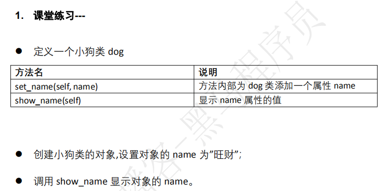
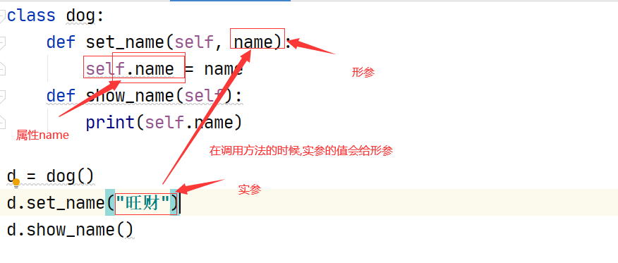
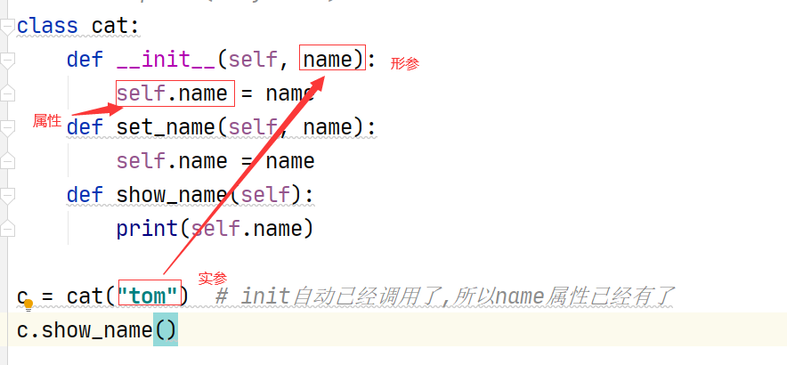
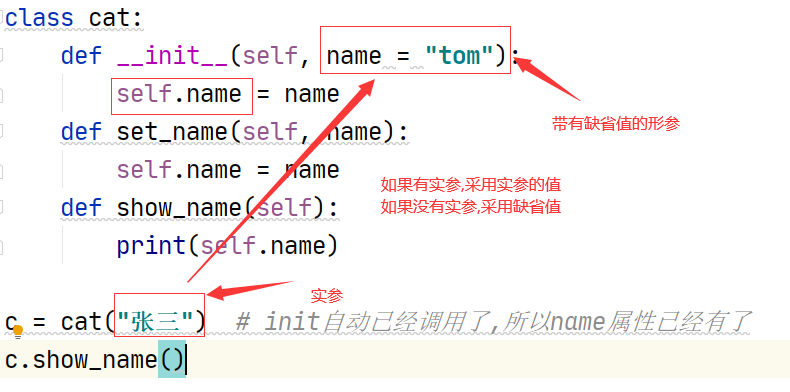
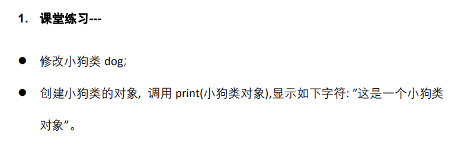

# 类

- 类是一个图纸,模板
- 类不能直接使用, 相当于设计飞机的时候画的图纸
- 类中行为----方法
- 类的特性----属性

# 对象

- 根据类制造出来,可以直接使用的
- 一个类可以制造多个对象
- 每个对象的属性的值可能有所不同
- 一定先有类,然后才有对象

# 面向对象设计的基础

- 面向对象编程首先要设计类
- 类的三个要素
  - 类名
  - 属性
    - 类中的变量---属性
  - 方法
    - 类中的函数---方法

- 设计一个小猫类
  - 类名cat
  - 属性
    - name(名字)
    - color(颜色)
    - height(身高)
    - weight(体重)
    - sex(性别)
  - 方法
    - eat(吃)
    - drink(喝)
    - sleep(睡)


# class关键字

- 定义一个类
- 语法

```python
class 类名:
    def 方法名(self, 参数1, 参数2, ......):
        pass
```

```python
class cat:
    def eat(self):
        print("猫吃饭")
    def drink(self):
        print("猫喝水")


```


# 对象

- 类中的方法不能直接调用
- 把类实例化为对象后,通过对象调用方法
- 实例
  - 通过类创建的对象, 叫类的实例
- 实例化
  - 创建对象的动作, 叫实例化
- 语法

```python
对象名 = 类名(参数列表)
# 对象创建后通过对象名.方法名(参数),调用方法
对象名.方法1()
```

```python
class cat:  # 定义了一个类cat,这个类不能直接使用
    def eat(self):  # 第一个参数必须是self
        print("猫吃饭")
    def drink(self):
        print("猫喝水")

c1 = cat()   # 根据类cat, 创建了一个对象c1, 对象名类似于变量名
c1.eat()  # 调用的时候,不需要提供self对应的实参
c1.drink()  # 调用对象的方法
# 方法只能通过对象调用,不能通过类直接调用
# c1就是类cat的实例
# c1 = cat() 这个动作就叫实例化
c2 = cat()   # 实例化, 实例化的结果是cat类有一个对象叫c2
# c2是类cat的实例
```

# self参数的作用

- self可以在方法内部定义和使用属性
- self可以在方法内部嵌套调用其他方法
- 在类的外部,是不能使用self的
- 在类的外部调用方法
  - 对象名.方法名
- 在类的外部使用属性
  - 对象名.属性名

```python
class cat:  # 定义了一个类cat,这个类不能直接使用
    def set_name(self):
        self.name = "tom"  # 定义了一个属性,名叫name,值是tom

    def eat(self):  # 第一个参数必须是self
        print("%s吃饭" % self.name) # 这里在使用name属性
    def drink(self):
        print("%s喝水" % self.name) # 这里在使用name属性

    def demo(self):  # 这个方法只是为了举例,在类的内部,方法嵌套调用
        self.eat()
        self.drink()

c = cat()
c.set_name()
c.drink()
c.eat()
c.name = "张三"
c.drink()
c.eat()
c.demo()
```





```python
class dog:
    def set_name(self, name):
        self.name = name
    def show_name(self):
        print(self.name)

d = dog()
d.set_name("旺财")
d.show_name()
```




# init方法

- `__init__`注意名字,前面两个下划线,后面两个下划线
- 当创建对象的时候,也就是实例化对象的时候,init自动调用

```python
class cat:
    def __init__(self):
        print("cat被创建了")
    def eat(self):
        print("小猫爱吃鱼")

c = cat()  # 实例化对象的时候,init方法自动调用
c.eat()  # 必须明确的通过代码调用普通方法
```

- init方法的作用
  - 定义类中的属性
  - 同时通过init方法的参数为属性赋值
  - init方法一旦有形参,对象实例化的时候就必须提供实参
  - 为了避免实例化的时候必须提供实参,init的形参总是有缺省值


```python
# class cat:  # 不在普通方法中定义属性
#     def set_name(self, name):
#         self.name = name
#     def show_name(self):
#         print(self.name)
class cat:
    def __init__(self, name = "tom"):
        self.name = name
    def set_name(self, name):
        self.name = name
    def show_name(self):
        print(self.name)

c = cat("张三")  # init自动已经调用了,所以name属性已经有了
c.show_name()
```








- 如果init有形参,实例化对象的时候,必须提供实参

```python
class cat:
    def __init__(self, name):
        pass

c = cat("tom")  # 如果init有形参,那么实例化对象的时候,必须提供实参
```


- 一个完整的cat说明

```python
class cat:
    def __init__(self, name = "tom", color = "red"):
        self.name = name
        self.color = color

    def show_name(self):
        print(self.name)

    def show_color(self):
        print(self.color)

    def show(self):
        self.show_name()
        self.show_color()

c1 = cat("小猫", "white")
c1.show_name()
c1.show_color()
c2 = cat("大猫", "black")
c2.show_name()
c2.show_color()
c3 = cat()
c4 = cat("懒猫")

```


- 课堂练习-car类的设计

```python
# 汽车car       要区分属性和方法,在init方法中为每个属性定义默认值
# 属性
# luntai(轮胎)
# yanse(颜色)
# chuanghu(窗户)
# xinghao(型号)
# 方法
# guadang(挂挡)
# qianjin(前进)
# houtui(后退)
# wurenjiashi(无人驾驶)
# shache(刹车)
# jiayou(加油)

class car:
    def __init__(self, luntai="轮胎", yanse="白色", chuanghu="黑窗户", xinghao="大众"):
        self.luntai = luntai
        self.yanse = yanse
        self.chuanghu = chuanghu
        self.xinghao = xinghao

    def guadang(self, a = "前进"):
        self.jiayou()
        if a == "前进":
            self.qianjin()
        elif a == "后退":
            self.houtui()
        else:
            print("档不对")

    def qianjin(self):
        print("%s在前进" % self.xinghao)
    def houtui(self):
        print("%s在后退" % self.xinghao)
    def wurenjiashi(self):
        print("无人驾驶")
    def shache(self):
        print("刹车")
    def jiayou(self):
        print("加油")

c = car()
# c.qianjin()
c.guadang("前进")

c1 = car(xinghao="奔驰")
c1.guadang("后退")
```


# del方法

- 当对象在内存中销毁的时候,自动调用del方法
- del方法只有一个参数self

```python
class cat:
    def __init__(self, name = "tom"):
        self.name = name

    def show_name(self):
        print(self.name)

    def __del__(self):
        print("%s销毁了" % self.name)

c = cat()  # c是个对象,同时也是一个变量
c.show_name()  # 这里显示了tom
```


如果对象是局部的,那么函数执行完毕,自动调用对象的del方法

如果对象是全局的,那么程序执行完毕,自动调用对象的del方法

```python
class cat:
    def __init__(self, name = "tom"):
        self.name = name

    def show_name(self):
        print(self.name)

    def __del__(self):
        print("%s销毁了" % self.name)

def my_test1():
    c1 = cat("小猫")
    c1.show_name()

my_test1()   # 程序的第一条执行语句
c = cat()  # c是个对象,同时也是一个变量
c.show_name()  # 这里显示了tom
```


- `__init__`不要写成`__int__`
- `__del__`对象在内存中销毁的时候自动调用del
  - 不要理解成调用del是把对象从内存中删除了
  - 对象即使没有del,同样会被销毁
  - 当对象从内存中销毁的时候,有机会能执行一些代码


- 设计方法的惯例

```python
class cat:
    def __init__(self, name = "tom"):
        self.name = name

    # 不想写show_name方法, 只是想把name返回给调用者
    def get_name(self):   # 设计方法管理,得到属性值get_属性名
        return self.name

    def set_name(self, name):  # set_属性名(self, 形参)
        self.name = name

    def show_name(self):  # 在方法中显示属性的值一般show_属性名
        print(self.name)

c = cat()
print(c.get_name())
print(c.show_name()) # 没有return语句的方法或者函数,不要放到print
c1 = cat("小猫")
c1.set_name("加菲猫")
print(c1.get_name())

```


- 课堂练习-设计小狗类

```python
# 有一个dog类,有属性name和age
# 提供设置,得到,显示name和age属性的方法
class dog:
    def __init__(self, name = '二哈', age = 2):
        self.name = name
        self.age = age

    def set_name(self, name):
        self.name = name

    def get_name(self):
        return self.name

    def show_name(self):
        print(self.name)

    def set_age(self, age):
        self.age = age

    def get_age(self):
        return self.age

    def show_age(self):
        print(self.age)

d = dog("比熊", 3)  # 实例化的时候设置属性的值
print(d.get_name())
d.set_name("黑背") # 实例化以后再设置属性值
print(d.get_name())
d.show_name()
```


# str方法

- `__str__`
  - 只有self,没有其他参数
  - 必须有return return必须返回一个字符串
- str方法的作用
  - 当把一个带有str方法的对象放到print里面,print函数会显示str方法return返回的字符串
- 如果类没有str方法,那么类实例化的对象放到print里面显示的是对象的内存地址

```python
class cat:
    def __init__(self):
        pass

c = cat()
print(c)  # 当把对象直接放到print里面,实现的是对象在内存的地址编号
# 有时候,我们希望print能显示我们想显示的内容

# 假设,自己设计一个对象,放到print里面,显示对象的name属性值
class demo:
    def __init__(self, name = "demo"):
        self.name = name

    def __str__(self):
        return self.name

d = demo()
print(d)
```



```python
class dog:
    def __str__(self):
        return "这是一个小狗类对象"

d = dog()
print(d)
```


# 类设计实例演示-计算器

```python
class calc:
    def __init__(self, oper = "+"):
        self.oper = oper

    def calc(self, a, b):
        if self.oper == "+":
            return a + b
        elif self.oper == "-":
            return a - b
        elif self.oper == "*":
            return a * b
        elif self.oper == "/":
            if b != 0:
                return a / b
            else:
                return None
        else:
            return None

c = calc()
print(c.calc(3, 4))

d = calc("*")
print(d.calc(3, 4))

e = calc("/")
print(e.calc(3, 0))

f = calc("sdfsd")
print(f.calc(4, 5))
```

