# 面向对象三大特性

- 封装
- 继承
- 多态

# 封装

- 就是把类的属性和方法封装到类的内部,只能在内部使用,不能在类的外部使用
- 把属性和方法名前面加两个下划线__,这个属性和方法就成为了类的私有属性和方法

```python
class woman:
    def __init__(self):
        self.name = "玛丽"
        self.__weight = 200  # __weigth是一个私有属性

    def __eat(self):   # __eat方法为私有方法
        print("吃的很多")


w = woman()
print(w.name)
# print(w.__weight)  不能在类的外部访问类的私有属性
# w.__eat()   不能在类的外部调用私有方法
```


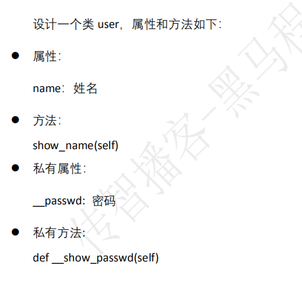

```python
class user:
    def __init__(self):
        self.name = "tom"
        self.__passwd = "123456"

    def show_name(self):
        print(self.name)

    def __show_passwd(self):
        print(self.__passwd)

u = user()
u.show_name()
# u.__show_passwd()  类的外部不能访问类的私有属性和方法
```

# 继承

- 类A继承自类B,类A会拥有类B的所有属性和方法
- 语法

```python
class A:
    pass
class B(A):  # B继承自类A
    pass
```

```python
class animal:
    def sleep(self):
        print("睡")
    def eat(self):
        print("吃")

class dog(animal):  # 类dog继承自animal类
    def run(self):
        print("跑")

d = dog()   # dog会拥有animal所有属性和方法
d.sleep()
d.eat()
d.run()

```

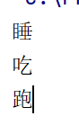


# 专业术语

- 子类---派生类
  - dog是animal的子类
  - dog是animal的派生类
- 父类---基类
  - animal是dog的父类
  - animal是dog基类
- 继承---派生
  - dog类继承自animal
  - dog类派生自animal

- 一个父类可以有多个子类继承,每个子类可以有自己特有的方法和属性

```python
class animal:
    def sleep(self):
        print("睡")

    def eat(self):
        print("吃")

class dog(animal):
    def run(self):
        print("跑")

class fish(animal):
    def swimming(self):
        print("游泳")

class bird(animal):
    def fly(self):
        print("飞")

```

针对animal类,dog,fish和bird类是说明

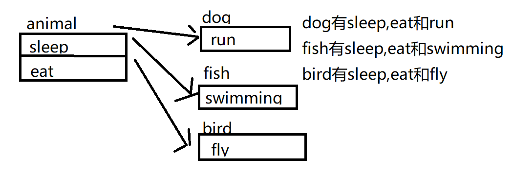


# 多级继承

- 类C继承自类B,类B继承自类A
- 类C就拥有了类B和类A的所有属性和方法

```python
class animal:
    def sleep(self):
        print("睡")

    def eat(self):
        print("吃")

class dog(animal):
    def run(self):
        print("跑")

class erha(dog):
    def kawayi(self):
        print("萌")

e = erha()
e.sleep()
e.eat()
e.run()
e.kawayi()
```

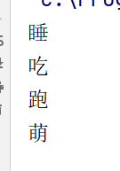

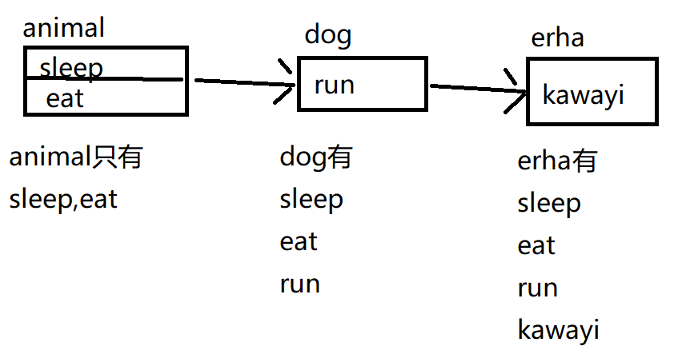

- 课堂练习-多级继承

```python
class animal:
    def sleep(self):
        print("睡")

    def eat(self):
        print("吃")

class dog(animal):
    def run(self):
        print("跑")

class fish(animal):
    def swimming(self):
        print("游泳")

class erha(dog):
    def kawayi(self):
        print("萌")

class cangao(dog):
    def yaoren(self):
        print("咬人")

class shark(fish):
    def chiren(self):
        print("吃人")

s = shark()
s.sleep()
s.eat()
s.swimming()
s.chiren()

c = cangao()
c.sleep()
c.eat()
c.run()
c.yaoren()
```

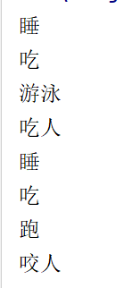

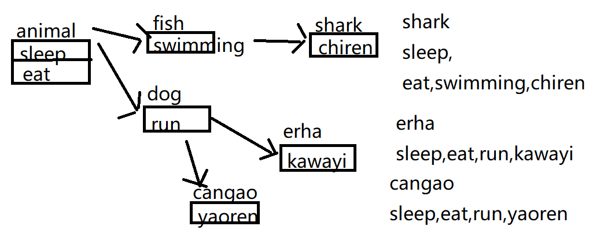


# 方法的重写

- 父类的方法不能满足子类的需求
- 方法重写有两种方式
  - 覆盖父类方法
  - 扩展父类方法

## 覆盖父类方法

- 子类中出现和父类相同的方法,那么在子类中相同方法会把父类的方法覆盖

```python
class animal:
    def sleep(self):
        print("睡")

    def eat(self):
        print("吃")

class dog(animal):
    def eat(self):  # 出现和父类同名方法,在子类dog中,就没有父类的eat方法了
        print("吃肉")

d = dog()
d.sleep()
d.eat()  # 由于覆盖了父类的eat方法,,所以这里调用的是dog类的eat方法

```

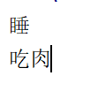

## 扩展父类方法

- 如果父类的方法不能完全满足子类需求, 子类可以在父类方法基础上增加功能
- 语法

```python
1.在子类中实现和父类同名方法
2.在子类的同名方法中用super().父类同名方法 来调用父类的方法
```

```python
class animal:
    def sleep(self):
        print("睡")

    def eat(self):
        print("吃")

class dog(animal):
    def sleep(self):
        super().sleep() # 在子类方法中调用父类的sleep方法
        print("睡得更多")

d = dog()
d.sleep() # 扩展了父类的sleep,所以既执行了父类的sleep,又增加了功能
```

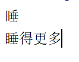


# 父类的私有成员不会继承给子类

- 父类中所有的私有方法和私有属性归父类特有,子类不能继承

```python
class animal:
    def sleep(self):
        print("睡")

    def __eat(self):  # 私有成员不会被子类继承
        print("吃")

class dog(animal): # 在dog类里面,没有__eat方法
    pass

d = dog()
d.sleep()
# d.__eat()  # 这里的代码会出错
```

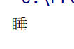


- 课堂练习-father类和继承

```python
class father:
    def __init__(self):
        self.__name = "张三"
        self.house = "别墅"
    def eat(self):
        print("吃")
    def sleep(self):
        print("睡")
    def __edu_back(self):
        print("本科")

class son(father):  # son拥有father所有的方法和属性
    def show_eat(self):
        self.eat()    # eat是继承自father的,但也是son自己的

    def show_sleep(self):
        self.sleep()

    def show_house(self):
        print(self.house) # house是一个属性,不能调用,要用print

s = son()
s.show_eat()
s.show_sleep()
s.show_house()

# father有两个属性,三个方法
# son继承了father一个属性,两个方法

```

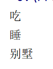

# 多态

- 不同的子类,调用相同的父类方法,产生不同的结果
- 多态的前提,不同的子类来自相同的一个父类,子类会覆盖父类的方法

```python
class animal:
    def food(self):
        pass
    def eat(self):
        self.food()

class dog(animal):
    def food(self):
        print("吃肉")

class cattle(animal):
    def food(self):
        print("吃草")

d = dog()
d.eat()
c = cattle()
c.eat()
```

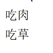

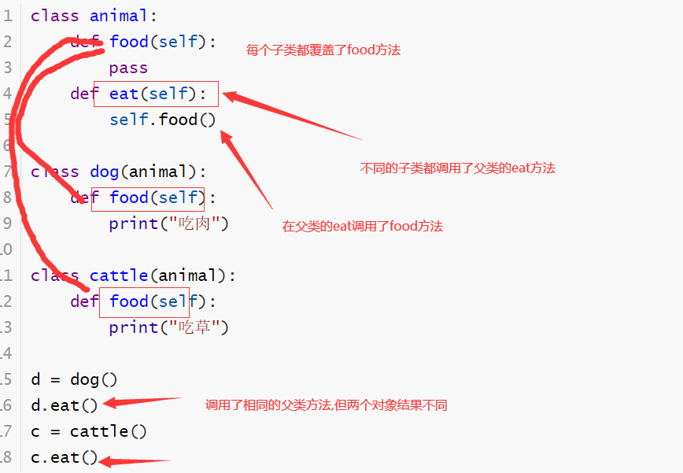


# 类属性

- 定义在类里面,方法外面,定义的时候不需要self关键字,语法类似于定义普通变量
- 不需要把类实例化为对象,直接通过类名.属性名 使用

```python
class dog:
    name = "二哈"   # 如果在这个位置定义的变量,就是类属性
    def __init__(self):
        pass

print(dog.name)  # 显示类属性的值
dog.name = "狼狗"  # 修改类属性的值
print(dog.name)
```


# 类方法

- 类方法不需要把类实例化为对象,通过类名.类方法名调用
- 用@classmethod来修饰的方法,就是类方法
- 类方法的一个参数是cls(不是self)
- 在类方法内部如果使用类属性, cls.类属性名
- 类方法内部不能使用普通属性,也不能调用普通方法
  - 因为类方法不需要对象的,但普通方法和普通属性一定需要通过对象调用

```python
class dog:
    name = "二哈"   # 如果在这个位置定义的变量,就是类属性
    @classmethod
    def set_name(cls, name):
        cls.name = name   # 通过类方法的形参修改类属性name值

    def __init__(self):
        self.age = 20  # 在类方法里面无法访问age

    def demo(self):  # 在类方法中无法调用demo
        print("普通方法")

print(dog.name)  # 显示类属性的值
dog.name = "狼狗"  # 修改类属性的值
print(dog.name)
dog.set_name("比熊")
print(dog.name)
```


## 课堂练习-类属性和类方法

```python
class dog:
    name = "小白"
    @classmethod
    def get_name(cls):
        return cls.name

    def __init__(self):
        self.age = 0
    def get_age(self):
        return self.age
# 要把类属性name的值修改为"小小白"
dog.name = "小小白"
# 调用类方法get_name,显示name的值
print(dog.get_name())
# 要把普通属性age的值修改为10
d = dog()
d.age = 10
# 调用普通方法get_age显示age的值
print(d.get_age())
```

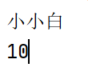


## 在普通方法中使用类属性和类方法

- 普通方法中通过类名.类属性或者类名.类方法使用类属性和类方法

```python
class dog:
    name = "小白"
    @classmethod
    def get_name(cls):
        return cls.name

    def demo(self): # 演示如何在普通方法中使用类属性和类方法
        dog.name = "小小白"
        print(dog.get_name())

d = dog()
d.demo()
```


```python
class dog:
    index = 0   # 定义了一个类属性
    @classmethod
    def count(cls):   # 返回值为类属性index
        return cls.index

    def __init__(self):  # 实例化的时候自动调用init
        dog.index += 1  # 每次实例化的时候类属性index + 1

d1 = dog()
d2 = dog()
d3 = dog()
d4 = dog()
print(dog.count())
```

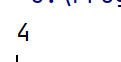


# 静态方法

- 在类中通过@staticmethod修饰的方法
- 静态方法不需要实例化为对象,通过类名.静态方法名 调用
- 静态方法不能访问类中的其他成员,静态方法就是一个独立与类存在的函数

```python
class dog:
    @staticmethod
    def help():
        print("这是一个静态方法")

dog.help()
```


## 静态方式使用场景

- 当代码量特别大的时候,函数也会特别多,为了避免函数的重名,可以把同名函数放到不同的类里面,做为静态方法
- 避免由于函数重名带来错误

```python
class dog:
    @staticmethod
    def help():
        print("这是一个静态方法")

class A:
    @staticmethod
    def help():
        print("这是第二个静态方法help")

dog.help()
A.help()
```


# object类(了解即可)

- 在python3中,如果一个类定义的时候,没有明确的写父类,那么父类就是object
- object类是python内部自带的
- 如果是python2,那么如果一个类没有写父类,就是没有父类,不会自动继承自object

```python
class animal:  # 如果定义了一个类,没明确的写父类,那么父类就是object
    def sleep(self):
        print("睡")

# class animal(object):
#     def sleep(self):
#         print("睡")

a = animal()

```

