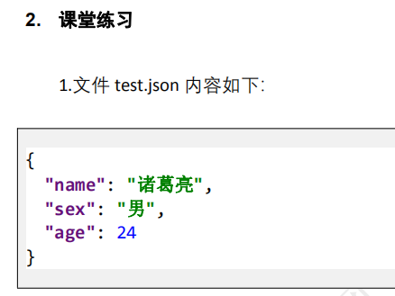

# 文件操作步骤

- 打开文件-open
- 读写文件
  - 读---把文件的内容读到变量里-read
  - 写---把变量的值写到文件内容里-write
- 关闭文件-close

# 读取第一个文件内容

- 打开文件
  - file = open(要打开文件的路径和文件名, "r")
  - file是一个变量名,代表文件操作对象
  - open的第一个参数一定要文件存在, 如果文件不存在,会报错
  - "r"意思是用只读方式打开文件

- 读取文件内容
  - txt = file.read()
  - txt是定义一个变量,代表存放读取到的文件内容
  - file是上一个open返回的文件操作对象
  - read是file对象的一个方法,用来读取文件内容
- 关闭文件
  - file.close()
  - 文件打开后,一定要记得关闭

```python

# 第一步: 打开文件
file = open(r"C:\file\temp\a.txt", "r")
# 第二步:读取文件内容
txt = file.read()
print(txt)  # 为了显示文件内容
# 第三步:关闭文件
file.close()
```

# 写第一个文件内容

- 打开文件
  - file = open("要打开的文件路径和文件名", "w")
  - 第二个参数w代表用写的方式打开文件
  - 如果用w方法打开文件,文件名不存在,会创建一个新文件,存在的话会覆盖已有文件
- 写文件
  - file.write(要写入的内容)
- 关闭文件
  - file.close()

```python
# 第一步:打开文件
file = open(r"c:\file\temp\b.txt", "w")
# 第二步:写内容
file.write("hello python")
# 第三步:关闭文件
file.close()
# 验证程序是否执行成功?看c盘file目录的temp目录下是否生成了文件b.txt
# b.txt文件内容是否为hello python
```

> 注意项:如果open第二个参数是"r",打开文件后只能用read读,不能用write写
>
> 如果open第二个参数是"w", 打开文件后只能用write写,不能用read读

# 追加写文件内容

- 打开文件
  - file = open("文件路径和文件名", "a")
  - "a"当文件不存在的时候创建新文件
  - 当文件存在的时候,在文件后面追加内容
- 写文件
  - file.write("要写入文件的内容")
- 关闭文件
  - file.close()

```python

file = open(r"c:\file\temp\c.txt", "a")
file.write("hello\n")
file.close()
```

# 总结打开文件的方式

- open函数第二个参数的意思是打开文件的方式
  - r只读
  - w只写
  - a追加写
  - rb用二进制方法打开,只读
  - wb用二进制方法打开,只写
  - ab用二进制方法打开,追加

# 打开文件的时候,指定字符集

- 如果文件格式是utf8的,open打开文件的时候需要指定字符集
  - file = open("文件名", "r", encoding="utf8")
- 如果出现以下错误提示,基本就是由于字符集导致的错误

```txt
UnicodeDecodeError:
```

```python
file = open(r"C:\file\teach\05python\day09\3-code\01-open函数.py", "r", encoding="utf8")
txt = file.read()
print(txt)
file.close()
```

# 课堂练习-修改文件内容

```python
# 有文件a.txt
# 内容如下:
# 我爱你python, 我爱你
#
# 写代码,把a.txt内容中的python替换为world
#
# 思路,先把a.txt文件内用r方式读出来
# 用字符串的replace方法把python替换为world
# 在用w方式把替换后的内容写回到a.txt里面
file = open(r"c:\file\temp\a.txt", "r")
txt = file.read()
a = txt.replace("python", "world")
file.close()  # 这一步必须关闭
file = open(r"c:\file\temp\a.txt", "w")
file.write(a)
file.close()
```

# 复制文件

```python
# 把文件a.txt复制为b.txt
# 思路:把a.txt打开,读取全部内容
# 把b.txt用w方法打开,把内容写入
file = open(r"c:\file\temp\a.txt", "r")
txt = file.read()
file.close()
file = open(r"c:\file\temp\b.txt", "w")
file.write(txt)
file.close()
```

# 课堂练习-合并文件

```python
# 有文件a.txt
# 内容如下:
#
# 我爱你python, 我爱你
#
# 有文件b.txt
# 内容如下:
#
# hello
#
# 把文件a.txt和b.txt合并为c.txt
# 思路:把文件a.txt内如读出来放到变量a
# 把文件b.txt内如读出来放到变量b
# 把a + b 结果写入的c.txt中
file = open(r"c:\file\temp\a.txt", "r")
a = file.read()
file.close()
file = open(r"c:\file\temp\b.txt", "r")
b = file.read()
file.close()
file = open(r"c:\file\temp\c.txt", "w")
file.write(a + b)
file.close()
```


# 按行读取文件内容

- readline()按行读取文件内容
- 由于read一次把文件所有内容都读取到内存中,如果文件特别大,会消耗内存
- 每调用一次readline,内部的文件指针就会向下一行移动,这样的结果是下次再次调用readline会自动读取下一行
- readline读取到文件最后,返回""
- 如果要通过readline来读取文件所有内容
  - 写一些死循环
  - 在循环内部调用readline,读取文件每一行
  - 如果readline返回为"", 终止这个死循环

```python
file = open(r"c:\file\temp\a.txt", "r")
# 在循环开始的时候,不知道文件有多少行,所以也不能决定循环多少次
while True:
    txt = file.readline()
    # 如果readline读取到文件最后末尾,返回""
    if txt == "":
        break
    print(txt, end="")

file.close()
```

# 课堂练习-读取文件偶数行

```python
# 有文件a.txt,有很多行,只显示偶数行
# 思路:只读方式打开a.txt,读取所有行,但只显示偶数行
# 做一个循环读取所有行,在循环的时候做一个计数器,每次循环计数器+1
# 可以判断计数器是偶数还是奇数,如果是偶数那么就print

file = open(r"c:\file\temp\a.txt", "r")
index = 1
while True:
    txt = file.readline()
    if txt == "":
        break
    if index % 2 == 0:  # 如果条件成立,代表index为偶数
        print(txt, end="")
    index += 1

file.close()

```


# readlines

- 一下读取文件所有行,返回一个列表,列表中的一个成员就是文件中的一行, 文件有多少行,列表就有多少成员

```python
file = open(r"c:\file\temp\a.txt", "r")
list1 = file.readlines()
for n in list1:
    print(n, end="")
file.close()
```


# 课堂练习-计算文件中最大数字与最小数字的差

```python
# 有个文件a.txt,内容每一行是一个整数,最大值和最小值的差
# 思路:
# 把文件每一行 做为list的每个成员(文件的每一行是字符串)
# 只有max(list) - min (list)
#
# 先做一个空的list
# 循环读每行,把每行用int转化为整数,append到空的list里面
# 循环读完后,就可以max(list) - min(list)
file = open(r"c:\file\temp\a.txt", "r")
list1 = []
while True:
    txt = file.readline()
    if txt == "":
        break
    list1.append(int(txt))
file.close()
print(max(list1) - min(list1))
```


- 字符串比较大小的原理

```python
list1 = [2, 12, 5]
list2 = ['2', '12', '5']
print(max(list1), min(list1))
print(max(list2), min(list2))
# 如果长得像数字的字符串比较大小,比较原理是先比较字符串的一个字符
```

# with open语法

- 这个语法传统的file = open的一种简化语法, 不需要明确的调用close关闭文件

```python
# file = open(r"c:\file\temp\a.txt", "r")
# txt = file.read()
# print(txt)
# file.close()
# 对等代码
with open(r"c:\file\temp\a.txt", "r") as file:
    txt = file.read()
    print(txt)
```

# json文件

- 一般是定义数据使用的
- 在互联网传递数据的时候,很常见的一种文件格式
- 所有数据用一对大括号括起来
- 大括号内部是键值对,键和值用冒号分隔
- 多个键值对用逗号分隔
- 字符串用双引号
- 数字不需要引号
- 列表用中括号
- 对象用大括号

```json
{
  "name": "tom",
  "age": 20,
  "addr": [1, 2, 3]
}
```


# 读取json文件的方法

- 第一步要导入json模块
  - import json
- 第二步打开json文件
  - json中有中文,一般字符集都是utf8,打开文件的时候要指定字符集为utf8
  - open(json文件名, "r", encoding="utf8")
- 第三步:调用json模块的load方法,读取文件内容
  - data = json.load(file)
- 第四步:关闭open打开的文件
  - file.close()

```python
import json
file = open("a.json", "r", encoding="utf8")
data = json.load(file) # 把json文件的内容转化为python的字典
file.close()
# print(data)
for n in data:
    print(n, data[n])
```


# 操作json文件常见错误

## 错误1:json格式错误

```txt
json.decoder.JSONDecodeError
```

## 错误2:扩展名不是json,是其他的

```txt
json文件的扩展名必须是.json
```

## 错误3:自己创建了一个文件名叫json.py

```txt
AttributeError: module 'json' has no attribute 'load'
```


# 写json文件

- 导入json模块
  - import json
- 用只写方式打开json文件
  - open(json文件,"w", encoding="utf8")
- 用dump方法把字典内容写入到json文件中
  - ensure_ascii = False代表中文不转义
- 关闭文件

```python
import json
dict1 = {"name":"刘备", "age":20, "sex":"男"}
file = open("data.json", "w", encoding="utf8")
json.dump(dict1, file, ensure_ascii=False)
file.close()
```


# 课堂练习-修改json文件内容



```python
# 思路:
# 先把内容从test.json文件中读出来
# 读出来的结果是一个字典
# 把字典中键age对应 的值修改为30
# 再把字典写回到test.json文件中
import json
file = open("test.json", "r", encoding="utf8")
dict1 = json.load(file)
file.close()
dict1["age"] = 30
file = open("test.json", "w", encoding="utf8")
json.dump(dict1, file, ensure_ascii=False)
file.close()
```


# 在pycharm中安装课程需要的包-演示


