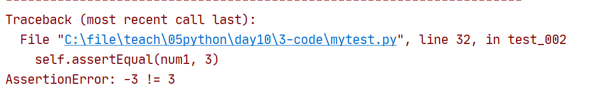

# UnitTest介绍

- UnitTest是python自带的自动化测试框架
- UnitTest主要包含的内容
  - TestCase(测试用例)
  - TestSuite(测试套件,把多个TestCase集成到一个测试TestSuite)
  - TestRunner(执行测试用例)
  - TestLoader(自动从代码中加载多个测试用例TestCase)
  - Fixture(UnitTest特性)


# TestCase

- 第一步:导入unittest模块
- 第二步:实现一个类,这个类必须继承自unittest.TestCase类
- 第三步:类中每个方法代表一个测试用例,方法名必须以test开头

```python
import unittest

def my_sum(a, b):
    return a + b

class my_test(unittest.TestCase):
    def test_001(self):
        print(my_sum(5, 6))

    def test_002(self):
        print(my_sum(0, 3))


```


- 如果鼠标右键不出现unittest运行选项的处理方法


# TestSuite

- 把多个测试用例整合成一个测试套件
- 使用方法
  - import导入unittest
  - import导入其他的包含测试用例的py文件
    - py文件的命名规则与变量名相同
  - 实例化unittest.TestSuite类的对象
  - 调用对象的addTest方法
    - addTest(py文件名.类名("方法名"))

```python
import unittest
import testcase_01

suite = unittest.TestSuite()
suite.addTest(testcase_01.my_test("test_001"))
suite.addTest(testcase_01.my_test("test_002"))
# 只是把测试用例添加到了测试套件中,并不是执行测试用例

```

- 用unittest.makeSuite一次导入一个类中的所有测试方法

```python
import unittest
import testcase_01

suite = unittest.TestSuite()
# suite.addTest(testcase_01.my_test("test_001"))
# suite.addTest(testcase_01.my_test("test_002"))
# 只是把测试用例添加到了测试套件中,并不是执行测试用例
suite.addTest(unittest.makeSuite(testcase_01.my_test))

```


# TextTestRunner

- 作用,执行在suite中的测试用例
- 使用方法
  - 先实例化TextTestRunner的对象
  - 调用对象的run方法
    - 只要把suite做为参数,放入到run方法里面

```python
import unittest
import testcase_01

suite = unittest.TestSuite()
# suite.addTest(testcase_01.my_test("test_001"))
# suite.addTest(testcase_01.my_test("test_002"))
# 只是把测试用例添加到了测试套件中,并不是执行测试用例
suite.addTest(unittest.makeSuite(testcase_01.my_test))

runner = unittest.TextTestRunner() # 实例化TextTestRunner的对象
runner.run(suite)  # 调用对象的run方法

```

# TestLoader

- 可以从指定目录查找指定py文件中的所有测试用例,自动加载到TestSuite中

```python
import unittest
# 用TestLoader对象的discover方法来自动查找py,自动加载py文件中的方法
# 第一个参数是从哪里找py文件,"."从当前目录开始查找py文件
# 第二个参数是指定py文件的文件名,可以用通配符
suite = unittest.TestLoader().discover(".", "my*.py")
runner = unittest.TextTestRunner()
runner.run(suite)
```


# TestSuite和TestLoader的使用区别

- 当只是要执行py文件中多个测试用例中的几个,而不是全部执行那么适合用TestSuite的addTest加载指定的测试用例
- 当要执行所有的py文件中的所有的测试用例,那么适合使用TestLoader


# 小结

- 所有的TestCase最终都是用TextTestRunner来执行的
- TextTestRunner执行的是TestSuite
- 一个TestSuite中可以有多个TestCase


# Fixture

- 可以在测试用例执行执行之前自动调用指定的函数,在测试用例执行之后自动调用指定的函数
- 控制级别
  - 方法级
    - 每个方法执行前和执行后都自动调用函数
  - 类级
    - 不管类中有多少方法,一个类执行前后都自动调用函数
  - 模块级
    - 不管一个模块(一个模块就是一个py文件)中有多少类,模块执行前后自动调用函数

## 方法级

- 在TestCase,也就是测试用例所在的class中定义方法
- def setUp(self)   当测试用例执行前,自动被调用
- def tearDown(self) 当测试用例执行后,自动被调用
- 如果一个TestCase中有多个测试用例,那么setUp和tearDown就会被自动调用多次

**mytest.py内容修改如下:**

```python
import unittest

def my_sum(a, b):
    return a + b

class my_test(unittest.TestCase):
    def setUp(self):
        print("setup被自动调用了")
    def tearDown(self):
        print("teardown被自动调用了")

    def test_001(self):
        print(my_sum(5, 6))

    def test_002(self):
        print(my_sum(0, 3))
```

## 类级

- 不管类中有多少方法,一个类开始的时候自动调用函数,结束的之后自动调用函数
- 类级的fixture一定要是类方法
- `@classmethod def setUpClass(cls)`类开始时自动调用的方法
- `@clasmethod def tearDownClass(cls)`类结束的时候自动调用的方法

mytest.py修改如下:

```python
import unittest

def my_sum(a, b):
    return a + b

class my_test(unittest.TestCase):
    @classmethod
    def setUpClass(cls):
        print("setupclass自动调用了")
    @classmethod
    def tearDownClass(cls):
        print("teardownclass自动调用了")
    def setUp(self):
        print("setup被自动调用了")
    def tearDown(self):
        print("teardown被自动调用了")

    def test_001(self):
        print(my_sum(5, 6))

    def test_002(self):
        print(my_sum(0, 3))


```

## 模块级

- 不管py文件中有多少个类,以及类中有多少方法,只自动执行一次
- def setUpModule()  在py文件开始的时候自动调用
- def tearDownModule() 在py文件结束的时候自动调用

修改后的mytest.py内容如下

```python
import unittest

def setUpModule():
    print("setUpModule自动调用了")

def tearDownModule():
    print("tearDownModule自动调用了")

def my_sum(a, b):
    return a + b

class my_test1(unittest.TestCase):
    @classmethod
    def setUpClass(cls):
        print("setupclass自动调用了")
    @classmethod
    def tearDownClass(cls):
        print("teardownclass自动调用了")
    def setUp(self):
        print("setup被自动调用了")
    def tearDown(self):
        print("teardown被自动调用了")

    def test_001(self):
        print(my_sum(5, 6))

    def test_002(self):
        print(my_sum(0, 3))

class my_test2(unittest.TestCase):
    @classmethod
    def setUpClass(cls):
        print("setupclass自动调用了")
    @classmethod
    def tearDownClass(cls):
        print("teardownclass自动调用了")
    def setUp(self):
        print("setup被自动调用了")
    def tearDown(self):
        print("teardown被自动调用了")

    def test_001(self):
        print(my_sum(5, 6))

    def test_002(self):
        print(my_sum(0, 3))


```

## fixture小结

- 一定要在继承于unittest.TestCase这个类的子类中使用
- setUP,tearDown, 每个方法执行开始和完毕后自动调用
- setUPClass, tearDownClass, 每个类开始时候和结束时候自动调用
- setUpModule, tearDownModule,每个py文件开始和结束的时候自动调用


# 断言

- 让程序来判断测试用例执行结果是否符合预期

## unittest断言

- assertEqual(参数1, 参数2)
  - 如果参数1,参数2的值相等,断言成功,否则断言失败
  - 两个参数,有一个存放实际结果,有一个存放预期结果

修改后的mytest.py内容

```python
import unittest

def setUpModule():
    print("setUpModule自动调用了")

def tearDownModule():
    print("tearDownModule自动调用了")

def my_sum(a, b):
    return a - b

class my_test1(unittest.TestCase):
    @classmethod
    def setUpClass(cls):
        print("setupclass自动调用了")
    @classmethod
    def tearDownClass(cls):
        print("teardownclass自动调用了")
    def setUp(self):
        print("setup被自动调用了")
    def tearDown(self):
        print("teardown被自动调用了")

    def test_001(self):
        num1 = my_sum(5, 6)  # 定义变量num1得到my_sum函数的返回值
        self.assertEqual(num1, 11)  # num1里存放的是实际结果,11是预期结果
        # 实际结果与预期结果相符,代表测试用例测试通过
        # 不相符代表测试用例测试失败

    def test_002(self):
        num1 = my_sum(0, 3)
        self.assertEqual(num1, 3)


```




- assertIn(参数1, 参数2)
  - 如果参数1在参数2里面,断言通过,否则断言失败

修改后的mytest.py内容如下:

```python
import unittest
import random

def setUpModule():
    print("setUpModule自动调用了")

def tearDownModule():
    print("tearDownModule自动调用了")

def my_sum(a, b):
    return a + b

def my_rand(): # 返回从1到5之间的一个随机数
    return random.randint(10, 50)

class my_test1(unittest.TestCase):
    def test_001(self):
        num1 = my_sum(5, 6)  # 定义变量num1得到my_sum函数的返回值
        self.assertEqual(num1, 11)  # num1里存放的是实际结果,11是预期结果
        # 实际结果与预期结果相符,代表测试用例测试通过
        # 不相符代表测试用例测试失败

    def test_002(self):
        num1 = my_sum(0, 3)
        self.assertEqual(num1, 3)

    def test_003(self):
        num1 = my_rand()
        self.assertIn(num1, [1, 2, 3, 4, 5])


```


# 参数化

## 测试用例中使用参数化的场景

- 多个测试用例代码相同,只是测试数据不同,预期结果不同,可以把多个测试用例通过参数化技术合并为一个测试用例

```python
import unittest
import random

def setUpModule():
    print("setUpModule自动调用了")

def tearDownModule():
    print("tearDownModule自动调用了")

def my_sum(a, b):
    return a + b

class my_test1(unittest.TestCase):
    def test_001(self):
        num1 = my_sum(5, 6)  # 定义变量num1得到my_sum函数的返回值
        self.assertEqual(num1, 11)  # num1里存放的是实际结果,11是预期结果
        # 实际结果与预期结果相符,代表测试用例测试通过
        # 不相符代表测试用例测试失败

    def test_002(self):
        num1 = my_sum(0, 3)
        self.assertEqual(num1, 3)

    def test_003(self):
        num1 = my_sum(-3, 7)
        self.assertEqual(num1, 4)

    def test_004(self):
        num1 = my_sum(-4, -20)
        self.assertEqual(num1, -24)

    # 以上的测试用例,基本是一样的,测试用例的数据和预期结果不同


```


# 手工安装py包的过程

- 把parameterized目录和parameterized-0.7.4.dist-info拷贝到python安装目录的Lib/site-packages下
- 在pycharm中新建项目的时候,注意一个选项
  - 第一步:先新建了一个文件夹c:\file\mycode


# 参数化

- 第一步:导入from parameterized import parameterized
- 第二步在方法上面用@parameterized.expand()修饰方法
  - expand()里面是一个列表
  - 列表里面放多个元组, 每个元组中的成员就代表调用方法使用的实参
  - 列表中有几个元组,方法就会自动被调用几次


```python
import unittest
from parameterized import parameterized

def my_sum(a, b):
    return a + b

class my_test1(unittest.TestCase):
    # a是调用my_sum的第一个参数
    # b是调用my_sum的第二个参数
    # c是预期结果
    @parameterized.expand([(1, 2, 3), (5, 6, 110), (-1, 3, 2)])
    def test_001(self, a, b, c):
        num1 = my_sum(a, b)  # 定义变量num1得到my_sum函数的返回值
        self.assertEqual(num1, c)  # num1里存放的是实际结果,11是预期结果
        # 实际结果与预期结果相符,代表测试用例测试通过
        # 不相符代表测试用例测试失败

```


执行结果


参数化场景二

```python
import unittest
from parameterized import parameterized

def my_sum(a, b):
    return a + b

list1 = [(1, 2, 3), (5, 6, 110), (-1, 3, 2)]

class my_test1(unittest.TestCase):
    # a是调用my_sum的第一个参数
    # b是调用my_sum的第二个参数
    # c是预期结果
    @parameterized.expand(list1)
    def test_001(self, a, b, c):
        num1 = my_sum(a, b)  # 定义变量num1得到my_sum函数的返回值
        self.assertEqual(num1, c)  # num1里存放的是实际结果,11是预期结果
        # 实际结果与预期结果相符,代表测试用例测试通过
        # 不相符代表测试用例测试失败


```

参数化场景三:

```python
import unittest
from parameterized import parameterized

def my_sum(a, b):
    return a + b

def get_data():  # 定义了一个函数,返回一个列表
    return [(1, 2, 3), (5, 6, 110), (-1, 3, 2)]

class my_test1(unittest.TestCase):
    # a是调用my_sum的第一个参数
    # b是调用my_sum的第二个参数
    # c是预期结果
    @parameterized.expand(get_data())
    def test_001(self, a, b, c):
        num1 = my_sum(a, b)  # 定义变量num1得到my_sum函数的返回值
        self.assertEqual(num1, c)  # num1里存放的是实际结果,11是预期结果
        # 实际结果与预期结果相符,代表测试用例测试通过
        # 不相符代表测试用例测试失败


```


# 跳过(了解即可)

- 可以通过@unittest.skip跳过指定的方法或者函数
- 语法

```python
@unittest.skip
def 方法名():
```

```python
import unittest
from parameterized import parameterized

def my_sum(a, b):
    return a + b

def get_data():  # 定义了一个函数,返回一个列表
    return [(1, 2, 3), (5, 6, 11), (-1, 3, 2)]

class my_test1(unittest.TestCase):
    # a是调用my_sum的第一个参数
    # b是调用my_sum的第二个参数
    # c是预期结果
    @parameterized.expand(get_data())
    def test_001(self, a, b, c):
        num1 = my_sum(a, b)  # 定义变量num1得到my_sum函数的返回值
        self.assertEqual(num1, c)  # num1里存放的是实际结果,11是预期结果
        # 实际结果与预期结果相符,代表测试用例测试通过
        # 不相符代表测试用例测试失败
    @unittest.skip
    def test_002(self):
        print("test002")


```


# 通过TextTestRunner生成测试报告

- 在实例化TextTestRunner对象的时候,需要写参数

```python
stream=file, verbosity=2
file代表用open打开的一个文件
verbosity=2,固定
```

- 第一步:用open,w方式打开测试报告文件
- 第二步:实例化TextTestRunner对象
- 第三步调用对象的run方法执行测试套件
- 第四步:关闭open打开的文件

```python
import unittest
# 用TestLoader对象的discover方法来自动查找py,自动加载py文件中的方法
# 第一个参数是从哪里找py文件,"."从当前目录开始查找py文件
# 第二个参数是指定py文件的文件名,可以用通配符
suite = unittest.TestLoader().discover(".", "my*.py")
# runner = unittest.TextTestRunner()
file = open("test01.txt", "w", encoding="utf8")
runner = unittest.TextTestRunner(stream=file, verbosity=2)
runner.run(suite)
file.close()
```


# HTML测试报告

- 把文件HTMLTestRunner.py拷贝到项目目录下
- 在代码中导入模块from HTMLTestRunner import HTMLTestRunner
- 调用HTMLTestRunner(stream=file, title="我的第一个html测试报告")
  - 第一个参数是用open打开的文件, 打开的文件扩展名一定是.html
  - open打开文件的时候,用wb,不用指定字符集
- 调用runner对象的run方法执行测试套件
- 关闭open打开的文件

```python
import unittest
from HTMLTestRunner import HTMLTestRunner
# 用TestLoader对象的discover方法来自动查找py,自动加载py文件中的方法
# 第一个参数是从哪里找py文件,"."从当前目录开始查找py文件
# 第二个参数是指定py文件的文件名,可以用通配符
suite = unittest.TestLoader().discover(".", "my*.py")
# runner = unittest.TextTestRunner()
file = open("test01.html", "wb")  # 用wb代表用二进制写方式打开文件
# runner = unittest.TextTestRunner(stream=file, verbosity=2)
runner = HTMLTestRunner(stream=file, title="我的第一个html测试报告")
runner.run(suite)
file.close()
```

