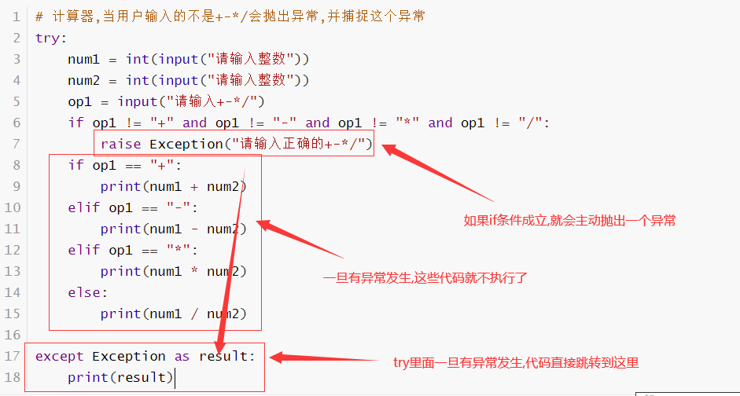

# 异常

- 程序的错误有两种
- 编码出错,不符合语言的语法
- 运行时报错--------异常
- 程序运行期间是要避免异常
- 程序一旦出现异常就终止运行


## 捕获异常

- 语法

```python
try:
    可能出现异常的语句
except:
    出现异常后会自动执行的代码
    
如果try下面的代码没出现异常,那么except下面的代码不会执行
只有try下面的代码出现异常,except下面的代码才会执行
一旦异常被try捕捉,那么程序就不会报错终止了
```

```python
try:
    a = int(input("请输入一个整数"))
except:
    print("输入不正确")
```


## 捕捉不同类型异常

- 语法

```python
try:
    可能出异常的代码
except 异常类型1:
    出现异常类型执行的代码
except 异常类型2:
    出现异常类型执行的代码
except:
    出现未知异常执行的代码
```

```python
try:
    a = int(input("请输入一个整数"))
    b = int(input("请输入一个整数"))
    print(a / b)
except ValueError:
    print("请输入一个可以转化整数")
except ZeroDivisionError:
    print("除数不能为0")
except:
    print("未知错误")

# ValueError: 输入的值不能转化为整数
# ZeroDivisionError: 除数为0的时候报的错误

```

- 课堂练习-计算器


```python
try:
    num1 = int(input("请输入num1的值"))
    num2 = int(input("请输入num2的值"))
    op1 = input("请输入op1的值")
    if op1 == "+":
        print(num1 + num2)
    elif op1 == "-":
        print(num1 - num2)
    elif op1 == "*":
        print(num1 * num2)
    elif op1 == "/":
        print(num1 / num2)
    else:
        print("op1值不对")
except ValueError:
    print("请输入一个可以转化整数")
except ZeroDivisionError:
    print("除数不能为0")
except:
    print("未知错误")

```


## 没有异常发生执行的代码

- 语法

```python
try:
    可能出现异常的代码
except:
    发生异常要处理的代码
else:
    没有异常发生要执行的代码
```

```python
try:
    a = int(input("请输入a的值"))
    b = int(input("请输入b的值"))
    print(a / b)
except:
    print("异常发生")
else:
    print("没有异常发生")
```


- 捕捉未知异常显示系统异常提示信息

```python
try:
    a = int(input("请输入a的值"))
    b = int(input("请输入b的值"))
    print(a / b)
except Exception as result: # 捕捉未知异常,把未知异常系统的错误提示显示出来
    print(result)
```

- 无论是否异常都要执行的代码

```python
try:
    可能出现异常的代码
except:
    出现异常要处理的代码
finally:
    无论是否异常都要执行的代码
```

```python
try:
    a = int(input("请输入a的值"))
    b = int(input("请输入b的值"))
    print(a / b)
except:
    print("异常发生")
finally:
    print("不论是否有异常都要执行的代码")
```


- 异常完整语法

```python
try:
    可能出现异常的代码
except 指定异常类型1:
    异常执行代码
except 指定异常类型2:
    异常执行代码    
except Exception as result:
    异常执行代码
else:
    没有异常执行代码
finally:
    无论是否有异常执行代码
```

```python
try:
    a = int(input("请输入a的值"))
    b = int(input("请输入b的值"))
    print(a / b)
except ValueError:
    print("请输入正确的整数")
except ZeroDivisionError:
    print("除数不能为0")
except Exception as result:
    print("未知异常", result)
else:
    print("代码没有异常发生")
finally:
    print("代码执行完成")
```


## 主动抛出异常

- 可以通过代码人为的抛出异常
- 语法

```python
raise Exception("异常描述")
```

- 主动抛出的异常同样会导致程序报错终止

```python
print("开始")
raise Exception("主动抛出的异常")  # 这个异常是自己人为抛出
# 不论什么样的异常,只有不捕捉,代码就会报错终止
print("结束")  # 这里的print执行不了,因为上面一句代码已经抛出异常了,程序终止了
```


## 捕捉主动抛出的异常

- 不管是什么异常,都需要代码捕捉,不然程序会报错

```python
# 计算器,当用户输入的不是+-*/会抛出异常,并捕捉这个异常
try:
    num1 = int(input("请输入整数"))
    num2 = int(input("请输入整数"))
    op1 = input("请输入+-*/")
    if op1 != "+" and op1 != "-" and op1 != "*" and op1 != "/":
        raise Exception("请输入正确的+-*/")
    if op1 == "+":
        print(num1 + num2)
    elif op1 == "-":
        print(num1 - num2)
    elif op1 == "*":
        print(num1 * num2)
    else:
        print(num1 / num2)

except Exception as result:
    print(result)
```





```python
# 设计一个函数,如果参数str1中有数字返回true,否则返回false
def digital(str1):
    for n in str1:
        if n >= "0" and n <= "9":
            return True
    return False

try:
    name = input("请输入姓名")
    if digital(name): # 条件成立,抛出异常
        raise Exception("名字不允许有数字")
    age = int(input("请输入年龄"))
    if age < 0:
        raise Exception("年龄不能小于0")
except Exception as result:
    print(result)

```


```txt
当一个函数返回一个布尔值,做为条件放到if或者while后面的时候
if 函数名 == True  等价 if 函数名  如果函数返回True,等于条件成立
    如果返回返回False等于条件不成立

如果一个函数返回False,那么就执行if语句
if not 函数名 :
```


# 模块

- 一个py文件就是一个模块
- 一个项目是由多个py文件构成的,所以说一个项目是多个模块组成
- 模块名,也就是py文件名要符合变量的命名规则
  - 一般习惯模块名用小写字母,如果有多个单词,单词之间用下划线分隔

import

- 在一个py文件中使用另一个py文件中内容,需要先使用import导入模块
- 语法

```python
import 模块名
模块名.函数
```

```python
# 在module2.py里面使用module1.py中定义的函数
import module1
print(module1.my_sum(3, 4))
```

module1.py

```python
def my_sum(a, b):
    return a + b

```


- 导入模块同时起一个别名

```python
import 模块名 as 别名
别名.函数名
```

```python
# 在module2.py里面使用module1.py中定义的函数
import module1 as m
print(m.my_sum(3, 4))
```


## from import导入指定内容

- 从指定模块中导入指定的内容
- import默认会把模块中所有内容导入,from import会有选择的导入内容
- 语法一

```python
from 模块名 import 函数名
调用函数的时候,不需要前面在接模块名.,直接写函数名调用即可
```

- 语法二

```python
from 模块名 import *
导入所有内容,使用内容的时候,不需要写模块名.
```


module1.py

```python
def my_sum(a, b):
    return a + b

def my_max(a, b):
    if a > b:
        return a
    else:
        return b

```

module3.py

```python
# 只想导入module1中的my_max函数
from module1 import my_max
print(my_max(4, 5))
```


## `__name__`属性

- 每一个py文件都有一个属性`__name__`
- 如果这个py文件是正在执行的模块,那么name属性的值为`__main__`
- 如果这个py文件是被其他py文件import导入调用的,那么name属性的值就是这个py文件的模块名

module4.py

```python

def my_test():
    print(__name__)

# my_test()  当前如果执行的就是module4这个模块,那么属性__name__的值为"__main__"
```

module5.py

```python
import module4
module4.my_test()  # 调用module4中的my_test函数
# 这里的my_test会输出module4
```

# 包

- 包就是一个特殊的目录
- 一个目录下需要有`__init__.py`文件
- 使用包的目的是一次性可以把一个目录下所有的模块通过一条import语句导入


## 创建步骤的演示

- 第一步:在项目里建立一个目录my_pack
- 第二步在my_pack目录里创建两个py文件,a1.py和a2.py,内容如下

a1.py

```python
def my_max(a, b):
    if a > b:
        return a
    else:
        return b
```

a2.py

```python
def my_sum(a, b):
    return a + b
```

- 第三步,在my_pack目录下创建`__init__.py`文件

`__init__.py`

```python
from . import a1
from . import a2
```

- 第四步:在my_pack的上级目录建立一个module6.py文件,建立这个文件的目的是要使用my_pack包

module6.py

```python
# module6要使用包my_back
import my_pack
print(my_pack.a1.my_max(3, 5))
print(my_pack.a2.my_sum(3, 5))

```

- 使用包中的函数

```python
import 包名
包名.模块名.函数名
```

- 使用包注意的点
  - 不管目录下有多少模块
  - 只有在`__init__.py`文件中通过import导入模块才能使用
  - `__init__.py`里面的from 后面是个相对路径


## 导入包中指定函数

- 语法

```python
from 包.模块 import 函数
直接写函数名调用函数即可
```

```python
from my_pack.a1 import my_max
from my_pack.a2 import my_sum
print(my_max(4, 6))
print(my_sum(4, 6))
```


## 课堂练习-my_pack1包


my_pack1/m1.py

```python
def m1_func():
    print("我是m1的func函数")

def m1_test():
    print("我是m1的test函数")
```


my_pack1/m2.py

```python
def m2_func():
    print("我是m2的func函数")
```


`my_pack1/__init__.pu`

```python
from . import m1
from . import m2
```


module8.py

```python
# import my_pack1
# my_pack1.m1.m1_func()
# my_pack1.m1.m1_test()
# my_pack1.m2.m2_func()
from my_pack1.m1 import m1_test
from my_pack1.m1 import m1_func
from my_pack1.m2 import m2_func
m1_test()
m1_func()
m2_func()

```


