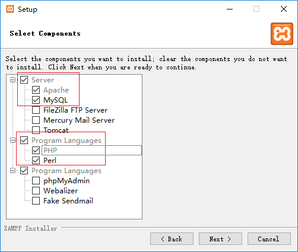

# Ego微商环境搭建

## 一. 完成后端（服务端）

搭建的方法有很多种，例如可以使用Linux+Apache+Mysql+Php+代码完成

还可以使用Windows + Apache + Mysql + php + 代码完成（主讲）

**注意** ：phpstudy搭建过tpshop项目，这个phpstudy也是WAMP架构，所以需要注意端口冲突的问题。

例如：phpstudy的数据库默认端口是3306端口。所以我们搭建Ego微商项目时，需要修改数据库的端口。

### 1 准备工作

* 会使用一个新的叫做xampp的工具来进行搭建

  

* 准备Ego服务端的代码

  

  项目文件中的ego文件夹中存放了所有服务端的代码

  

  

### 2 在windows系统中安装XAMPP

双击运行XAMPP的安装包，然后按照提示信息一路确认到这个界面，

按照下图所示，勾选Apache、Mysql、PHP、Perl然后，按照默认方式，一直下一步

最后就能看到安装的进度条

### 3 拷贝Ego后端源代码ego复制到xampp中的htdoc目录

### 4 配置

* 配置apache的http的默认端口

  

  

* 配置apche的https的默认端口

  

  

* 启动apache，在web页面验收

* 配置apache的虚拟主机

  虚拟主机就是指，虚拟的域名

  * hosts文件

    编辑hosts文件，增加127.0.0.1 www.myego.com的配置

    

  * apache的虚拟主机配置

    

    

* 配置数据库的配置

  在windows系统中使用xampp创建的数据库，默认端口是3306，用户名是root没有密码

  需要先关闭phpstudy，否则我们的数据库起不来

  有的可能使用的是服务启动的数据库，需要把服务中的MYSQL关闭

​     配置数据库和数据库表

​     

然后修改数据库中端口

* 配置代码的配置

  

问题1：

解决方式：修改虚拟机的端口

问题2：配置端口报错

可能是端口冲突，也有可能是PHP不兼容，下载一个环境库文件，运行后重启

https://download.visualstudio.microsoft.com/download/pr/d60aa805-26e9-47df-b4e3-cd6fcc392333/7D7105C52FCD6766BEEE1AE162AA81E278686122C1E44890712326634D0B055E/VC_redist.x64.exe

问题3：

打开控制面包，找到管理工具

关闭系统apache 服务器

再启动xampp中的apache

