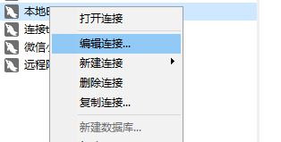
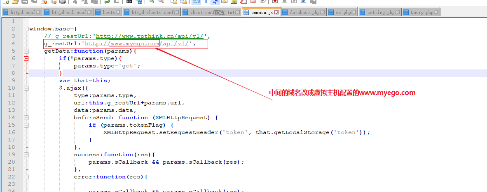

# DAY02

## EGO微商项目后端部署

### 1 先安装XAMPP

### 2 复制代码到xampp/htdocs目录中

### 3 配置apache和虚拟主机

* 配置apache的http的端口

  

  

* 配置apache的https的端口

  

  

  启动apache，验证http的13140端口，是否能够使用，

  

  

* 配置apache虚拟主机

  虚拟主机就是虚拟域名，我们配置虚拟主机的目录，是为了能够使用域名来访问我们的内部的服务的IP地址

  * 配置apache虚拟主机配置

    

    

  * 配置hosts文件

    

    

    

  ### 4 配置数据库

  * 配置数据库的库名和表

    在xampp中启动数据库

    

    用navicat连接到数据库

    

    

    

    

    

    

    

    

  * 配置数据库的端口

    

    

  * 启动数据库，验证结果

    

    

    

    确定之后，重新连接，能看到egowx库，并且库中有表，那么证明成功了

    

### 4 配置Ego源码配置

在第1步安装xampp时，我们已经把后端代码ego拷贝到了xampp下的htdocs目录中

接下来需要进行4个配置

* 配置代码连接数据库的配置

  

  

* 配置代码rest_url的配置

  

  

* 配置图片的URL配置

  

  

* 配置微信APPID和APPSECRET

  

  

  查看微信APPID和APPSECRET，先登录微信小程序公众号

  

  

## EGO微商项目前端部署

* 1 注册了微信小程序公众号（测试号）

  之前做过

* 2 下载和安装微信开发者工具的稳定版本

  之前做过

* 3 需要使用微信开发者工具，打开前端代码

  * 准备Ego微商前端代码

    

  * 使用微信开发者工具，打开前端代码

    

    

    

    

    

    

    

    

* 4 配置前端访问后端服务器的URL配置

  需要utils下的config.js中的Config.restUrl

  

* 配置前端的APPID

  

* 配置不校验合法域名

  

* 进行编译

  编译发现报错，可以在编译器中，点击Console查看报错内容

  经过分析，发现是前端配置访问的URL有误，没有加上端口号导致

  所以重新配置config.json文件，加上端口号

  

  并行更新服务端的common.js的配置

  

  

  修正问题之后，重新编译

  

  修复服务端图片配置的URL

  

  配置完成之后，再编译前端

  

  

