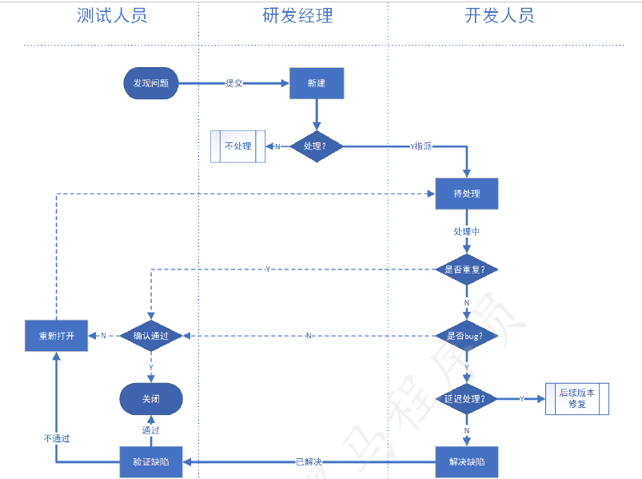

# 微信小程序day03

## 今日目标

```text
1 能设计Ego微商项目功能测试用例
2 能执行Ego微商项目的测试用例
3 能设计Ego微商项目的测试报告
```

## 一、功能测试用例设计

## 二、非功能测试用例设计

## 三、用例评审

* 评估用例是否准确严谨
* 评估用户是否覆盖了所有需求
* 让大家对用户的理解达成一致
* 都能够执行测试用例
* 评估之后，确定测试用例可以用来保证软件产品质量

## 四、测试用例执行

### 1 提取执行的测试用例

为什么要提取测试用例呢？

答案：因为执行测试用例时，为了最大化测试时间，我们需要提取测试用例

* 开发完成一个模式

  提取这个模块对应的测试用例执行（这样可以最早介入开发的测试，集成测试阶段）

* 开发完成了多个模块

  按照多个模块和用例的优先级筛选主要的测试用例集进行测试（这样可以用最小的代码检查多个模块的功能是否可以用，后续还需要更详细的覆盖测试）

* 开发完成所有模块

  提取业务场景的功能测试用例进行测试（可以保证业务功能可用）

* 按照测试计划的范围规定进行测试

  可以根据之前设计好的规范来进行测试，节省测试时间（如果不这么做，那么每次都需要进行全量的测试，测试成本非常高）


### 2 执行测试用例

* 测试方式

  测试时选择的执行方式（手工方式、自动化、自动化+持续集成）

* 测试资源

  测试的用例数目、测试的人力安排、测试的时间安排、每个测试用例的消耗的时间（按照测试计划和测试方案来执行测试资源）

* 过程工具

  执行测试过程当中，需要使用到的工具（禅道提交BUG，微信开发者工具，真机（安卓和ios），linux，等工具）

* 过程记录

  录屏记录，日志记录，执行的用户结果记录等等


### 3 测试缺陷的生命周期




### 4 缺陷的结果跟踪 

注意：提交缺陷时，注意缺陷的环境和版本（例如：iPhone 4上发现的问题不一定会在iPhone 12中出现）

## 五、测试报告

### 1.构成要素

#### 测试项目概述

编写目的
项目概述
参考资料

#### 测试过程回顾

测试环境：多少、配置、轮次
进度回顾：符合计划、偏离计划、测试日志

#### 测试统计分析

整体统计
测试bug统计：优先级、模块、版本
测试bug分析：优先级、模块、版本
遗留问题清单：无遗漏、有遗留（严重程度）

#### 测试结果确认

传智播客-黑马程序员
黑马程序员-软件测试
模块评价
整体结果

#### 总结和改进

经验总结
注意事项

### 2.附属文档

支持文档：《需求说明书》
输出文档：
《测试计划&方案》
《测试用例》
《测试报告》

