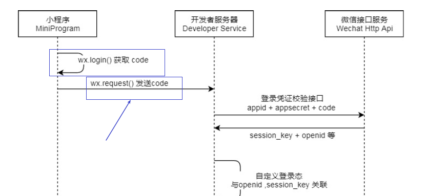

# 微信小程序day05

## 目标

```text
掌握使用python + unittest + requests 实现微信小程序接口的测试
```


## 代码实现Ego微商项目测试


### 1、初始化项目

* 创建项目的目录结构

  

* 安装项目所需要的依赖包

  * 发送请求的requests

    

  * 连接数据的pymysql

    

  * 安装HTMLTestRunner

    

### 2、初始化日志

为什么要有日志?

* 1 可以记录操作过程，帮助排查问题

* 2 我们测试和开发可以通过操作过程日志，分析数据和预期是不是一样，

  帮助定位问题。

```python
# 初始化日志的函数
import logging
import os
from logging import handlers

def init_logging():
    # 1 创建一个日志器:如果不写日志器的名称，那么会使用默认的日志器root
    logger = logging.getLogger()
    # 2 设置日志的等级:控制打印日志的级别，使用logging打印日志时，如果
    # 日志级别低于设置的级别，那么不会打印日志
    logger.setLevel(logging.INFO)
    # 3 设置处理器
    # 控制台处理器：控制把日志输出到控制台
    sf = logging.StreamHandler()
    # 文件处理器：控制把日志输出到外部文件当中，需要提前定义文件的路径和文件名称
    logname = os.path.dirname(os.path.abspath(__file__)) + "/log/ego.log"
    fh = logging.handlers.TimedRotatingFileHandler(logname,when='M', interval=1,backupCount=7, encoding='utf-8')
    # 4 设置格式化器：指打印日志时的格式内容（日志器名称、打印日志的函数名称、模块名称、代码行数、日志消息等内容）
    fmt = "%(asctime)s %(levelname)s [%(name)s] [%(filename)s(%(funcName)s:%(lineno)d)] - %(message)s"
    formmater = logging.Formatter(fmt)
    # 5 将格式化器添加到处理器当中（文件处理器和控制台处理器都要添加）
    sf.setFormatter(formmater)
    fh.setFormatter(formmater)
    # 6 将处理器添加到日志器当中
    logger.addHandler(sf)
    logger.addHandler(fh)

# init_logging()
# logging.info("在utis中，测试日志会不会打印")
```


### 3、全局变量属性介绍

在实际项目开发中，有一些公有的全局使用的属性，需要分离到单独的py文件中，统一管理

具体的全局属性，一般是经过大量实战后总结出来的经验。在这里，我们总结了前人的经验，定义5哥需要使用的全局属性

* **BASE_DIR** 

  项目根目录

* **TOKEN** 

  令牌，用于维持登录状态

* **HEADERS** 

  请求头，大部分请求头都是固定的写法

* **CODE** 

  code由微信小程序客户端生成，然后发送给微信服务器，由微信服务器按照内部规则生成token

  我们需要使用code来获取token

  

* **BASE_URL**

  Ego微商项目的根路径

  这个根路径会随着Ego微商项目搭建的服务器不同而发生改变，所以需要独立出来。

  ```python
  # 定义全局变量
  import os
  
  BASE_DIR = os.path.dirname(os.path.abspath(__file__)) # 项目根目录
  BASE_URL = "http://www.myego.com:13140" #ego微商服务器域名
  TOEKN = "71ce3a105b89b2bc82fb3bd21ecc1a99" # 注意令牌可能会失效，也是使用code之后，获取的令牌，也需要手动设置
  HEADERS = {"Content-Type": "application/json"}
  CODE = "093yS0000rF93K1KH9000WxFJ21yS00Q" # code是手动从微信小程序前端获取的
  ```

  

### 3、封装接口

```python
# 导入requests模块
import requests
import app
# 创建API接口类
class EgoApi:
    def __init__(self):
        # 定义轮播图的url
        self.banner_url = app.BASE_URL + "/api/v1/banner/1"
        # 定义专题栏位的url
        self.theme_url = app.BASE_URL + "/api/v1/theme"
        # 最近新品的URL
        self.recent_product_url = app.BASE_URL + "/api/v1/product/recent"
        # 获取商品分类url
        self.category_url = app.BASE_URL + "/api/v1/category/all"
        # 获取商品分类下的某个商品
        self.by_category_url = app.BASE_URL + "/api/v1/product/by_category"
        # 获取商品详情
        self.product_detail_url = app.BASE_URL + "/api/v1/product"
        # 获取用户订单列表
        self.order_list_url = app.BASE_URL + "/api/v1/order/by_user"
        # 创建订单URL
        self.create_order_url = app.BASE_URL + "/api/v1/order"
        # 查看订单详情
        self.order_detail_url = app.BASE_URL + "/api/v1/order"
        # 获取Token
        self.get_token_url = app.BASE_URL + "/api/v1/token/user"
        # 验证token的url
        self.verify_token_url = app.BASE_URL + "/api/v1/token/verify"
        # 获取地址信息的URL
        self.get_address_url = app.BASE_URL + "/api/v1/address"
    # 轮播图
    def get_banner(self):
        return requests.get(self.banner_url)

    # 专题栏位
    def theme(self, params):
        return requests.get(self.theme_url, params={"ids":params})

    # 最近新品
    def recent_product(self):
        return requests.get(self.recent_product_url)

    # 获取商品分类
    def get_product_category(self):
        return requests.get(self.category_url)

    # 获取商品分类下的某个商品
    def by_category(self, params):
        return requests.get(self.by_category_url, params={"id":params})

    # 获取商品信息
    def get_product_detail(self, product_id):
        return requests.get(self.product_detail_url + "/" + str(product_id))

    # 获取用户订单列表（登录后的接口）
    def get_order_list(self, page):
        return requests.get(self.order_list_url, params={"page":page}, headers=app.HEADERS)

    # 创建订单
    def create_order(self, jsondata):
        return requests.post(self.create_order_url, json=jsondata, headers=app.HEADERS)

    # 查看订单
    def get_order_detail(self, order_id):
        return requests.get(self.order_detail_url + "/" + str(order_id), headers=app.HEADERS)

    # 获取Token
    def get_token(self, code):
        return requests.post(self.get_token_url, json={"code": code})

    # Token验证接口
    def verify_token(self, token):
        return requests.post(self.verify_token_url, json={"token": token})

    # 获取地址信息
    def get_address(self):
        return requests.get(self.get_address_url, headers=app.HEADERS)

```


### 4、在script中调用封装的接口，发送接口请求进行接口测试

```python
# 导包
import unittest
import logging

import app
from api.ego_api import EgoApi

# 创建测试类
class TestEgo(unittest.TestCase):

    @classmethod
    def setUpClass(cls) -> None:
        # 实例化EgoApi类
        cls.ego_api = EgoApi()

    # 测试获取轮播图
    def test01_get_banner(self):
        # 使用封装的接口获取轮播图
        response = self.ego_api.get_banner()
        # 打印结果
        logging.info("获取轮播图的结果为：{}".format(response.json()))

        # 断言结果
        self.assertEqual(200, response.status_code) # 断言响应状态码
        self.assertEqual(['6', '25', '11', '21', '10'], [i.get("key_word") for i in response.json().get('items')])

    # 测试获取专题栏位
    def test02_get_theme(self):
        # 使用封装的接口获取专题栏位
        response = self.ego_api.theme("1,2,3")
        # 打印结果
        logging.info("获取专题栏位为：{}".format(response.json()))

        # 断言
        self.assertEqual(200, response.status_code)
        self.assertEqual("美味水果世界", response.json()[0].get("description"))

    # 测试获取最近新品
    def test03_get_recent_data(self):
        # 使用封装的接口获取最近新品
        response = self.ego_api.recent_product()
        # 打印结果
        logging.info("获取最近新品为：{}".format(response.json()))

        # 断言
        self.assertEqual(200, response.status_code)
        self.assertEqual("芹菜 半斤", response.json()[0].get('name'))

    # 获取商品分类
    def test04_get_category(self):
        # 使用封装的接口获取商品分类
        response = self.ego_api.get_product_category()
        # 打印结果
        logging.info("获取商品分类为：{}".format(response.json()))

        # 断言
        self.assertEqual(200, response.status_code)
        self.assertEqual("果味", response.json()[0].get("name"))

    # 获取商品分类下的商品
    def test05_get_product(self):
        # 使用封装的接口获取商品分类下的商品
        response = self.ego_api.by_category(2)
        # 打印结果
        logging.info("获取商品分类下的商品为：{}".format(response.json()))

        # 断言
        self.assertEqual(200, response.status_code)
        self.assertEqual("梨花带雨 3个", response.json()[0].get("name"))

    # 获取商品详情
    def test06_get_product_detail(self):
        # 使用封装的接口获取商品详情
        response = self.ego_api.get_product_detail(2)
        # 打印结果
        logging.info("获取商品商品详情：{}".format(response.json()))

        # 断言
        self.assertEqual(200, response.status_code)
        self.assertEqual("梨花带雨 3个", response.json().get("name"))

    # 获取Token
    def test07_get_token(self):
        # 使用封装的接口获取token
        response = self.ego_api.get_token(app.CODE)
        # 打印结果
        logging.info("获取token：{}".format(response.json()))

        # 断言
        self.assertEqual(200, response.status_code)

    # 验证token是否正确
    def test08_verify_token(self):
        # 发送获取token的接口请求
        response = self.ego_api.verify_token(app.TOKEN)
        # 打印结果
        logging.info("获取token的接口请求：{}".format(response.json()))

        # 断言
        self.assertEqual(200, response.status_code)
        self.assertEqual(True, response.json().get("isValid"))

    # 验证获取用户订单列表
    def test09_get_order_list(self):
        # 发送获取用户订单列表的请求
        response = self.ego_api.get_order_list(1,)
        # 打印结果
        logging.info("获取用户订单列表的请求：{}".format(response.json()))

        # 断言
        self.assertEqual(200, response.status_code)
        self.assertEqual("夏日芒果 3个", response.json().get("data")[0].get("snap_name"))

    # 创建订单
    def test10_create_order(self):
        # 创建订单
        response = self.ego_api.create_order({"products":[{"product_id":8,"count":1}]})
        # 打印结果
        logging.info("创建订单：{}".format(response.json()))
        # 断言
        self.assertEqual(200, response.status_code)
        self.assertEqual(True, response.json().get("pass"))

    # 查看订单
    def test11_get_order_detail(self):
        # 查看订单
        response = self.ego_api.get_order_detail(50)
        # 打印结果
        logging.info("查看订单：{}".format(response.json()))
        # 断言
        self.assertEqual(200, response.status_code)
        self.assertEqual(3, response.json().get("total_count"))

    # 获取用户地址信息
    def test12_get_address(self):
        # 获取用户地址
        response = self.ego_api.get_address()
        # 打印
        logging.info("获取用户地址：{}".format(response.json()))

        # 断言
        self.assertEqual(200, response.status_code)
        self.assertEqual("17620332300", response.json().get("mobile"))


```


### 5、生成测试报告

注意，生成测试报告时，需要先安装依赖HTMLTestRunner

```python
# 导包
import unittest
import app
from script.test_ego import TestEgo
from lib.HTMLTestRunner import HTMLTestRunner
# 创建测试套件
suite = unittest.TestSuite()
# 将测试用例的代码添加到测试套件中
suite.addTest(unittest.makeSuite(TestEgo))
# 定义测试报告的路径和名称
report_name = app.BASE_DIR + "/report/mini.html"
# 使用HTMLTestRunner运行测试套件生成测试报告
with open(report_name, 'wb') as f:
    # 初始化HTMLTestRunner
    runner = HTMLTestRunner(f, verbosity=1, title="Ego微商", description="测试Ego微商的常见接口")
    # 使用实例化的runner运行测试套件，并生成测试报告
    runner.run(suite)
```

