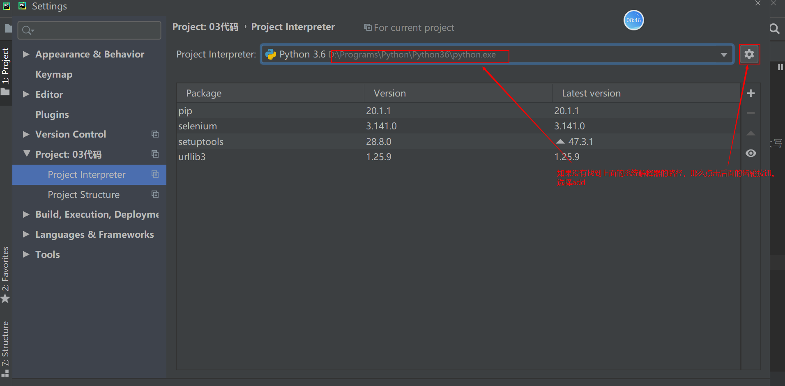
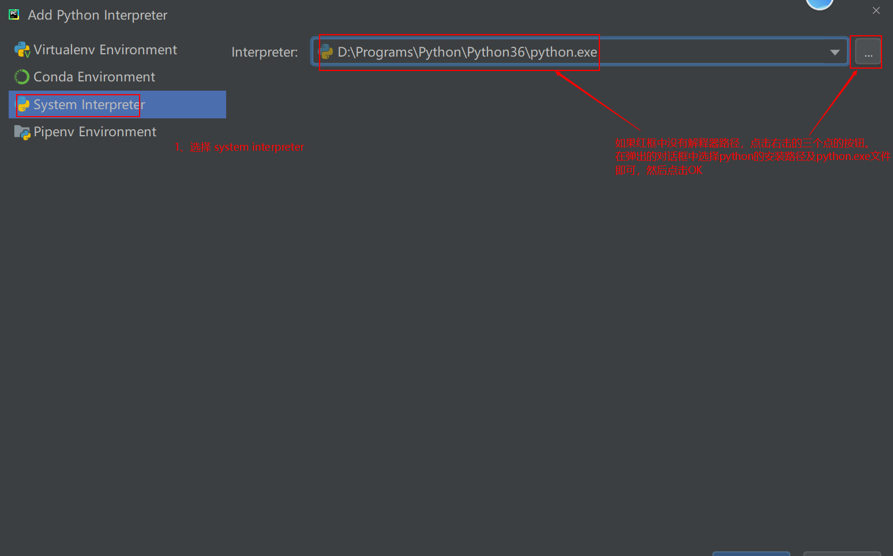

# ui自动化测试day01

<font color=red>课程目标：针对任何的web或者是app系统，能够实现UI的自动化代码的实现。</font>

课程介绍：

1、web自动化(selenium)                3天

2、app专项测试                              2天

3、app自动化测试(appium)          3.5天

4、pytest测试框架                       1 天

5、PO模式                                   1 天

6、数据驱动                              0.5天

7、日志收集                            1天

8、黑马头条综合实战              3天


<font color=red>今日目标：</font>1、要能分析当前项目是否适合做UI自动化

​					2、熟练掌握web自动化测试环境搭建

​					3、撑握元素定位的方法

## 一、UI自动化测试介绍

### 1、什么是自动化测试

概念：由程序代替人工进行系统校验的过程

#### 1.1自动化测试能解决的问题？

* 回归测试       (冒烟测试)
  * 针对之前老的功能进行测试     通过自动化的代码来实现。  
  * 针对上一个版本的问题的回归
* 兼容性测试    web实例化不同的浏览器驱动相当于对不同的浏览器进行操作，从而解决浏览器的兼容性测试问题
* 性能测试          通过一些工具来模拟多个用户实现并发操作
* 提高工作效率，保障产品质量   


#### 1.2自动化测试的优点

* 自动化测试能在较少的时间内执行更多的测试用例  
* 自动化测试能够减少人为的错误   
* 自动化测试能够克服手工的局限性    
* 自动化测试可以重复执行(  注册用户 --已注册)

#### 1.3自动化则试的误区

* 自动化测试可以完全代替手工测试      针针某些功能（图片、页面架构）也是没有办法通过自动化来实现

* 自动化测试一定比手工测试厉害     金融行业更看重业务的积累

* 自动化测试可以发现更多的BUG  是因为自动化测试主要用来做回归测试

* 自动化测试适用于所有的功能     页面的架构、图片、文字，用户体验

  

#### 1.4自动化测试分类

* web自动化测试（本阶段学习内容）  web系统
* 移动app自动化（本阶段学习内容）   app应用
* 接口自动化                                          接口：用来给web或者app前端传输数据用的
* 单元测试-自动化测试                         针对开发人员的代码进行测试。  是由开发自己来做的
* 安全测试（渗透测试）                       针对系统、数据、应用等安全方面进行测试
* 桌面应用自动化测试                         针对windows的桌面应用程序进行自动化测试
* 嵌入式设备自动化测试                     针对嵌入式设备的应用程序进行自动化测试

---


### 2、什么是UI自动化测试

概念：UI(user interface)通过对web应用以及app应用进行自动化测试的过程。

####  <font color=red>2.1 什么项目适合做ui自动化测试？</font>

* 需求变动不频繁      前端代码变更维护不方便
* 项目周期长       项目短，上线之后不需要再去测试
* 项目需要回归测试    不用回归测试的也不需要写自动化

#### 2.2 UI自动化测试在什么阶段开始？

* 手工测试完成之后才做自动化测试，相当于是编写自动化测试代码（通过手工测试能够清楚的知道自动化测试的步骤以及结果）

#### 2.3 UI自动化测试所属分类

* 黑盒测试（功能测试）  UI自动化测试     模拟人工对web以及app页面进行操作的过程
* 白盒测试（单元测试）
* 灰盒测试（接口测试）


1、V1     通过手工测试完成之后，有十个功能。   

2、 针对V1版本的十个功能，进行自动化的代码编写

3、V2  增加了十个功能（总共有20个功能）， v2版本的测试过程当，新增的10个功能手工测试。针对老的10个功能就可以通过自动化来进行回归测试。


---


## 二、web自动化测试基础

### 1、web自动化框架

#### 1.1 主流的web自动化工具

* QTP     由惠普公司开发的一款自动化工具，支持web、桌面的自动化测试。  收费的商用工具。
* selenium     主要用来做web自动化测试的，开源的免费的工具。
* root framework    自动化测试平台。通过它可以实现web自动化测试、接口自动化测试、桌面的自动化测试。


#### 1.2 selenium特点

selenium中文名是硒，就是用来做web自动化测试的

* 开源软件:  源代码开放，但是不一定免费

* 跨平台:    平台指操作系统。   linux、windows、 mac操作系统

* 支持多种浏览器：firefox、chrome、 ie、edge、opera、safari

* 支持多语言：python\java\C#\js\Ruby\PHP

* 成熟稳定功能强大：被大公司使用。google、华为、百度、腾讯

  后续大家在选择自动化工具的时，这几个特点就是选择工具的依据。

#### 1.3selenium发展史

* selenium 1.0

  * selenium IDE 

    * 是firefox的一款插件，通过它可以记录用户的操作并生成对应的自动化脚本。

  * selenium grid     通过grid可以将脚本下发到不同的电脑在不同的浏览器上面执行。

    

    

  * selenium RC

    由JS封装的一个工具，用来对浏览器进行操作的。

* selenium 2.0 

  * selenium 1.0 + webdriver 
  * 针对浏览器的操作都是通过webdriver来实现的。
  * 支持的语言更多

* selenium 3.0 

  * 删除了selenium RC
  * 全面支持java8 
  * 支持macOS，支持safari浏览器
  * 支持微软最新的EDGE浏览器，支持更多的浏览器


---


### <font color=red>2、环境搭建</font>

#### 2.1 selenium工作原理


### 2.2 selenium环境安装

#### 2.1 python开发工具安装(不需要安装，python阶段已经安装过了)

#### 2.2 浏览器安装（浏览器电脑已安装）

<font color=red>需要注意浏览器与浏览器驱动的版本， 不同的浏览器有不同的浏览器驱动，而且不同的版本也有不同的浏览器驱动</font>

#### 2.3selenium工具包安装

* 在线安装方式:   在dos命令行中输入:  pip install selenium

* 离线安装方式:   

  * 需要获取selenium离线安装包并解压
  * 在DOS命令行进入到解压的目录，然后执行python setup.py install 

* pycharm进行安装

  * 在file菜单中选择setting， 然后选择"project- interpreter"
  * 
  * 

* 如何确认selenium安装完成：可以通过pip show selenium进行查看

  

#### 2.4 浏览器驱动安装

* 安装浏览器驱动之前，一定要知道自己浏览器的版本。

  

* 通过https://npm.taobao.org/mirrors/chromedriver/   获取对应的浏览器驱动

* 解压浏览器驱动文件，并将驱动文件复制到python的根目录就行了。

  查看python安装根目录：通过where python命令

  

#### 2.4 入门示例

* 项目创建

  * 项目名称不要 与第三方的模块名同名

  * 文件名称也不要与第三方的模块名或者是类名同名

  * 项目创建时不要使用虚拟环境.

    

```python
# 导入selenium
import time

from selenium import webdriver
# 实例化浏览器驱动对象（创建浏览器驱动对象）
driver = webdriver.Chrome()  # 创建的是谷歌浏览器驱动对象   chrome后面有括号，而且第一个字母要大写
# driver = webdriver.Firefox() # 创建火狐浏览器驱动对象
# 打开百度网站
driver.get("http://www.baidu.com")
# 等待3s（代表业务操作）
time.sleep(3)     # 通过快捷导包的方式导入time模块，  光标要在time后面再按alt+enter
# 退出浏览器驱动(释放系统资源)
driver.quit()
```


---

FAQ：

搭建环境问题总结：

1、安装过程中没有urllib3这个模块

* 如果没有对应的模块，可以通过在线或者离线的方式，安装一下urllib3这个模块

2、chrome浏览器的版本与chrome浏览器驱动的版本不一致

* 先确定浏览器的版本，再下载对应的浏览器驱动版本

3、chrome浏览器安装有问题，移动了chrome浏览器的应用程序目录 从C盘移到E盘

* 不要随便去移动安装程序的位置，因为在注册表中会记录程序安装目录信息。

4、chrome浏览器驱动没有复制到python安装的根目录下

* python安装的根目录不是python安装文件的目录。

5、大家在创建项目时，用的是虚拟环境（包含venv目录），虚拟环境下找不到selenium模块

* 切换虚拟环境到正常的环境



---





---


## 3、元素定位

#### 3.1 如何进行元素定位？

元素： 由标签头+标签尾+标签头和标签尾包括的文本内容

元素的信息就是指元素的标签名以及元素的属性

元素的层级结构就是指元素之间相互嵌套的层级结构

元素定位最终就是通过元素的信息或者元素的层级结构来进行元素定位。

#### 3.2 浏览器开发者工具介绍

* 浏览器开发者工作主要用来查看元素的信息, 同时也可以查看接口的相关信息。
* 浏览器开发者工作不需要安装，浏览器自带.
* 浏览器开发者工具的启动:
  * 直接按F12  不区分浏览器
  * 通过右键的方式来启动浏览器开发者工具 (谷歌浏览器右键选择“检查”, 火狐浏览器右键选择“检查元素”
* 浏览器开发者工具使用
  * 点击 浏览器开发者工具左上角的  元素查看器按钮
  * 再点击想要查看的元素

#### 3.3 元素定位

* id定位
* name定位
* class_name定位
* tag_name定位
* link_text定位
* partail_link_text定位
* xpath定位
* css定位

##### <font color=red>3.3.1 ID定位</font>

* 通过元素的ID属性值来进行元素定位  ，在html标准规范中 ID值是唯一的

  说明： 元素要有ID属性

* 定位方法：  find_element_by_id(id)     # id参数表示的是id的属性值

```python
# 导包selenium
import time

from selenium import webdriver
# 创建浏览器驱动对象
driver = webdriver.Chrome()
# 打开测试网站
driver.get("file:///D:/software/UI%E8%87%AA%E5%8A%A8%E5%8C%96%E6%B5%8B%E8%AF%95%E5%B7%A5%E5%85%B7/web%E8%87%AA%E5%8A%A8%E5%8C%96%E5%B7%A5%E5%85%B7%E9%9B%86%E5%90%88/pagetest/%E6%B3%A8%E5%86%8CA.html")
# 通过ID定位到用户名输入框并在用户名输入框中输入admin
driver.find_element_by_id("userA").send_keys("admin")
# 通过ID定位到密码输入框并在密码输入框中输入123456
driver.find_element_by_id("passwordA").send_keys("123456")
# 等待3s
time.sleep(3)
# 退出浏览器
driver.quit()
```


##### 3.3.2 name定位

* 通过元素的name属性值为进行元素定位   name属性值 在HTML页面中，是可以重复的。

  说明：元素要有name属性

* 定位方法:  find_element_by_name(name)   # name 参数表示的是name的属性值

```python
# 导入selenium
import time

from selenium import webdriver
# 实例化浏览器驱动对象（创建浏览器驱动对象）
driver = webdriver.Chrome()  # 创建的是谷歌浏览器驱动对象   chrome后面有括号，而且第一个字母要大写
# driver = webdriver.Firefox() # 创建火狐浏览器驱动对象
# 打开百度网站
driver.get("file:///D:/software/UI%E8%87%AA%E5%8A%A8%E5%8C%96%E6%B5%8B%E8%AF%95%E5%B7%A5%E5%85%B7/web%E8%87%AA%E5%8A%A8%E5%8C%96%E5%B7%A5%E5%85%B7%E9%9B%86%E5%90%88/pagetest/%E6%B3%A8%E5%86%8CA.html")
# 通过name定位用户名，输入admin
driver.find_element_by_name("userA").send_keys("admin")
# 通过name定位密码， 输入123456
driver.find_element_by_name("passwordA").send_keys("123456")
# 等待3s（代表业务操作）
time.sleep(3)     # 通过快捷导包的方式导入time模块，  光标要在time后面再按alt+enter
# 退出浏览器驱动(释放系统资源)
driver.quit()
```


##### <font color=red>3.3.3 class_name定位</font>

* 通过元素的class属性值进行元素定位    class属性值是可重复的

  说明：元素必须要有class属性

* 定位方法： find_element_by_class_name(class_name)   #  class_name参数表示的是class的其<font color=red>中一个属性值</font>

```python
# 导入selenium
import time

from selenium import webdriver
# 实例化浏览器驱动对象（创建浏览器驱动对象）
driver = webdriver.Chrome()  # 创建的是谷歌浏览器驱动对象   chrome后面有括号，而且第一个字母要大写
# driver = webdriver.Firefox() # 创建火狐浏览器驱动对象
# 打开百度网站
driver.get("file:///D:/software/UI%E8%87%AA%E5%8A%A8%E5%8C%96%E6%B5%8B%E8%AF%95%E5%B7%A5%E5%85%B7/web%E8%87%AA%E5%8A%A8%E5%8C%96%E5%B7%A5%E5%85%B7%E9%9B%86%E5%90%88/pagetest/%E6%B3%A8%E5%86%8CA.html")
# 1).通过class_name定位电话号码A，并输入：18611111111
driver.find_element_by_class_name("telA").send_keys("18611111111")
# 2).通过class_name定位电子邮箱A，并输入：123@qq.com
driver.find_element_by_class_name("dzyxA").send_keys("123@qq.com")
# 等待3s（代表业务操作）
time.sleep(3)     # 通过快捷导包的方式导入time模块，  光标要在time后面再按alt+enter
# 退出浏览器驱动(释放系统资源)
driver.quit()
```


##### 3.3.4 tag_name定位

* 通过元素的标签名称进行定位，   在同一个html页面当中，相同标签元素会有很多。

  这种定位元素的方式不建议大家在工作当中使用。

* 定位方法:  find_element_by_tag_name(tag_name)  # tag_name表示的是元素的标签名称。

  如果有重复的元素，定位到的元素默认都是第一个元素

```python
# 导入selenium
import time

from selenium import webdriver
# 实例化浏览器驱动对象（创建浏览器驱动对象）
driver = webdriver.Chrome()  # 创建的是谷歌浏览器驱动对象   chrome后面有括号，而且第一个字母要大写
# driver = webdriver.Firefox() # 创建火狐浏览器驱动对象
# 打开百度网站
driver.get("file:///D:/software/UI%E8%87%AA%E5%8A%A8%E5%8C%96%E6%B5%8B%E8%AF%95%E5%B7%A5%E5%85%B7/web%E8%87%AA%E5%8A%A8%E5%8C%96%E5%B7%A5%E5%85%B7%E9%9B%86%E5%90%88/pagetest/%E6%B3%A8%E5%86%8CA.html")
# 1).使用tag_name定位用户名输入框，并输入：admin
driver.find_element_by_tag_name("input").send_keys("admin")
# 等待3s（代表业务操作）
time.sleep(3)     # 通过快捷导包的方式导入time模块，  光标要在time后面再按alt+enter
# 退出浏览器驱动(释放系统资源)
driver.quit()
```


##### 3.3.5  link_text定位

* 通过超链接的全部文本信息进行元素定位 ,主要用来定位a标签
* 定位方法：  find_element_by_link_text(link_text)   #  link_text参数代表的是a标签的<font color=red>全部</font>文本内容。

```python
# 导入selenium
import time

from selenium import webdriver
# 实例化浏览器驱动对象（创建浏览器驱动对象）
driver = webdriver.Chrome()  # 创建的是谷歌浏览器驱动对象   chrome后面有括号，而且第一个字母要大写
# driver = webdriver.Firefox() # 创建火狐浏览器驱动对象
# 打开百度网站
driver.get("file:///D:/software/UI%E8%87%AA%E5%8A%A8%E5%8C%96%E6%B5%8B%E8%AF%95%E5%B7%A5%E5%85%B7/web%E8%87%AA%E5%8A%A8%E5%8C%96%E5%B7%A5%E5%85%B7%E9%9B%86%E5%90%88/pagetest/%E6%B3%A8%E5%86%8CA.html")
# 通过linu_text定位到新浪网站并点击
# driver.find_element_by_link_text("新浪").click()
driver.find_element_by_link_text("访问 新浪 网站").click()
# 等待3s（代表业务操作）
time.sleep(3)     # 通过快捷导包的方式导入time模块，  光标要在time后面再按alt+enter
# 退出浏览器驱动(释放系统资源)
driver.quit()
```


##### <font color=red>3.3.6 partial_link_text定位</font>

* 通过超链接的局部文本信息进行元素定位，主要用来定位a标签 
* 定位方法：find_element_by_partial_link_text(partial_link_text)    #  partial_link_text表示的是a标签 的<font color=red>局部</font>文本内容

```python
# 导入selenium
import time

from selenium import webdriver
# 实例化浏览器驱动对象（创建浏览器驱动对象）
driver = webdriver.Chrome()  # 创建的是谷歌浏览器驱动对象   chrome后面有括号，而且第一个字母要大写
# driver = webdriver.Firefox() # 创建火狐浏览器驱动对象
# 打开百度网站
driver.get("file:///D:/software/UI%E8%87%AA%E5%8A%A8%E5%8C%96%E6%B5%8B%E8%AF%95%E5%B7%A5%E5%85%B7/web%E8%87%AA%E5%8A%A8%E5%8C%96%E5%B7%A5%E5%85%B7%E9%9B%86%E5%90%88/pagetest/%E6%B3%A8%E5%86%8CA.html")
# 通过partial_link_text定位到新浪网站并点击
driver.find_element_by_partial_link_text("访问 新浪 网站").click()
# 等待3s（代表业务操作）
time.sleep(3)     # 通过快捷导包的方式导入time模块，  光标要在time后面再按alt+enter
# 退出浏览器驱动(释放系统资源)
driver.quit()
```


##### 3.3.7 定位一组元素

* 定位一组元素的方法:

  find_elements_by_id(id)    

  find_elements_by_tag_name(tag_name)

* 定位一组元素返回的值是一个列表

* 可以通过下标来使用列表中的元素

* 下标是从0开始。

```python
# 导入selenium
import time

from selenium import webdriver
# 实例化浏览器驱动对象（创建浏览器驱动对象）
driver = webdriver.Chrome()  # 创建的是谷歌浏览器驱动对象   chrome后面有括号，而且第一个字母要大写
# driver = webdriver.Firefox() # 创建火狐浏览器驱动对象
# 打开百度网站
driver.get("file:///D:/software/UI%E8%87%AA%E5%8A%A8%E5%8C%96%E6%B5%8B%E8%AF%95%E5%B7%A5%E5%85%B7/web%E8%87%AA%E5%8A%A8%E5%8C%96%E5%B7%A5%E5%85%B7%E9%9B%86%E5%90%88/pagetest/%E6%B3%A8%E5%86%8CA.html")
# 使用tag_name定位密码输入框(第二个input标签)，并输入：123456
elements = driver.find_elements_by_tag_name("input")
elements[2].send_keys("123456")
# 等待3s（代表业务操作）
time.sleep(3)     # 通过快捷导包的方式导入time模块，  光标要在time后面再按alt+enter
# 退出浏览器驱动(释放系统资源)
driver.quit()
```

