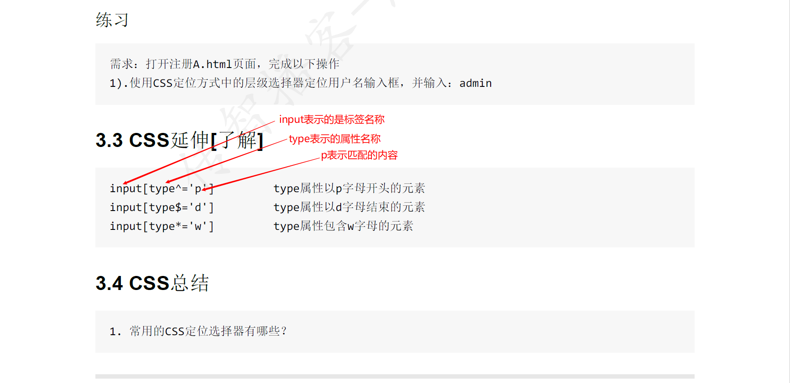

# ui自动化测试day02(web自动化)

<font color=red>今日目标：</font>1、掌握xpath和CSS元素定位方式

​					2、掌握元素及浏览器操作

## 一、元素定位Xpath、CSS

？为什么要使用Xpath或者CSS

因为在页面当中，有一些元素无法通过元素的信息精准的定位到，所以需要借助于Xpath和CSS

### 1 xpath元素定位

#### 1.1 什么是xpath

总结：xpath是用来在xml文件中进行元素定位的标记语言，html是一种特殊的xml，所以xpath也可以用在html中

#### <font color=red>1.2 Xpath定位策略</font>

* 路径定位
* 属性定位
* 属性与逻辑结合
* 属性与层级结合

定位方法:  find_element_by_xpath(xpath)   # xpath表达式

按Ctrl+F 可以在搜索框对xpath和css表达式进行校验

##### 1.2.1 路径定位

* 绝对路径   表达式是以  /html开头，元素的层级之间是以  / 分隔

  相同层级的元素可以使用下标，下标是从1开始.

  需要列出元素所经过的所有层级元素  ,  工作当中， 一般不使用绝对路径

  例：/html/body/div/fieldset/form/p[1]/input

  

* 相对路径   匹配任意层级的元素，  是以  //tag_name或者//* 开头

  也可以使用下标，下标是从1开始。

  例子：//p[5]/button

```python
# 导包
import time
from selenium import webdriver
# 创建浏览器驱动对象
driver = webdriver.Chrome()
# 打开测试网站
driver.get("file:///D:/software/UI%E8%87%AA%E5%8A%A8%E5%8C%96%E6%B5%8B%E8%AF%95%E5%B7%A5%E5%85%B7/web%E8%87%AA%E5%8A%A8%E5%8C%96%E5%B7%A5%E5%85%B7%E9%9B%86%E5%90%88/pagetest/%E6%B3%A8%E5%86%8CA.html")
# 通过xpath的绝对路径定位用户名输入框并输入admin
driver.find_element_by_xpath("/html/body/div/fieldset/form/p/input").send_keys("admin")
# 等待3S
time.sleep(3)
# 通过xapth的相对路径定位密码输入框并输入123
driver.find_element_by_xpath("//form/p[2]/input").send_keys("123")
# 等待3S
time.sleep(3)
# 退出
driver.quit()
```


##### 1.2.2 元素属性定位

* //\**或者//tag_name       //*\*[@attribute='value']   # attribute表示的是元素的属性名，value表示的是元素对应属性值

<font color=red>如果使用class的属性进行元素定位，需要用到class里面所有的值</font>

```python
# 导包
import time
from selenium import webdriver
# 创建浏览器驱动对象
driver = webdriver.Chrome()
# 打开测试网站
driver.get("file:///D:/software/UI%E8%87%AA%E5%8A%A8%E5%8C%96%E6%B5%8B%E8%AF%95%E5%B7%A5%E5%85%B7/web%E8%87%AA%E5%8A%A8%E5%8C%96%E5%B7%A5%E5%85%B7%E9%9B%86%E5%90%88/pagetest/%E6%B3%A8%E5%86%8CA.html")

# 利用元素的属性信息精确定位用户名输入框，并输入：admin
driver.find_element_by_xpath("//*[@placeholder='请输入用户名']").send_keys("admin")
# 等待3S
time.sleep(3)
# 退出
driver.quit()

```


##### 1.2.3 属性与逻辑结合定位

* //* 或者//tag_name 开头  //*[@attribute1='value1' and @attribute2='value2']

```python
# 导包
import time
from selenium import webdriver
# 创建浏览器驱动对象
driver = webdriver.Chrome()
# 打开测试网站
driver.get("file:///D:/software/UI%E8%87%AA%E5%8A%A8%E5%8C%96%E6%B5%8B%E8%AF%95%E5%B7%A5%E5%85%B7/web%E8%87%AA%E5%8A%A8%E5%8C%96%E5%B7%A5%E5%85%B7%E9%9B%86%E5%90%88/pagetest/%E6%B3%A8%E5%86%8CA.html")

# 使用属性与逻辑结合定位策略，在test1对应的输入框里输入：admin
driver.find_element_by_xpath("//input[@name='user' and @class='login']").send_keys("admin")
# 等待3S
time.sleep(3)
# 退出
driver.quit()
```


##### 1.2.4 属性与层级结合定位

* 是以//*或者//tag_name开头    //p[@id='pa']/input

  在任意层给当中，都可以结合属性来使用

  ```python
  # 导包
  import time
  from selenium import webdriver
  # 创建浏览器驱动对象
  driver = webdriver.Chrome()
  # 打开测试网站
  driver.get("file:///D:/software/UI%E8%87%AA%E5%8A%A8%E5%8C%96%E6%B5%8B%E8%AF%95%E5%B7%A5%E5%85%B7/web%E8%87%AA%E5%8A%A8%E5%8C%96%E5%B7%A5%E5%85%B7%E9%9B%86%E5%90%88/pagetest/%E6%B3%A8%E5%86%8CA.html")
  
  # 使用层级与属性结合定位策略，在test1对应的输入框里输入：admin
  driver.find_element_by_xpath("//p[@id='p1']/input").send_keys("admin")
  # 等待3S
  time.sleep(3)
  # 退出
  driver.quit()
  ```

  

##### 1.2.5 XPATH扩展

* //*[text() = 'value']   value表示的是要定位的元素的全部文本内容.   

* //*[contains(@attribute,'value')]   attribute表示的属性名称, value表示的是字符串

  要定位的元素中，attribute属性的属性值包含了value的内容。

* //*[starts-with(@attribute,'value')]      attribute表示的属性名称, value表示的是字符串

  要定位的元素，attribute属性的属性值是以value开头

---

### 2、CSS定位

#### 2.1 什么是CSS

总结：css是可以用来在selenium中定位元素的

CSS定位元素的方法： find_element_by_css_selector(css_selector)   # css_selector表示的是CSS选择器表达式

#### <font color=red>2.2 CSS定位策略</font>

* id选择器
* class选择器
* 元素选择器
* 属性选择器
* 层级选择器

##### 2.2.1 id选择器

* 表达式： #id    #  表示通过元素的ID属性进行元素选择    id  表示的的id属性的属性值

##### 2.2.2 class选择器

* 表达式： .class   # .表示通过元素的class属性进行元素选择， class表示的class属性的<font color=red>其中一个属性值</font>

```python
# 导包
import time
from selenium import webdriver
# 创建浏览器驱动对象
driver = webdriver.Chrome()
# 打开测试网站
driver.get("file:///D:/software/UI%E8%87%AA%E5%8A%A8%E5%8C%96%E6%B5%8B%E8%AF%95%E5%B7%A5%E5%85%B7/web%E8%87%AA%E5%8A%A8%E5%8C%96%E5%B7%A5%E5%85%B7%E9%9B%86%E5%90%88/pagetest/%E6%B3%A8%E5%86%8CA.html")
# 通过css的id选择器定位用户名输入框，输入admin
driver.find_element_by_css_selector("#userA").send_keys("admin")
# 通过css的class选择器定位电子邮箱输入框，输入123@qq.com
driver.find_element_by_css_selector(".emailA").send_keys("123@qq.com")
# 等待3S
time.sleep(3)
# 退出
driver.quit()
```


##### 2.2.3 元素选择器

* 就是通过元素标签名称来选择元素 。表达式： tag_name   不推荐使用

##### 2.2.4 属性选择器

* 就是通过元素的属性来选择元素。  表达式：[attribute='value']  #attribute 表示的是属性名称，value表示的是属性值 

  <font color=red>如果使用的是class属性，需要带上class的全部属性值</font>

```python
# 导包
import time
from selenium import webdriver
# 创建浏览器驱动对象
driver = webdriver.Chrome()
# 打开测试网站
driver.get("file:///D:/software/UI%E8%87%AA%E5%8A%A8%E5%8C%96%E6%B5%8B%E8%AF%95%E5%B7%A5%E5%85%B7/web%E8%87%AA%E5%8A%A8%E5%8C%96%E5%B7%A5%E5%85%B7%E9%9B%86%E5%90%88/pagetest/%E6%B3%A8%E5%86%8CA.html")

# 通过css的元素选择器定位用户名输入框，输入admin
driver.find_element_by_css_selector("input").send_keys("admin")
# 通过css的属性选择器定位电子邮箱输入框，输入123@qq.com
driver.find_element_by_css_selector("[class='emailA dzyxA']").send_keys("123@qq.com")
# 等待3S
time.sleep(3)
# 退出
driver.quit()
```


##### 2.2.5层级选择器

* 父子层级关系选择 器 
  * 表达式： element1>element2      通过element1来找element2，<font color=red>并且element2是element1的直接子元素</font>

* 隔代层级关系选择器
  * 表达式： element1 element2    通过element1来找element2， <font color=red>并且element2是element1的后代元素</font>

```python
# 导包
import time
from selenium import webdriver
# 创建浏览器驱动对象
driver = webdriver.Chrome()
# 打开测试网站
driver.get("file:///D:/software/UI%E8%87%AA%E5%8A%A8%E5%8C%96%E6%B5%8B%E8%AF%95%E5%B7%A5%E5%85%B7/web%E8%87%AA%E5%8A%A8%E5%8C%96%E5%B7%A5%E5%85%B7%E9%9B%86%E5%90%88/pagetest/%E6%B3%A8%E5%86%8CA.html")

# 通过css的层级选择器定位用户名输入框输入admin
driver.find_element_by_css_selector(".zc #userA").send_keys("admin")
# 等待3S
time.sleep(3)
# 退出
driver.quit()
```


##### 2.2.6CSS扩展

* input[type^='value']   input表示标签名称，type表示属性名称， value表示的文本内容

  查找元素type属性值是以value开头的元素

* input[type$='value']   input表示标签名称，type表示属性名称， value表示的文本内容

  查找元素type属性值以value结尾的元素

* input[type*='value']    input表示标签名称，type表示属性名称， value表示的文本内容

  查找元素type属性值包含value的元素



### 3、元素定位总结


### 4、定位元素的另外一种写法

* find_element(By.ID, id)   需要导入By类。

---


## 二、元素操作及浏览器操作方法

### 1、元素操作

* 点击操作    element.click()      element表示的是元素对象
* 输入操作   element.send_keys("value")    element表示的是元素对象， value表示的是要输入的内容
* 清除操作   element.clear()     element表示的是元素对象. 将输入框里面的内容全部清除。

```python
# 导包
import time
from selenium import webdriver
# 创建浏览器驱动对象
from selenium.webdriver.common.by import By

driver = webdriver.Chrome()
# 打开测试网站
driver.get("file:///D:/software/UI%E8%87%AA%E5%8A%A8%E5%8C%96%E6%B5%8B%E8%AF%95%E5%B7%A5%E5%85%B7/web%E8%87%AA%E5%8A%A8%E5%8C%96%E5%B7%A5%E5%85%B7%E9%9B%86%E5%90%88/pagetest/%E6%B3%A8%E5%86%8CA.html")
# 1).通过脚本执行输入用户名：admin；密码：123456；电话号码：18611111111；电子邮件：123@qq.com
driver.find_element(By.ID, "userA").send_keys("admin")
driver.find_element(By.ID, "passwordA").send_keys("123456")
driver.find_element(By.CSS_SELECTOR, ".telA").send_keys("18611111111")
driver.find_element(By.XPATH, "//*[@class='emailA dzyxA']").send_keys("123@qq.com")
# 2).间隔3秒，修改电话号码为：18600000000
time.sleep(3)
driver.find_element(By.CSS_SELECTOR, ".telA").clear()
time.sleep(3)
driver.find_element(By.CSS_SELECTOR, ".telA").send_keys("18600000000")

# 等待3S
time.sleep(3)
# 退出
driver.quit()

```


### 2、浏览器操作

* 浏览器常用操作方法

1. <font color=red>maximize_window() 最大化浏览器窗口 --> 模拟浏览器最大化按钮</font>  实例化浏览器驱动之后，就可以调用窗口最大化的方法

2. set_window_size(width, height) 设置浏览器窗口大小 --> 设置浏览器宽、高(像素点)

3. set_window_position(x, y) 设置浏览器窗口位置 --> 设置浏览器位置

   x,y是一个坐标点，通过此坐标点确定浏览器最左上角的位置，以此确定浏览器在屏幕上的位置。

   x, y不能超过屏幕的分辨率大小

```
# 导包
import time
from selenium import webdriver
# 创建浏览器驱动对象
from selenium.webdriver.common.by import By

driver = webdriver.Chrome()
# 窗口最大化
driver.maximize_window()
# 打开测试网站
driver.get("file:///D:/software/UI%E8%87%AA%E5%8A%A8%E5%8C%96%E6%B5%8B%E8%AF%95%E5%B7%A5%E5%85%B7/web%E8%87%AA%E5%8A%A8%E5%8C%96%E5%B7%A5%E5%85%B7%E9%9B%86%E5%90%88/pagetest/%E6%B3%A8%E5%86%8CA.html")
time.sleep(3)
# 设置窗口大小
driver.set_window_size(500, 500)
time.sleep(3)
# 设置窗口位置
driver.set_window_position(300, 300)

# 等待3S
time.sleep(3)
# 退出
driver.quit()
```


4. back() 后退 --> 模拟浏览器后退按钮
5. forward() 前进 --> 模拟浏览器前进按钮
6. refresh() 刷新 --> 模拟浏览器F5刷新
7. close() 关闭当前窗口 --> 模拟点击浏览器关闭按钮
8. quit() 关闭浏览器驱动对象 --> 关闭所有程序启动的窗口

```python
import time

from selenium import webdriver
# 创建浏览器驱动对象
from selenium.webdriver.common.by import By

driver = webdriver.Chrome()
# 窗口最大化
driver.maximize_window()
# 打开测试网站
driver.get("file:///D:/software/UI%E8%87%AA%E5%8A%A8%E5%8C%96%E6%B5%8B%E8%AF%95%E5%B7%A5%E5%85%B7/web%E8%87%AA%E5%8A%A8%E5%8C%96%E5%B7%A5%E5%85%B7%E9%9B%86%E5%90%88/pagetest/%E6%B3%A8%E5%86%8CA.html")
# 在注册A页面中点击 新浪网站
driver.find_element(By.CSS_SELECTOR, "#linkto>a").click()
# 调用浏览器的后退
time.sleep(3)
driver.back()
# 再调用浏览器的前进
time.sleep(3)
driver.forward()
# 再调用浏览器的后退
time.sleep(3)
driver.back()
# 点击击访问新浪网站
driver.find_element(By.XPATH, "//*[text()='访问 新浪 网站']").click()
time.sleep(3)
# 再调用关闭按钮
driver.close()
time.sleep(3)
# 等待3S
time.sleep(3)
# 退出
driver.quit()
```

9. title 获取页面title
10. current_url 获取当前页面URL

```python
import time

from selenium import webdriver
# 创建浏览器驱动对象
from selenium.webdriver.common.by import By

driver = webdriver.Chrome()
# 窗口最大化
driver.maximize_window()
# 打开测试网站
driver.get("file:///D:/software/UI%E8%87%AA%E5%8A%A8%E5%8C%96%E6%B5%8B%E8%AF%95%E5%B7%A5%E5%85%B7/web%E8%87%AA%E5%8A%A8%E5%8C%96%E5%B7%A5%E5%85%B7%E9%9B%86%E5%90%88/pagetest/%E6%B3%A8%E5%86%8CA.html")

# 获取页面标题
print(driver.title)

# 获取页面的URL地址
print(driver.current_url)

# 等待3S
time.sleep(3)
# 退出
driver.quit()
```


### 3、获取元素信息


