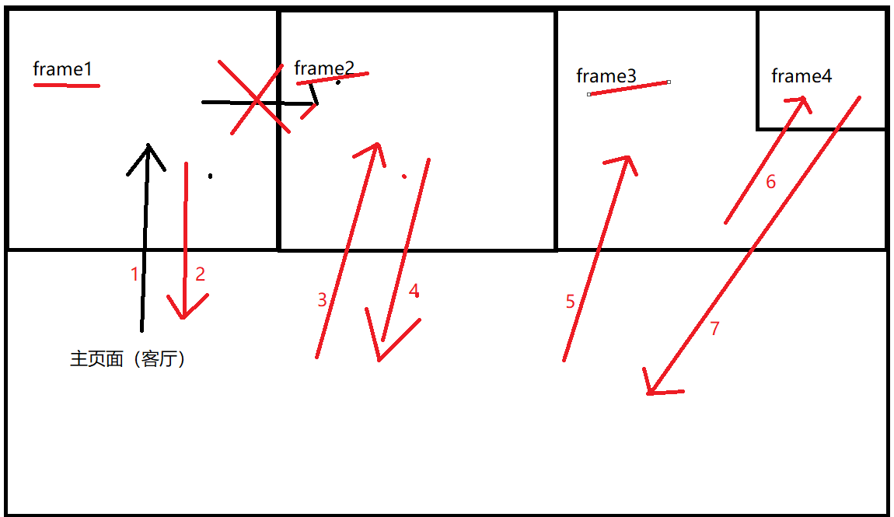

# ui自动化测试day04

##  一、frame切换、多窗口切换

### 1、frame切换

* frame切换实现方法：
  * driver.switch_to.frame(frame_reference) --> 切换到指定frame的方法
     frame_reference：可以为frame框架的name、id或者定位到的frame元素
  * . driver.switch_to.default_content() --> 恢复默认页面方法

frame切换原理总结:

* 针对同一层级的frame，如果要进行切换的话，需要切回到默认首页
* 针对所要进入的frame， 有多少个层级，就需要切换几次
* 不管当前在哪个层级，如果要回到默认首页，只需要调用一次回到默认首页的方法(driver.switch_to.default_content())



```python
import time

from selenium import webdriver
from selenium.webdriver.common.by import By

driver = webdriver.Chrome()
driver.maximize_window()
driver.implicitly_wait(10)

driver.get("file:///D:/software/UI%E8%87%AA%E5%8A%A8%E5%8C%96%E6%B5%8B%E8%AF%95%E5%B7%A5%E5%85%B7/web%E8%87%AA%E5%8A%A8%E5%8C%96%E5%B7%A5%E5%85%B7%E9%9B%86%E5%90%88/pagetest/%E6%B3%A8%E5%86%8C%E5%AE%9E%E4%BE%8B.html")
# 针对主页的用户名输入admin
driver.find_element(By.ID, "userA").send_keys("admin")

# 针对注册用户a输入用户名adminA
driver.switch_to.frame(driver.find_element(By.ID, "idframe1"))
driver.find_element(By.ID, "AuserA").send_keys("adminA")

# 回到默认首页面
driver.switch_to.default_content()

# 针对注册用户B输入用户名adminB
ele_frame = driver.find_element(By.ID, "idframe2")
driver.switch_to.frame(ele_frame)
driver.find_element(By.ID, "BuserA").send_keys("adminB")

time.sleep(3)


driver.quit()
```


### 2、多窗口切换

* 窗口操作的三种方法

  获取当前窗口句柄：  driver.current_window_handle

  获取所有窗口句柄:     driver.window_handles            返回的是一个列表

  切换窗口句柄:    driver.switch_to.window(window_handle)  window_handle表示的是要切换到哪个窗口句柄

  窗口句柄：由操作系统生成的一串唯 一识别码，是一串字符。

  ```
  import time
  
  from selenium import webdriver
  from selenium.webdriver.common.by import By
  
  driver = webdriver.Chrome()
  driver.maximize_window()
  driver.implicitly_wait(10)
  
  driver.get("file:///D:/software/UI%E8%87%AA%E5%8A%A8%E5%8C%96%E6%B5%8B%E8%AF%95%E5%B7%A5%E5%85%B7/web%E8%87%AA%E5%8A%A8%E5%8C%96%E5%B7%A5%E5%85%B7%E9%9B%86%E5%90%88/pagetest/page/%E6%B3%A8%E5%86%8C%E5%AE%9E%E4%BE%8B.html")
  
  # 在注册实例页面中点击  注册A页面
  driver.find_element(By.ID, "ZCA").click()
  time.sleep(1)
  # 获取当前窗口句柄信息
  print(driver.current_window_handle)
  
  # 获取所有窗口句柄
  windows = driver.window_handles
  
  # 切换窗口句柄
  driver.switch_to.window(windows[-1])
  
  # 在注册A页中输入用户名和密码
  driver.find_element(By.ID, "userA").send_keys("admin")
  
  
  time.sleep(3)
  
  driver.quit()
  ```

窗口切换与frame切换的区别：  窗口切换是指针对浏览器窗口，  frame切换针对的是同一个窗口中的html代码。

窗口相当于是同一栋楼的一套房子，frame相当于一套房子中的某一间房子


---


## 二、窗口截图、验证码处理

### 1、窗口截图

* 目的：当程序运行出错时，通过截图文件能够更直观的知道具体是哪个操作步骤出错

* 窗口截图就是指把出错的图片保存到指定位置。

  载图方法：  driver.get_screenshot_as_file(filename)

  * 截图的文件名必须是以PNG结尾
  * filename中的文件目录必须手动创建

```python
import time

from selenium import webdriver
from selenium.webdriver.common.by import By

driver = webdriver.Chrome()
driver.maximize_window()
driver.implicitly_wait(10)

driver.get("file:///D:/software/UI%E8%87%AA%E5%8A%A8%E5%8C%96%E6%B5%8B%E8%AF%95%E5%B7%A5%E5%85%B7/web%E8%87%AA%E5%8A%A8%E5%8C%96%E5%B7%A5%E5%85%B7%E9%9B%86%E5%90%88/pagetest/%E6%B3%A8%E5%86%8CA.html")
try:
    # 输入用户名
    driver.find_element(By.ID, "userA").send_keys("admin")

# 输入密码
    driver.find_element(By.ID, "padd").send_keys("1234")
except Exception as e:
    driver.get_screenshot_as_file("img/error.png")
    raise e

time.sleep(3)
driver.quit()

```


---

### 2、验证码处理


#### 2.1 什么是验证码？

验证码就是指一种随机生成的信息（数字、字母、汉字、图片、算术题）等为了防止恶意的请求行为，增加应用的
安全性。

自动化过程中也是需要进行注册或者登陆的操作，所以需要处理验证码。

#### 2.2 验证码处理方式

* 去掉验证码     由开发操作 , 用在测试环境
* 设置万能验证码   由开发 操作， 一般也只使用在测试环境，
* 验证码识别技术     由于技术难度高，识别率很难达到100%， 一般不建议使用

* 记录COOKIE   通过记录cookie来跳过登陆的操作。

#### 2.3 Cookie原理

* 原理：
1. Cookie是由Web服务器生成的，并且保存在用户浏览器上的小文本文件，它可以包含用户相关的信息。
2. Cookie数据格式：键值对组成（python中的字典）
3. Cookie产生：客户端请求服务器，如果服务器需要记录该用户状态，就向客户端浏览器颁发一个Cookie
数据
4. Cookie使用：当浏览器再次请求该网站时，浏览器把请求的数据和Cookie数据一同提交给服务器，服务
器检
查该Cookie，以此来辨认用户状态。

#### 2.4 selenium操作cookie

* driver.get_cookie(name)  获取指名称的cookie信息  返回的是一个字典
* driver.get_cookies()    获取的是所有cookie的信息，  返回的是一个列表
* driver.add_cookie(dict_cookie)  往浏览器驱动增加cookie， dict_cookie是一字典

注意事项：如何确认哪个cookie是用来控制用户权限的

* 可以问开发同学
* 针对登陆的前后的cookie进行对比，比登陆之前多的cookie都可以用来使用控制用户权限。
* 手动登陆之后不能退出，退出之后就相当于cookie无效了。

---

## 扩展知识点

### 1、解决注册用例可重复执行的问题？

* 通过python代码编写一个生成手机号码的函数     (会生成比较多的垃圾数据)
*  在注册之前，备份一处数据库（备份只需要做一次），执行注册的用例，每次执先完用例之后，再去恢复数据库（如果数据库数据量大，那么恢复的时间会比较久，效率比较低）
* 通过python脚本直接在数据库删除新注的用户（要熟悉底层的数据库业务，要知道注册用户是存在哪些表中）

```python
import random
import time

from selenium import webdriver
from selenium.webdriver.common.by import By


# 定义获取手机号码的函数名
def get_mobile():
    mobiles = ['130', '131', '134', '135']  # 确定手机号码所需要格式
    number = str(int(time.time()))[2:]  # 通过时间戳获取手机号码的后8位数(一定不会重复)
    mobile = random.choice(mobiles)+number  # 把手机号码格式的三位数与后8位数相加
    return mobile


driver = webdriver.Chrome()
driver.maximize_window()
driver.implicitly_wait(10)

driver.get("http://tpshop-test.itheima.net/Home/user/reg.html")

driver.find_element(By.ID,  "username").send_keys(get_mobile())
driver.find_element(By.NAME,  "verify_code").send_keys("8888")
driver.find_element(By.ID, "password").send_keys("123456")
driver.find_element(By.ID, "password2").send_keys("123456")
driver.find_element(By.CSS_SELECTOR, ".J_btn_agree").click()
time.sleep(10)
driver.quit()
```


### 2、文件上传

* 安装这个工具。autoit V3工具是用来查看windows窗口信息及控件信息的
* 安装pyautoit模块。
  * 解压pyautoit-master.zip文件
  * 在windows窗口进入到解压目录之后，再在地址栏输入cmd
  * 执行以下命令  python setup.py install

```python
import time

import autoit
from selenium import webdriver
from selenium.webdriver import ActionChains
from selenium.webdriver.common.by import By

driver = webdriver.Chrome()
driver.maximize_window()
driver.implicitly_wait(10)
driver.get("http://www.baidu.com")
# 点击百度上面的照相机按钮
driver.find_element(By.CSS_SELECTOR, ".soutu-btn").click()
# 点击选择文件
ele = driver.find_element(By.CSS_SELECTOR, ".upload-pic")
# 定义鼠标对象
action = ActionChains(driver)
# 调用鼠标事件
action.click(ele)
# 执行鼠标事件方法
action.perform()
time.sleep(2)
#  针对windows操作
# 通过autoit来获取弹出的窗口
autoit.win_wait_active("打开", 3)  # 3表示的是时间，秒为单位

# 在文件选择输入框中输入文件的地址及文件名称
autoit.control_send("打开", "Edit1", r"C:\Users\LiaoFei\Pictures\Saved Pictures\333.jpg")

# 在弹出窗口中点击打开按钮
autoit.control_click("打开", "Button1")

time.sleep(10)
driver.quit()
```


---


# app测试

学习目标：

* 掌握基于敏捷开发的测试流程
* 掌握app的测试要点，熟悉各种专项测试的关注点
* 熟悉GT工具的使用，能使用GT工具进行对应的性能测试

## 一、app测试基础理论

### 1、app的应用架构

* app属于CS架构，是通过HTTP协义来传输数据的。 通过json的格式来传送数据的。

---

### 2、app项目环境及发布平台

#### 2.1 app项目环境介绍(后端服务器环境)

* 开发环境         是给开发人员进行代码联调的。给开发进行自测的。
* 测试环境         用来给测试人员进行测试用的。测试环境也可能分为手工测试环境和自动化测试环境的。
* 预发布环境    当项目要上线时，做最后一轮的验收测试时，预发布环境的数据跟生产环境的数据是一致的。
* 镜像环境        当生产环境出现问题时，把生产环镜的相关数据以及代码全部拉到镜像环境，复现生产上的问题，然后由测试人员协助开发人员复现问题，然后由开发人员去进行问题的定位和分析。
* 生产环境       给用户或者是客户使用的环境 (生产环境测试人员不能随便操作，由运维人员管理的)


#### 2.2 灰度发布介绍

所谓灰度发布，就是指在发布生产环境过程当，先发布其中几台服务器，如果这几台服务器功能运行一段时间后能够正常，那么再把其他未升级或者未发布的服务器进行生产环境发布，那如果说先发布的几台服务器运行有问题，那么就需要回滚到原来的版本。


#### 2.3app项目发布平台

* android   安卓app文件后缀名是  apk

* IOS    苹果app文件后缀名是ipa

* 获取app安装包文件的方式一:

  * anroid  可以直接找开发给对应apk安装包
  * IOS  直接将手机给开发人员，让开发人员安装对应的ipa包

* 获取app安装包文件的方式二:

  * 可以借助内测试平台

    国内用的内测平台是蒲公英， 国外用的是fir.im   

  * 测试包生成之后会上传到蒲公英平台，然后生成一个链接地址（二维码），可以直接通过二维码或者链接地址下载对应的测试包

* 生产app安装包的获取

  anroid app安装包    豌豆荚、应用宝、360手机助手、各类手机品牌商城(上传app安装包需要审核 2-3 )

  ios   app安装包    appstore  itools（IOS时间更长，一周左右）

---

#### 


