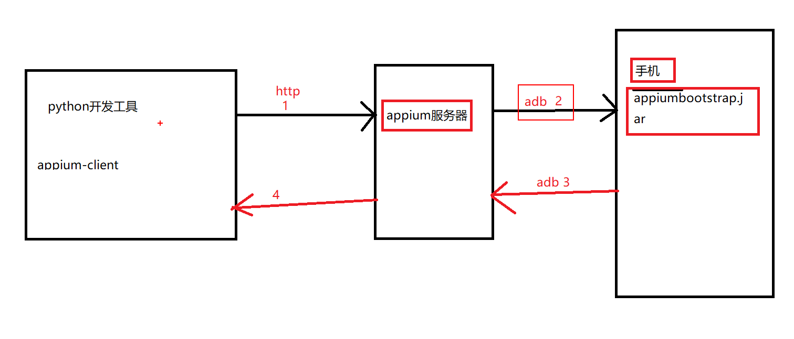
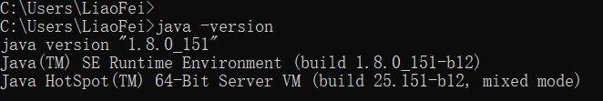
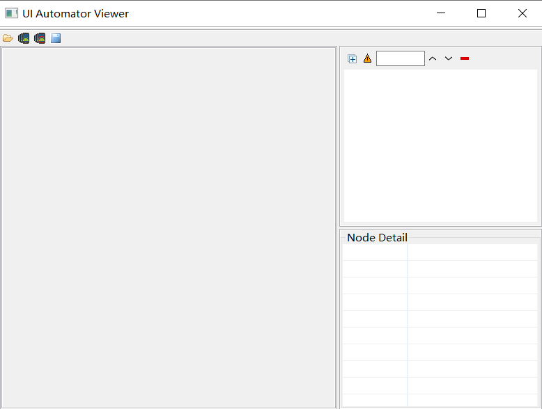
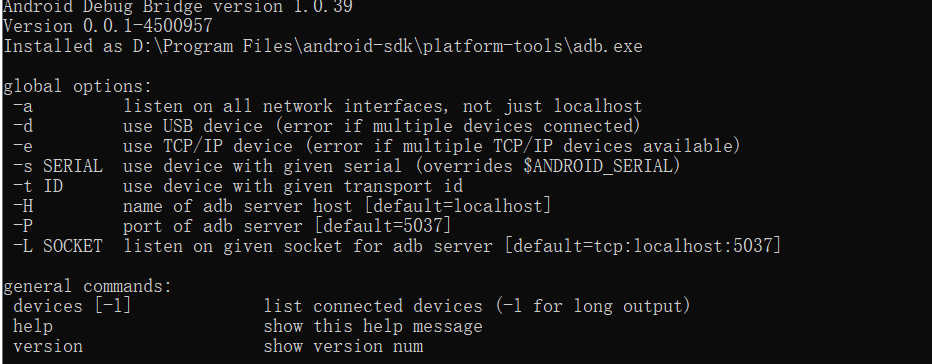
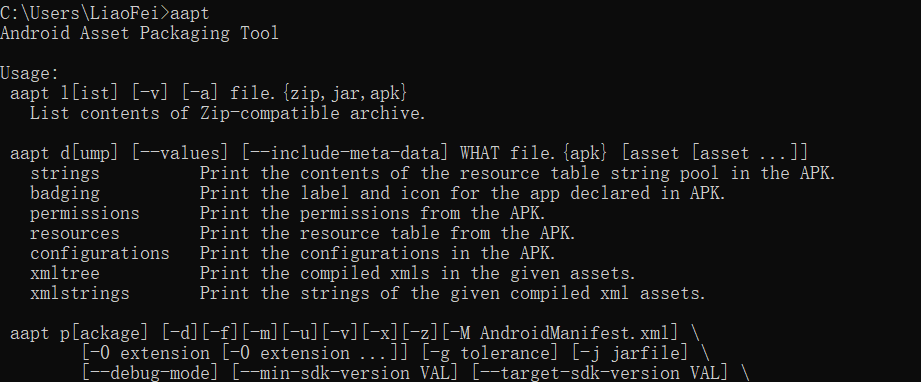
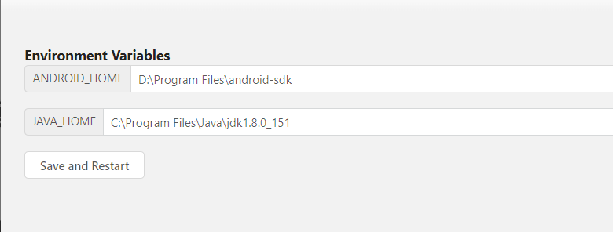
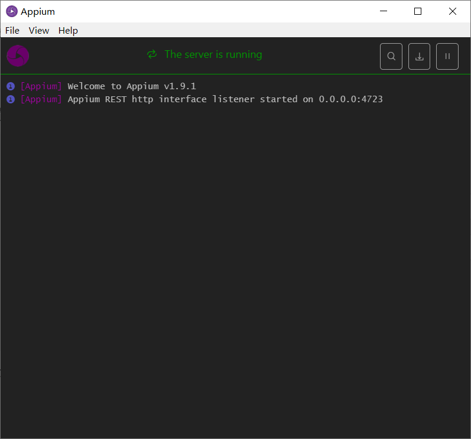
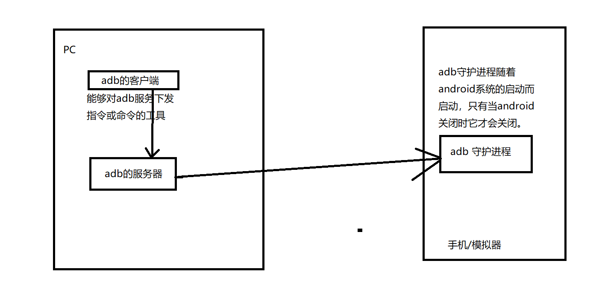
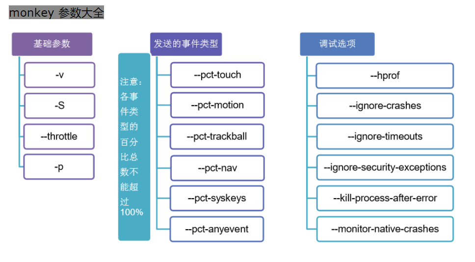

# ui自动化测试day06（app自动化）

#### 3.5 流畅度测试

GT工具提供了流畅度的监控指标：FPS

FPS是指人的肉眼能够看到的画面每一秒帧数

效果：想要达到流畅的效果，至少每秒的帧数要达到24帧

每秒和帧数越高流畅度就越好

如果想要达到最佳的流畅度需要达到每秒60帧

当页面静止不动时，FPS的值显示的是0

测试时间：15-30分钟

操作步骤：

1、打开GT工具，进入到AUT界面，选择被测试的app

2、进入到参数界面，点击编辑拖动FPS参数到已关注参数中，勾选之后，点击录制

3、进入到日志界面，开启logcat记录日志信息

4、返回到AUT界面，点击启动，打开被测试的app

5、针对被测app进行相关的业务操作

6、返回到参数界面查看参数数据

#### 3.6 流量测试

GT工具里面提供了一个监控流量的指标：NET

流量：手机在访问网络过程当所产生的上传和下载的数据（报文）就称为流量

* 常用流量测试方法

  * 抓包测试法

    通过抓包工具将所有的网络应用数据包，全部抓取到并保存到某个文件中，进行分析的过程 。

    wireshark所有协议的报文，sniffer也可以抓所有的报文，tcpdump命令可以抓所有的报文

  * 统计测试法

    获取的是某一个应用程序获取的数据报文，统计出对应的流量。

* GT工具测试步骤:
  * 打开GT进入到AUT界面，选择被测试的app，勾选NET指标
  * 进入到参数界面，点击编辑，拖选 NET参数，勾选并点击录制
  * 进入到日志界面，开启Logcat记录日志信息
  * 进入到插件界面，选择“抓包”，再点击“开始”
  * 返回到AUT界面，点击“启动”，启动测试app
  * 针对启动的app进行相关业务操作
  * 返回到参数界面，停止录制，再返回到插件界面，点击“抓包”，再点“停止”

流量的优化：

* 数据压缩                             在HTTP协议中可以通过此字段将数据进行压缩，减少数据容量。content-encoding: gzip
* 不同的数据格式的采用      json   lxml     数据格式
* 控制访问的频次                 通过异步加载的方式来加载数据。
* 只获取必要的数据    
* 缓存机制   
* 懒加载    将多个图片放在同一张图片里面，一起加载。

#### 3.7 电量测试

GT工具当中提供了电量的监控指标：电流、电压，电量跟温度

就是指移动设备电量消耗快慢的一种测试方法。一般用平均电流来衡量电量的消耗速度。

常见的耗电场景：

定位，GPS

网络传输

蓝牙

屏幕的亮度

GT工具只能特定类型的机型进行电量的测试。

可换其他性能测试工具进测试，也可以使用对比方式进行测试（拿 同类型的产品，在同样的手同样的场景下进行对比测试。）

#### 3.8 用户体验测试

用户体验主要是跟app的界面有关。

* UI界面测试    包括界面的设计、界面元素框架、结构、颜色、布局、图片、按钮选中的一些效、文字的内容。
* 易用性测试    菜单的层次、完成业务操作的步骤是否过多， 点击按钮的范围 是不是合适，包括返回键的操作
* 横竖屏测试    横屏之后，页在的表格是不是能正常的显示。
* 关注手机上的其他辅助功能    放大字体

---

## 二、app测试总结

如何测试app?

首先了解需求。

测试的过程 ：

* 测试功能
* 兼容性测试
* 安装、卸载、升级测试
* 交叉事件测试
* 用户体验测试
* PUSH测试
* 性能测试（CPU、内存、电量、流量、流畅度、启动时间）
* 稳定性测试

当对app进行了充分

的测试之后，主可以编写测试报告 ，发布app到线上了。

app的发布，打包上传到各大应用商城。

测试人员也需要关注，关注的是app线上的BUG。

运维需要关注的app的线上环境

---

# app自动化测试

## 一、app自动化框架介绍

### 1、常用自动化框架介绍

* Robtium  

   基于anroid的一款开源自动化测试框 架

  支持java语言

  不支持跨平台

* macaca

  由阿里巴巴公开开发的一套开源自动化解决方案

  适用平台：PC端、android、IOS

  支持的语言：java、python、nodejs

* Appium

  是一款国外开源的自动化测试框架

  适用平台：android、IOS

  支持的语言:java\js\php\python\C#\ruby

  社区活跃、资料丰富

* appium的特点:

  * 开源

  * 支持Native App(全部android sdk的java代码生成)  原生的app如果页面有变更，就得发一版本，提交到应用商城去审核 

    Web App（都是由HTML5生成的）  访问速度慢。H5的代码以及元素信息

    Hybird APP（既有native app也有H5的页面）混合app  是当前工作中用得最多的

  * 支持andorid  、IOS

  * 支持跨平台、支持windows、linux、macos

  * 支持多语言  java  js  python C#   ruby

### 2、appium介绍

#### 2.1 appium自动化框架特点

#### 2.2 appium自动化原理

通过此图可以知道app的自动化环境需要以下工具：

* appium服务器
* 基于python的appium客户端(appium-client-python)
* adb(adb集成在android-sdk中)
* JDK

## 一、自动化测试环境搭建

### 1、java安装

双击可执行文件，安装过程中建议不要将安装目录设置在含有中文的目录。建议不要发装在系统盘中。

验证： 在DOS命令行中输入 java   -version 如果能看下图所显示的信息就是正确的。

### 2、android SDK安装

#### 2.1 androidSDK安装

下载链接： https://android-sdk.en.softonic.com/?ex=MOB-593.7 

* 安装步骤：

  * 解压android-sdk的压缩包文件
  * 将解压的目录复制到某一个文件夹下，文件夹的路径也不要包含 中文
  * 添加相应的环境变量（以下三个目录）
    * D:\Program Files\android-sdk\tools        uiautomatorviewer.bat工具可以用来查看app的元素信息
    * D:\Program Files\android-sdk\platform-tools     adb.exe  此工具用来连接手机
    * D:\Program Files\android-sdk\build-tools\25.0.0     aapt.exe 可以获取app的包名和启动名

* 验证:

  1、在DOS命令行中输入 uiautomatorviewer  如果能显示以下图片，就说明是正常的。

  

  2、在DOS命令行中输入： adb  ，如果 能出现以下图片，就说明是正常.

  

  3、在DOS命令行中输入:  aapt , 如果能出现发下图片，就说明是正常的

  

### 3、模拟器安装（略过）

### 4、appium服务器安装

#### 4.1 appium安装

* 双击appium服务器的可执行文件，默认安装在C盘。

#### 4.2 appium验证

* 启动服务之前，需要先配置jdk以及android-sdk的目录。

  

* 启动服务,如果能看到以下图片信息，说明安装正常

  

  

### 5、appium-client-python安装

* 安装方式
  * 离线      解压对应的安装包文件，进到解压目录下执行 python setup.py install
  * 在线      pip install Appium-Python-Client
  * pycharm   
* 验证是否安装
  * pip show Appium-Python-Client
  * pycharm

## 二、adb工具

### 1、adb工具构成及原理

* adb  包含 了三个部分
  * adb 客户端    用来下发adb的指令工具
  * Server 服务端   adb.exe执行之后的进程，表示adb的服务端，通过服务端与手机上的adb守护进程进行 通信
  * adb守护进程   随着android系统的启动而启动，当android系统关闭之后它才会关闭。

### 2、adb常用命令

#### 2.1 adb常用命令(常看设备、启动关闭adb服务)

如果是真机，不要 使用一带多接头的数据线,否则找不到手机设备

* adb devices       常看手机的设备ID名称以及状态  

  emulator-5554   device         emulator-5554表示的是手机设备的ID名称， device表示设备处于在线状态，

  如果不在线显示的是offline        如果adb服务没有启动，下发该命令时，会自动的去启动adb的服务

* adb start-server   启动adb服务    

* adb kill-server   关闭adb 服务

#### 2.2 获取包名和界面名

* 包名: app包名  ,通过app的包名来区分不同的app，app包名是唯 一的
* 界面名(启动名): 相当于web页面当中的链接地址，在app当中，每个界面都有一个名字

原因：自动化过程当，需要通过app的包名和界面名来启动app。

* 操作步骤:  adb命令

  * 在手机或者模拟器上面打开app

  * windows命令一：adb shell dumpsys window windows | findstr  mFocusedApp

  * windows命令二:   adb shell dumpsys window |findstr "usedApp"

    com.android.settings/.Settings       com.android.settings是包名，    .Settings是界面名  通过 /  分隔包名和界面名

    LINUX/MacOS命令一:  adb shell dumpsys window windows | grep mFocusedApp

    LINUX/MacOS命令二:   adb shell dumpsys window |grep  "usedApp"

* 通过aapt获取app的包名和界面名

  * aapt dump badging  D:\BaiduNetdiskDownload\apptools\apk\xuechebu.apk  后面表示的是app安装包的路径及名称

    包名：  package: name='com.bjcsxq.chat.carfriend'    # package:name  后面的字符串表示的是app的包名

    界面名:  launchable-activity: name='com.bjcsxq.chat.carfriend.module_main.activity.SplashActivity'    launchable-activity: name后面的字符串是界面

#### 2.3 安装卸载app

* app安装    adb install 路径/app安装包名称

* app卸载    adb uninstall 包名

  

#### 2.4 上传下载文件

* 上传  将电脑上的文件上传到手机

  adb push  电脑上的文件路径    手机的路径

  例子：adb push ./monkey.txt  /sdcard

* 下载文件   从手机上下载文件到本地

  adb pull  手机的文件路径     电脑的文件夹路径

  例子：adb pull /sdcard/monkey.txt  D:\opt

#### 2.5 查看日志信息

为什么要获取日志信息：用来给开发定位问题。

adb  logcat    来查看相关的日志信息

#### 2.6 测试app的启动速度（性能测试）

* 测试app启动速度的命令:

  adb shell am start -W 包名/界面名

  Starting: Intent { act=android.intent.action.MAIN cat=[android.intent.category.LAUNCHER] cmp=com.baidu.homework/.activity.user.passport.ChoiceLoginModeActivity }
  Status: ok
  Activity: com.baidu.homework/.activity.user.passport.ChoiceLoginModeActivity
  ThisTime: 3345
  TotalTime: 3345
  WaitTime: 3378

* 需要大家关注的是TotalTImie的时间值，那么在实际的测试过程当，会进行多次测试，然后取平均值。

---

### 3、稳定性测试  (8小时)

* monkey   集成在adb工具当中,主要用来做稳定性测试用的, monkey是通过java语言编写的一种稳定性测试工具。

  主要用来测试app会不会出现crash（崩溃）的情况。

  相当于让一只猴子来随机操作app，所有的操作都有可能出现，长时间的操作来测试app会不会出现问题。

* monkey常用的参数

  * -p 参数   对指定的app进行随机操作

  adb shell monkey -p com.baidu.homework  100    (100次随机事件)

  *  -v 参数   表示的是记录信息的级别

    level 0：adb shell monkey -p com.baidu.homework  -v 100   默认级别

    level 1:  adb shell monkey -p com.baidu.homework  -v  -v 100 打印出来的信息会比较详细,只打印跟本程序相关的日志信息

    level 2:  adb shell monkey -p com.baidu.homework  -v  -v -v 100  打印出来的信息会更多，会显示出其他程序运行的信息

  * -s   用于指定伪随机数。如果两次的伪随机数相同，那么两次的操作步骤、流程、操作事件完全一样。

    主要的作用，就是用来复现上次的问题

    adb shell monkey -p com.baidu.homework  -v  -v  -s 10  100

  * --throttle 用于指定随机事件的间隔时间, 单位是毫秒

    adb shell monkey -p com.baidu.homework  -v  -v  --throttle 3000 -s 10  100

  组合使用:

  adb shell monkey -p com.baidu.homework  --throttle 500 --pct--touch 10  --pct-motion 50  -v -v -s 100 300> log.log

  --pct--touch   10       触模(10表示的是整个随机同件中的百分比)

  --pct-motion  50      滑屏(50表示的是整个随机同件中的百分比)

* 日志分析

  如果在日志里面出现了 ANR（application not responsing）

  如果日志中出现了Exception，可能程序崩溃。

  