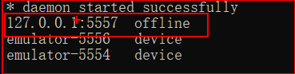
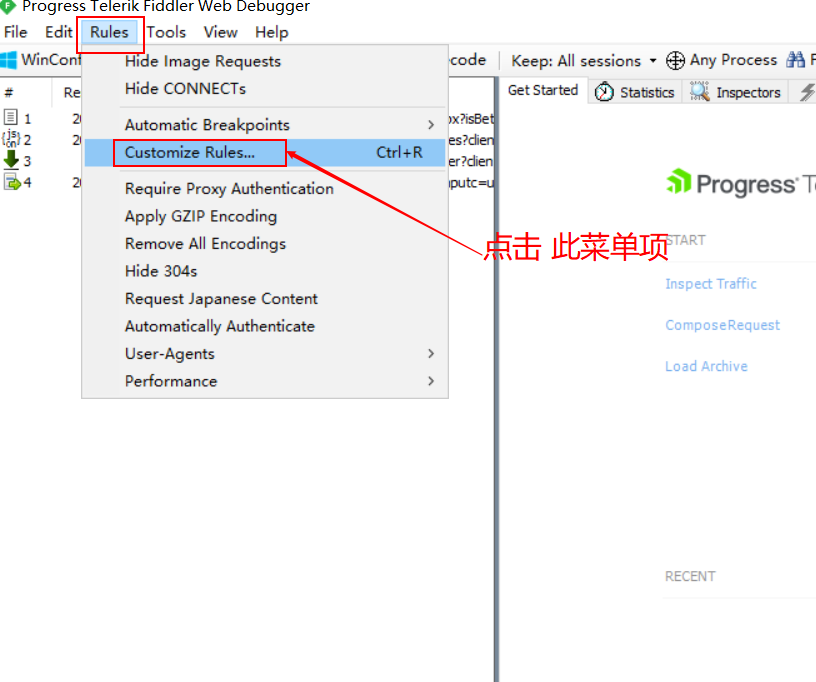
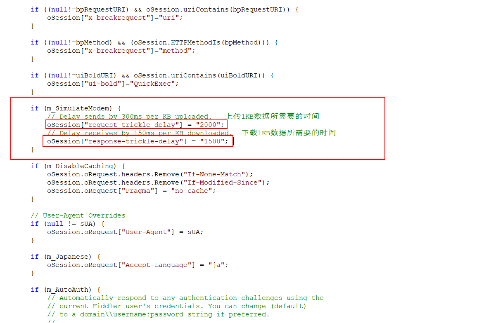
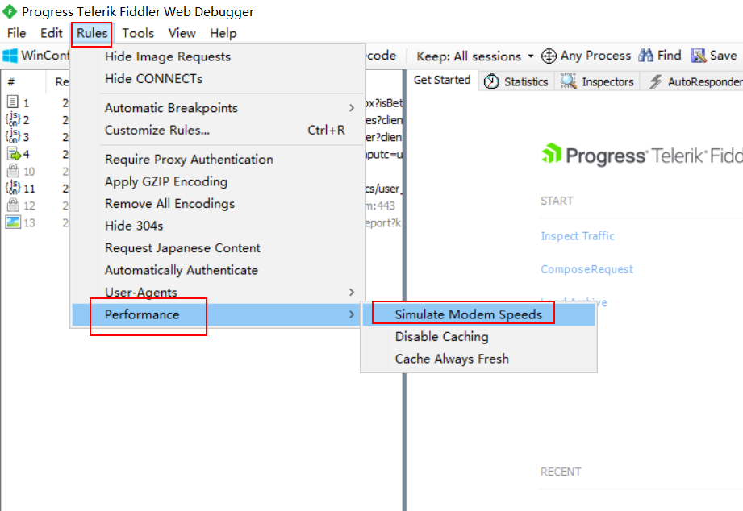
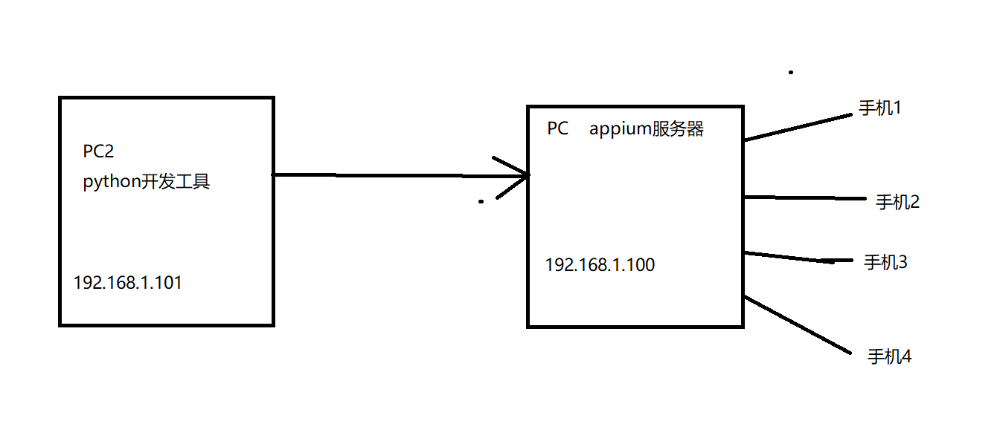
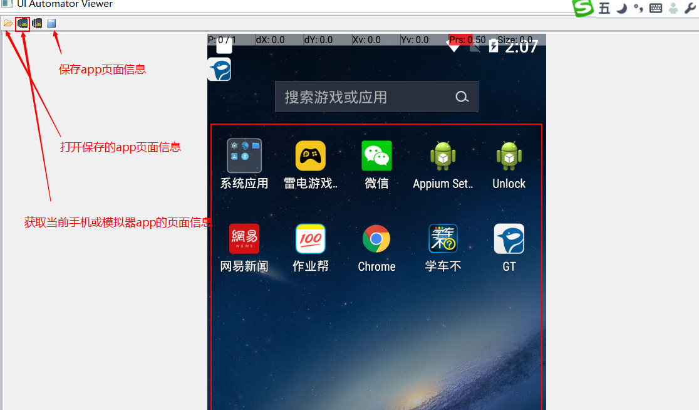
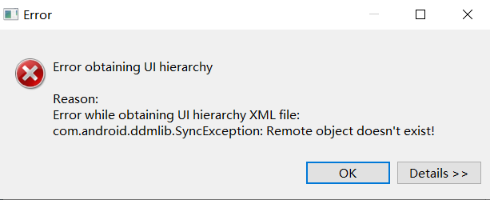

# ui自动化测试day01（app自动化）

### adb 操作命令

* 手势操作命令

  * 模拟点击事件

    adb shell input tap x y           #  x y表示的是坐标点    参数之间用空格隔开

  * 模拟滑屏事件（参数之间用空格隔开）

    adb shell input swipe   startx starty  endx  endy    # startx, starty 表示的是起始点坐标，endx，endy表示的是终点坐标

  * 模拟键盘操作

    adb shell input keyevent  键值   (3   表示的HOME键    4 表示的返回键    66表示的回车键)

  * 模拟输入操作

    adb shell input text  内容    内容表示要输入的内容，另外输入的内容不能是中文

  * 

    <font color=red>如果出现上图中  offline的设备，记得重启一下adb服务</font>

  * <font color=red>如果电脑上面连接了多个模拟器或者是手机。那么需要加上一个参数  -s  device_name  </font>

    adb -s emulator-5554 shell  input keyevent 4

### 1、弱网测试

* 弱网测试步骤:

  * 打开fiddler，设置相应的代理端口（当端口被占用时需要手动更改代理端口）

  * 在fiddler中设置网络的上传和下载的速度

    * 点击 “rules”--“customize rules”

  * 

    

    

  * 在手机中设置网络的代理

    * 手机的IP地址必须与fiddler电脑的IP地址，是同一个局域 网。也就是在同一网段。

      查看电脑的IP地址命令： ipconfig


## 一、入门示例



```
# 导入webdriver
import time

from appium import webdriver
# 初始化app的配置信息
des_cap = dict()  # 定义字典参数

des_cap["platformName"] = "android"   # 表示的是android 或者IOS系统
des_cap["platformVersion"] = "5.1.1"  # 表示的是平台系统的版本号
des_cap["deviceName"] = "****"  # 表示的是设备的ID名称（如果只有一个设备可以用****来替代）
des_cap["appPackage"] = "com.android.settings"  # 表示的是app的包名
des_cap["appActivity"] = ".Settings"  # 表示的是app的界面名

driver = webdriver.Remote("http://localhost:4723/wd/hub", des_cap)

time.sleep(6)

driver.quit()
```


---

## 二、uiautometorview工具使用

* 通过uiautomatorviewer工具可以查看app的元素信息。

  查看元素信息：

  

* 如果出现如下错误：

  

需要重启adb服务。获取app页面信息时不能正在运行代码，会占用adb服务。


为了提高效率，在android sdk的  tools目录下，将uiautomatorviewer.bat复制一份出来，并修改为ui.bat就OK了。

后续直接在dos中输入ui就可以打开了

## 三、appium基础操作

### 1、通过appium启动app

* driver.start_activity("包名"，”界面名“)

  ```
  driver.start_activity("com.baidu.homework", ".activity.user.passport.ChoiceLoginModeActivity")
  
  ```

### 2、获取包名和界面名

​	driver.current_package  获取当前脚本运行中的app的包名

​	driver.current_activity    获取当前脚本运行中的app的界面名


### 3、关闭app及关才驱动

* 关闭app   driver.close_app()    不需要跟参数
* 关闭驱动  driver.quit()

区别:

关闭app之后，可以再使用其他代码启动新的app

关闭驱动，那么代码与appium服务器之间的连接已经断，开不能再做任何的操作。

 

### 4、安装卸载app以及判断是否安装app

* 安装app    driver.install _app(apk路径)
* 卸载app    driver.remove_app(app包名)

```python
# 导入webdriver
import time

from appium import webdriver
# 初始化app的配置信息
des_cap = dict()  # 定义字典参数

des_cap["platformName"] = "android"   # 表示的是android 或者IOS系统
des_cap["platformVersion"] = "5.1.1"  # 表示的是平台系统的版本号
des_cap["deviceName"] = "****"  # 表示的是设备的ID名称（如果只有一个设备可以用****来替代）
des_cap["appPackage"] = "com.android.settings"  # 表示的是app的包名
des_cap["appActivity"] = ".Settings"  # 表示的是app的界面名

driver = webdriver.Remote("http://localhost:4723/wd/hub", des_cap)
driver.close_app()
time.sleep(2)
# 安装263app
# driver.install_app(r"D:\BaiduNetdiskDownload\apptools\apk\263.apk")

# 卸载263app
driver.remove_app("com.em.mobile")
time.sleep(6)
driver.quit()

```

* 判断手机是否安装app   driver.is_app_installed("包名")

  返回值：True  有安装app 或者False  没有安装app

### 5、将应用置于后台运行

driver.background_app(seconds)  # seconds 表示的是将app置于后台运行多少秒的时间


## 四、元素定位

### 1、定位单个元素

#### 1.1 通过ID定位元素

​      通过元素的resource-id来进行元素定位

​	driver.find_element_by_id(resource_id的值)


#### 1.2 通过class_name定位元素

​	通过元素的class属性值来进行元素定位

​	app中，class的值始终都只有一个。

​	driver.find_element_by_class_name(class)


#### 1.3 通过xpath定位元素

​    通过xpath的元素属性来进行元素定位

  driver.find_element_by_xpath("//*[@text='value']")

单个元素定位不到会报错。

```python
# 导入webdriver
import time

from appium import webdriver
# 初始化app的配置信息
from selenium.webdriver.common.by import By

des_cap = dict()  # 定义字典参数

des_cap["platformName"] = "android"   # 表示的是android 或者IOS系统
des_cap["platformVersion"] = "5.1.1"  # 表示的是平台系统的版本号
des_cap["deviceName"] = "****"  # 表示的是设备的ID名称（如果只有一个设备可以用****来替代）
des_cap["appPackage"] = "com.android.settings"  # 表示的是app的包名
des_cap["appActivity"] = ".Settings"  # 表示的是app的界面名

driver = webdriver.Remote("http://localhost:4723/wd/hub", des_cap)
# 找到“更多”按钮并点击(XPATH)
element = driver.find_element(By.XPATH, "//*[@text='更多']")
element.click()
time.sleep(2)
# 找到 飞行模式的 开关，并点击(ID)
air_element = driver.find_element(By.ID, "android:id/switchWidget")
air_element.click()
time.sleep(2)
# 找到返回按钮并点击(class)
return_element = driver.find_element(By.CLASS_NAME, "android.widget.ImageButton")
return_element.click()
time.sleep(3)
driver.quit()

```


通过显示等待定位元素

```python
from selenium.webdriver.support.wait import WebDriverWait
# 定义一个获取元素的方法


# def get_element(driver, find_type, value):
#     wait = WebDriverWait(driver, 10, 1)
#     element = wait.until(lambda x: x.find_element(find_type, value))
#     return element

def get_element(driver, element):
    wait = WebDriverWait(driver, 10, 1)
    element = wait.until(lambda x: x.find_element(element[0], element[1]))
    return element
```


### 2、定位一组元素

   driver.find_elements_by_id(resource_id)

​	driver.find_elements_by_class_name(class_name)

​	driver.find_elements_by_xpath(xpath)     

​	driver.find_elements(By.ID,  value)

返回的值是一个列表，如果没有找到，说明列表是空值，可以通过下标来使用其中的元素对象，下标是从0开始。

## 五、元素操作

###  1、点击操作

 	element.click()    针对元素进行点击操作

### 2、清空和输入操作

​	element.clear()   针对元素进行清空操作

​	element.send_keys("value")    针对元素进行输入操作

### 3、输入的封装

```python
#  为了保证代码的健壮性，确定输入的内容一定不会出错，所以在输入前做了一次清除。
def input_text(element, text):
    """
    :param element:  表示的是元素对象
    :param text: 表示的是要输入的内容
    :return:
    """
    # 清除元素中的文本内容
    element.clear()
    # 输入文本内容
    element.send_keys(text)
```

### 4、获取元素的信息

* 获取元素的文本内容(获取的是元素text属性的内容)

  element.text

* 获取元素的位置

  element.location  返回的值是一个字典，字典中包含x和y ， x和y表示的是元素在手机屏幕左上角的点的坐标

* 获取取元素的大小

  element.size     返回值是一个字典，字典中会包含 width和height， width表示的宽度，height表示的高度

* 获取元素的属性值

  element.get_attribute("attribute")  # attribute表示的是属性名称

  获取ID值时，  attribute=  “resourceId”  

  获取的是class的值 ,   attribute="className"

  如果attribute = "name"时，获取的是text或者content-desc（text优先，找不到text值，再去找content-desc的值）

```python
# 导入webdriver
import time

from appium import webdriver
# 初始化app的配置信息
from selenium.webdriver.common.by import By

from utils import get_element

des_cap = dict()  # 定义字典参数

des_cap["platformName"] = "android"   # 表示的是android 或者IOS系统
des_cap["platformVersion"] = "5.1.1"  # 表示的是平台系统的版本号
des_cap["deviceName"] = "****"  # 表示的是设备的ID名称（如果只有一个设备可以用****来替代）
des_cap["appPackage"] = "com.android.settings"  # 表示的是app的包名
des_cap["appActivity"] = ".Settings"  # 表示的是app的界面名

driver = webdriver.Remote("http://localhost:4723/wd/hub", des_cap)
# 找到wlan 元素
wlan_btn = By.ID, "com.android.settings:id/title"
element = get_element(driver, wlan_btn)
# 获取wlan菜单的文本内容
print(element.text)

# 获取wlan的位置信息
print(element.location)

# 获取wlan元素的大小
print(element.size)

# 获取wlan元素
print(element.get_attribute("className"))

time.sleep(6)

driver.quit()
```

