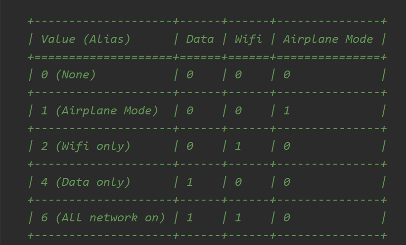

# ui自动化测试day08（app自动化）

#### 初始化：输入中文的处理

在初始化配置中增加两个参数:

```python
"resetKeyboard": True,        # 重置设备的输入键盘
"unicodeKeyboard": True        # 采用unicode编码输入
```

```python
from selenium.webdriver.support.wait import WebDriverWait
# 定义一个获取元素的方法


# def get_element(driver, find_type, value):
#     wait = WebDriverWait(driver, 10, 1)
#     element = wait.until(lambda x: x.find_element(find_type, value))
#     return element
# 减少代码量，不必要在每个元素定位的代码中都使用显示等待来定位。
def get_element(driver, element):   # element 表示的元素定位的值
    wait = WebDriverWait(driver, 10, 1)
    element = wait.until(lambda x: x.find_element(element[0], element[1]))
    return element


# 判断元素是否存
def element_is_exsit(driver, element):   # element 表示的元素定位的值
    try:  # 捕获异常信息
        get_element(driver, element)    # 能够正常找元素，就返回True
        return True
    except Exception as e:   # 如果捕获到了异常，返回False
        return False


#  为了保证代码的健壮性，确定输入的内容一定不会出错，所以在输入前做了一次清除。
def input_text(element, text):
    """
    :param element:  表示的是元素对象
    :param text: 表示的是要输入的内容
    :return:
    """
    # 清除元素中的文本内容
    element.clear()
    # 输入文本内容
    element.send_keys(text)
```


#### 初始化：区分首次打开还是非首次打开

```python
"noReset": True  # 用来记住app的session，如果有登陆或做过初始化的操作，为True时，后面不需要再操作
```

```python
# 导入webdriver
import time
from appium import webdriver
# 初始化app的配置信息
from selenium.webdriver.common.by import By

from utils import get_element, input_text, element_is_exsit

des_cap = {
"platformName" : "android" ,   #表示的是android  或者ios
"platformVersion" : "5.1.1",   #表示的是平台系统的版本号
"deviceName" : "****",    #表示的是设备的ID名称（如果只有一个设备可以用****来代替）
"appPackage" : "com.bjcsxq.chat.carfriend",   #表示app的包名
"appActivity" :  ".module_main.activity.SplashActivity",      #表示的是app的界面名
"noReset": True  # 用来记住app的session，如果有登陆或做过初始化的操作，为True时，后面不需要再操作
####"".module_main.activity.MainActivity""
}  #定义字典参数

driver = webdriver.Remote("http://localhost:4723/wd/hub",des_cap)

agree_btn = By.XPATH, "//*[@text='同意并继续使用APP']"

# 通过同意协议来判断app是否是首次打开
if element_is_exsit(driver, agree_btn):
    get_element(driver, agree_btn).click()
else:
    print("非首次打开")

# 点击“我的”
me_element = By.ID,"com.bjcsxq.chat.carfriend:id/mine_layout"
get_element(driver, me_element).click()
# 登录
login_element = By.ID, "com.bjcsxq.chat.carfriend:id/mine_username_tv"
get_element(driver, login_element).click()
# 输入手机号
tel_element = By.ID, "com.bjcsxq.chat.carfriend:id/login_phone_et"
input_text(get_element(driver, tel_element), "13751113926")
# 输入密码
password_element = By.ID, "com.bjcsxq.chat.carfriend:id/login_pwd_et"
input_text(get_element(driver, password_element), "a123456b")
# 点击登录
insert_element = By.ID, "com.bjcsxq.chat.carfriend:id/login_btn"
get_element(driver, insert_element).click()
# 点击确定
accept_element = By.CLASS_NAME, "android.widget.Button"
get_element(driver, accept_element).click()
# 点击“驾照圈”
licence_btn = By.ID, "com.bjcsxq.chat.carfriend:id/apply_layout"
get_element(driver, licence_btn).click()
# 选择第一条评论
pl_element = By.ID, "com.bjcsxq.chat.carfriend:id/tv_post_replay"
get_element(driver, pl_element).click()
# 填写评论内容
nr_element = By.XPATH, "//*[@text='发布评论']"
input_text(get_element(driver, nr_element), "test")
# 进行发布
fb_element = By.CLASS_NAME, "android.widget.TextView"
get_element(driver, fb_element)
time.sleep(3)
driver.quit()

```


## 一、获取手机操作

### 1、获取手机分辨率

 保证脚本在不同机型上都能实现滑屏的操作。 

driver.get_window_size()     返回的值是字典类型， 包含 height 和 width  高度和宽度的值

### 2、获取手机截图

driver.get_screenshot_as_file(filename)    

注意事项：1、路径必须手动创建  2、文件名称必须是以PNG结尾

```python
import time

from appium import webdriver
from selenium.webdriver.common.by import By

from utils import get_element, input_text

des_cap = {
"platformName" : "android" ,   #表示的是android  或者ios
"platformVersion" : "5.1.1",   #表示的是平台系统的版本号
"deviceName" : "****",    #表示的是设备的ID名称（如果只有一个设备可以用****来代替）
"appPackage" : "com.android.settings",   #表示app的包名
"appActivity" :  ".Settings",      #表示的是app的界面名
"resetKeyboard": True,        # 重置设备的输入键盘
"unicodeKeyboard": True        # 采用unicode编码输入
####"".module_main.activity.MainActivity""
}  #定义字典参数

driver = webdriver.Remote("http://localhost:4723/wd/hub",des_cap)

# 获取手机屏幕分辨率
print(driver.get_window_size())

# 截图
driver.get_screenshot_as_file("img/error.png")

time.sleep(2)
driver.quit()
```


### 3、获取设置手机网络

主要是为了实现视频类的app中，视频播放过程中网络切换时会有提示信息的操作。

#### 3.1 获取手机网络

driver.network_connection   

appium定义的网络类型



#### 3.2 设置手机网络

driver.set_network_connection(connectionType)   #  connectionType   网络类型的值

```python
import time

from appium import webdriver
from selenium.webdriver.common.by import By

from utils import get_element, input_text

des_cap = {
"platformName" : "android" ,   #表示的是android  或者ios
"platformVersion" : "5.1.1",   #表示的是平台系统的版本号
"deviceName" : "****",    #表示的是设备的ID名称（如果只有一个设备可以用****来代替）
"appPackage" : "com.android.settings",   #表示app的包名
"appActivity" :  ".Settings",      #表示的是app的界面名
"resetKeyboard": True,        # 重置设备的输入键盘
"unicodeKeyboard": True        # 采用unicode编码输入
####"".module_main.activity.MainActivity""
}  #定义字典参数

driver = webdriver.Remote("http://localhost:4723/wd/hub",des_cap)

# 获取网络类型
print(driver.network_connection)

# 设置网络类型
driver.set_network_connection(4)

print(driver.network_connection)
time.sleep(2)
driver.quit()
```


### 4、模拟键盘操作

常用的三个键值： 3 HOME键， 4 返回键 ,  66 回车键

driver.press_keycode(键值)

### 5、手机通知栏操作

driver.open_notifications()

```python
import time

from appium import webdriver
from selenium.webdriver.common.by import By

from utils import get_element, input_text

des_cap = {
"platformName" : "android" ,   #表示的是android  或者ios
"platformVersion" : "5.1.1",   #表示的是平台系统的版本号
"deviceName" : "****",    #表示的是设备的ID名称（如果只有一个设备可以用****来代替）
"appPackage" : "com.android.settings",   #表示app的包名
"appActivity" :  ".Settings",      #表示的是app的界面名
"resetKeyboard": True,        # 重置设备的输入键盘
"unicodeKeyboard": True        # 采用unicode编码输入
####"".module_main.activity.MainActivity""
}  #定义字典参数

driver = webdriver.Remote("http://localhost:4723/wd/hub",des_cap)

#  打开通知栏
driver.open_notifications()

# 模拟返回键
driver.press_keycode(4)

time.sleep(2)
driver.quit()

```


---

## 二、滑动和拖拽事件

### 1、swipe滑动事件

 driver.swipe(startx, starty,  endx, endy, duration=None) 

 # duration用来降低滑屏的速度及惯性, 单位是ms

### 2、swipe滑动事件封装

```python
# 封装滑屏操作方法
def execute_swipe(driver, fx, count=1):
    w = driver.get_window_size()["width"]  # 获取手机屏幕的宽度
    h = driver.get_window_size()["height"] # 获取手机屏幕的高度
    # w=1080  h=1920
    if fx == "top":  # 往上滑
        zb = (w/2, h*0.9, w/2, h*0.1)
    elif fx == "down":  # 往下滑
        zb = (w/2, h*0.1, w/2, h*0.9)
    elif fx == 'left':  # 往左滑
        zb = (w*0.9, h/2, w*0.1, h/2)
    else:  # 往右滑
        zb = (w*0.1, h/2, w*0.9, h/2)
    for i in range(count):
        driver.swipe(*zb, duration=1200)
        time.sleep(1)
```


### 3、swipe边滑动边查找封装

针对频道类的元素进行滑动选择对应的频道。

```python
# 封装一个边滑动边查找的方法
def swipe_find(driver, element, element_info):
    ele_size = element.size  # 获取元素大小
    width = ele_size["width"]  # 获取元素的宽度
    height = ele_size["height"]  # 获取元素的高度
    # 获了element元素左上角点的坐标
    ele_position = element.location
    x = ele_position["x"]  # 获取左上角点的x坐标值
    y = ele_position["y"]  # 获取左上角点的y坐标值

    start_x = x + width*0.9  # 获取的是起始点X的值
    y = y + height*0.5  # 获取的是起始及终止点的Y的值
    end_x = x + width*0.1   # 获取的是终止点X的值
    while True:
        page = driver.page_source  # 记录查找前的页面资源,通过对比页面资源来退出死循环
        try:
            driver.find_element(*element_info).click()  # 如果有找到对应的元素那么点击并返回
            return True
        except Exception as e:
            print("没有找到该元素！")
        driver.swipe(start_x, y, end_x, y, duration=1000)  # 没有找到元素，那么滑屏后再对比并重新查找
        time.sleep(1)
        if page == driver.page_source:
            print("滑屏操作完成且没有找到元素信息")
            return False
```


### 4、scroll滑动事件

  scroll是通过元素来进行滑动的

driver.scroll(source_element,  target_element)

scroll无法设置滑动的持续时间，带有一定惯性。 主要用于IOS中，android高版本系统可以使用。

```python
import time

from appium import webdriver
from selenium.webdriver.common.by import By

from utils import get_element, input_text, execute_swipe

des_cap = {
"platformName" : "android" ,   #表示的是android  或者ios
"platformVersion" : "5.1.1",   #表示的是平台系统的版本号
"deviceName" : "****",    #表示的是设备的ID名称（如果只有一个设备可以用****来代替）
"appPackage" : "com.android.settings",   #表示app的包名
"appActivity" :  ".Settings",      #表示的是app的界面名
"resetKeyboard": True,        # 重置设备的输入键盘
"unicodeKeyboard": True        # 采用unicode编码输入
####"".module_main.activity.MainActivity""
}  #定义字典参数

driver = webdriver.Remote("http://localhost:4723/wd/hub", des_cap)
# 存储 按钮
save_btn = By.XPATH, "//*[@text='存储']"
save_element = get_element(driver, save_btn)

# 蓝牙 按钮
lanya_btn = By.XPATH, "//*[@text='蓝牙']"
lanya_element = get_element(driver, lanya_btn)

# 通过scroll来进行滑动操作
driver.scroll(save_element, lanya_element)

time.sleep(3)

driver.quit()
```


#### 5、drag_and_drop拖拽事件

从一个元素滑动到另外一个元素的位置， 同时也能实现将一个元素拖动另一个元素当。

driver.drag_and_drop(source_element,  target_element)

source_element 表示的是被拖动的元素对象

target_element 表示的是目标元素对象

```python
import time

from appium import webdriver
from selenium.webdriver.common.by import By

from utils import get_element, input_text

des_cap = {
"platformName" : "android" ,   #表示的是android  或者ios
"platformVersion" : "5.1.1",   #表示的是平台系统的版本号
"deviceName" : "****",    #表示的是设备的ID名称（如果只有一个设备可以用****来代替）
"appPackage" : "com.android.settings",   #表示app的包名
"appActivity" :  ".Settings",      #表示的是app的界面名
"resetKeyboard": True,        # 重置设备的输入键盘
"unicodeKeyboard": True        # 采用unicode编码输入
####"".module_main.activity.MainActivity""
}  #定义字典参数

driver = webdriver.Remote("http://localhost:4723/wd/hub", des_cap)
# 存储
save_btn = By.XPATH, "//*[@text='存储']"
# 更多
more_btn = By.XPATH, "//*[@text='更多']"

# 通过拖动来实现滑屏操作
driver.drag_and_drop(get_element(driver, save_btn),  get_element(driver, more_btn))

time.sleep(3)

driver.quit()
```


## 三、高级手势操作

实现步骤：

1、创建TouchAction对象

2、调用手势方法

3、调用perform() 执行操作

### 1、轻敲操作

实现步骤：

*  action = TouchAction(driver)  #  创建建手势对象

* action.tap(element=None, x=None, y=None， count=1)  # 调用轻敲手势方法，传入的是一个元素对象或者是一个坐标点

  count表示的是轻敲的次数， 默认值为1.

* action.perform() # 调用perform()执行轻敲操作

```python
import time

from appium import webdriver
from appium.webdriver.common.touch_action import TouchAction
from selenium.webdriver.common.by import By

from utils import get_element, input_text

des_cap = {
"platformName" : "android" ,   #表示的是android  或者ios
"platformVersion" : "5.1.1",   #表示的是平台系统的版本号
"deviceName" : "****",    #表示的是设备的ID名称（如果只有一个设备可以用****来代替）
"appPackage" : "com.android.settings",   #表示app的包名
"appActivity" :  ".Settings",      #表示的是app的界面名
"resetKeyboard": True,        # 重置设备的输入键盘
"unicodeKeyboard": True        # 采用unicode编码输入
####"".module_main.activity.MainActivity""
}  #定义字典参数

driver = webdriver.Remote("http://localhost:4723/wd/hub", des_cap)

wlan_btn = By.XPATH, "//*[@text='WLAN']"
wlan_element = get_element(driver, wlan_btn)

# 调用轻敲手势操作
TouchAction(driver).tap(x=457, y=487).perform()
# action = TouchAction(driver)  # 创建手势对象
# # 调用手势方法
# action.tap(wlan_element)
# # 调用perform()执行
# action.perform()
time.sleep(3)
driver.quit()
```


### 2、按下和抬起操作

  按下：

   press(element, x, y)

   抬起：

​	release()

TouchAction(driver).press(x=477, y=489).release().perform()

按下和抬起可以结合起来使用，达到点击的效果

```python
import time

from appium import webdriver
from appium.webdriver.common.touch_action import TouchAction
from selenium.webdriver.common.by import By

from utils import get_element, input_text

des_cap = {
"platformName" : "android" ,   #表示的是android  或者ios
"platformVersion" : "5.1.1",   #表示的是平台系统的版本号
"deviceName" : "****",    #表示的是设备的ID名称（如果只有一个设备可以用****来代替）
"appPackage" : "com.android.settings",   #表示app的包名
"appActivity" :  ".Settings",      #表示的是app的界面名
"resetKeyboard": True,        # 重置设备的输入键盘
"unicodeKeyboard": True        # 采用unicode编码输入
####"".module_main.activity.MainActivity""
}  #定义字典参数

driver = webdriver.Remote("http://localhost:4723/wd/hub", des_cap)

# 调用按钮手势操作
TouchAction(driver).press(x=477, y=489).perform()
# 等待2S
time.sleep(2)
TouchAction(driver).press(x=477, y=489).release().perform()

time.sleep(3)
driver.quit()
```


### 3 、等待操作【掌握】

模拟手指等待。 wait(ms=0)   ms表示的是毫秒数

 TouchAction(driver).press(x=650, y=650).wait(5000).release().perform()


```python
import time

from appium import webdriver
from appium.webdriver.common.touch_action import TouchAction
from selenium.webdriver.common.by import By

from utils import get_element, input_text

des_cap = {
"platformName" : "android" ,   #表示的是android  或者ios
"platformVersion" : "5.1.1",   #表示的是平台系统的版本号
"deviceName" : "****",    #表示的是设备的ID名称（如果只有一个设备可以用****来代替）
"appPackage" : "com.android.settings",   #表示app的包名
"appActivity" :  ".Settings",      #表示的是app的界面名
"resetKeyboard": True,        # 重置设备的输入键盘
"unicodeKeyboard": True        # 采用unicode编码输入
####"".module_main.activity.MainActivity""
}  #定义字典参数

driver = webdriver.Remote("http://localhost:4723/wd/hub", des_cap)

# 找到wlan元素
wlan_btn = By.XPATH, "//*[@text='WLAN']"
get_element(driver, wlan_btn).click()
time.sleep(2)
# 通过等待及按下和抬起实现长按的操作
TouchAction(driver).press(x=467, y=569).wait(3000).release().perform()

time.sleep(3)

driver.quit()
```


### 4、长按操作

long_press(element, x=None, y=None,  duration=1000)

element表示的是元素对象

x， y表示的是坐标点

duration表示的是长按的时长，单位是毫秒

TouchAction(driver).long_press(x=650, y=650, duration=2000).perform()

```python
import time

from appium import webdriver
from appium.webdriver.common.touch_action import TouchAction
from selenium.webdriver.common.by import By

from utils import get_element, input_text

des_cap = {
"platformName" : "android" ,   #表示的是android  或者ios
"platformVersion" : "5.1.1",   #表示的是平台系统的版本号
"deviceName" : "****",    #表示的是设备的ID名称（如果只有一个设备可以用****来代替）
"appPackage" : "com.android.settings",   #表示app的包名
"appActivity" :  ".Settings",      #表示的是app的界面名
"resetKeyboard": True,        # 重置设备的输入键盘
"unicodeKeyboard": True        # 采用unicode编码输入
####"".module_main.activity.MainActivity""
}  #定义字典参数

driver = webdriver.Remote("http://localhost:4723/wd/hub", des_cap)

# 找到wlan元素
wlan_btn = By.XPATH, "//*[@text='WLAN']"
get_element(driver, wlan_btn).click()
time.sleep(2)
# 通过等待及按下和抬起实现长按的操作
# TouchAction(driver).press(x=467, y=569).wait(3000).release().perform()
TouchAction(driver).long_press(x=467, y=569, duration=3000).perform()
time.sleep(3)

driver.quit()

```


