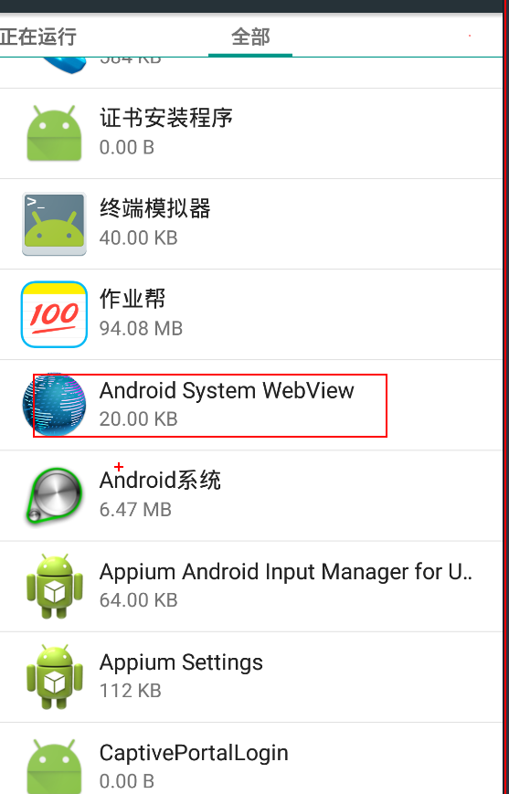
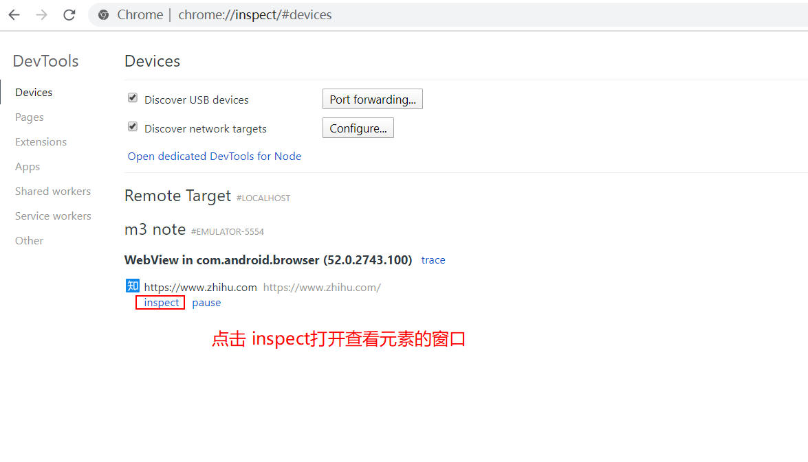
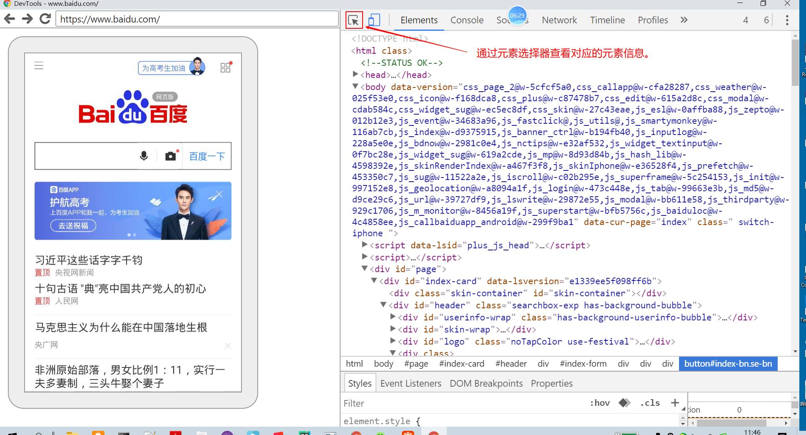
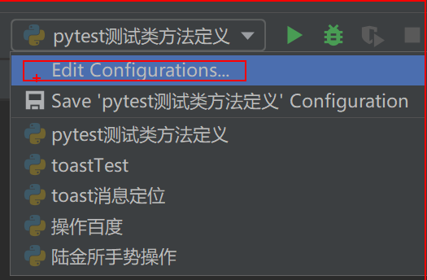
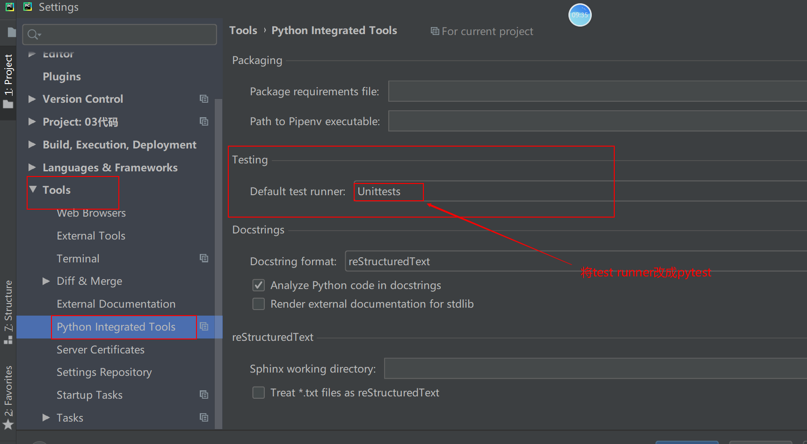

# ui自动化测试day09（app自动化）

## 一、高级手势操作

### 5、移动操作

模拟手指在手机屏幕上移动的过程

move_to(element, x=x, y=y)  ele表示的是元素对象， x和y表示的是坐标点。二选其一。

移动的操作是需要结合press和release一起使用。

```python
import time

from appium import webdriver
from appium.webdriver.common.touch_action import TouchAction
from selenium.webdriver.common.by import By

from utils import get_element, input_text

des_cap = {
"platformName" : "android" ,   #表示的是android  或者ios
"platformVersion" : "5.1.1",   #表示的是平台系统的版本号
"deviceName" : "****",    #表示的是设备的ID名称（如果只有一个设备可以用****来代替）
"appPackage" : "com.lufax.android",   #表示app的包名
"appActivity" :  ".activity.HomeActivity",      #表示的是app的界面名
"resetKeyboard": True,        # 重置设备的输入键盘
"unicodeKeyboard": True,        # 采用unicode编码输入
"noReset": True
####"".module_main.activity.MainActivity""
}  #定义字典参数

driver = webdriver.Remote("http://localhost:4723/wd/hub", des_cap)

me_btn = By.XPATH, "//*[@text='我的']"
get_element(driver, me_btn).click()

TouchAction(driver).press(x=260, y=720).wait(500).move_to(x=540, y=720)\
    .wait(500).move_to(x=820,y=720).wait(500).move_to(x=540, y=1000).wait(500).move_to(x=260, y=1270)\
    .wait(500).move_to(x=540, y=1270).wait(500).move_to(x=820, y=1270).release().perform()
time.sleep(5)
driver.quit()

```


## 二、toast操作

1、获取toast消息，在初始化配置中需要增加一个配置项。否则定位不到。

"automationName": "Uiautomator2"

```python
import time

from appium import webdriver
from appium.webdriver.common.touch_action import TouchAction
from selenium.webdriver.common.by import By

from utils import get_element, input_text, execute_swipe, element_is_exsit

des_cap = {
"platformName" : "android" ,   #表示的是android  或者ios
"platformVersion" : "5.1.1",   #表示的是平台系统的版本号
"deviceName" : "****",    #表示的是设备的ID名称（如果只有一个设备可以用****来代替）
"appPackage" : "com.android.settings",   #表示app的包名
"appActivity" :  ".Settings",      #表示的是app的界面名
"resetKeyboard": True,        # 重置设备的输入键盘
"unicodeKeyboard": True,        # 采用unicode编码输入
"noReset": True,
"automationName": 'Uiautomator2'
####"".module_main.activity.MainActivity""
}  #定义字典参数

driver = webdriver.Remote("http://localhost:4723/wd/hub", des_cap)
# 往上滑三次
execute_swipe(driver, 'top', count=3)

# 点击关于平板电脑
about_btn = By.XPATH, "//*[@text='关于平板电脑']"
get_element(driver, about_btn).click()

# 往上滑一次
execute_swipe(driver, 'top')

# 点击版本号
version_btn = By.XPATH, "//*[@text='版本号']"
get_element(driver, version_btn).click()
time.sleep(1)
# toast元素信息
toast_btn = By.XPATH, "//*[contains(@text, '开发者模式')]"
# driver.find_element(*toast_btn).click()
if element_is_exsit(driver, toast_btn):
    print("能够定位到toast消息")
else:
    print("不能定位到toast消息")
```


```python
# 定义获取toast消息的方法
def get_toast(driver, message, timeout=3):
    # xpath = "//*[contains(@text, '" + message + "')]"   #.format(message)   # 通过{} 符号将message当参数传到xpath表达式中去
    xpath = F"//*[contains(@text, '{message}')]"
    wait = WebDriverWait(driver, timeout, 1)
    element = wait.until(lambda x:x.find_element(By.XPATH, xpath))
    return element.text
```


## 三、webview操作(H5)

* 环境安装:

  1、需要查看手机或者模拟器上webView的版本   (webView的版本必须要与chromedriver的版本配套)

  

  2、在手机或者模拟器上面安装chrome浏览器(手机或者模拟器中chrome版本要低于电脑上chrome的版本)

  3、设置PC电脑上面的appium中chromedriver的版本，chrome版本要与webView的版本配套。

  替找appium中的chrome版本：

  C:\Users\LiaoFei\node_modules\appium\node_modules\appium-chromedriver\chromedriver\win


* 查看H5页面的元素信息

  1、在手机或者模拟器当中打开H5的页面

  2、在PC的chrome浏览器当中，打开对应的地址： [chrome://inspect/#devices](chrome://inspect/#devices) 

  

3、通过devtools来查看对应的元素信息。




代码实现步骤：

1、首先要获取context的信息， 如果是原生的app，context的信息显示为Native App,  如果页面为webView的页面，context的信息显示为webView的名称。如果需要在app当中查看对应的webView的名，需要在app的代码当中加上以下的代码：

```
if (Build.VERSION.SDK_INT>=Build.VERSION_CODES.KITKAT) {
    WebView.setWebContentsDebuggingEnabled(true);
}
```


2、切换到web页面

driver.switch_to.context(context)

```python
import time

from appium import webdriver
from appium.webdriver.common.touch_action import TouchAction
from selenium.webdriver.common.by import By

from utils import get_element, input_text, execute_swipe, element_is_exsit, get_toast

des_cap = {
"platformName" : "android" ,   #表示的是android  或者ios
"platformVersion" : "5.1.1",   #表示的是平台系统的版本号
"deviceName" : "****",    #表示的是设备的ID名称（如果只有一个设备可以用****来代替）
"appPackage" : "com.android.browser",   #表示app的包名
"appActivity" :  ".BrowserActivity",      #表示的是app的界面名
"resetKeyboard": True,        # 重置设备的输入键盘
"unicodeKeyboard": True,        # 采用unicode编码输入
"noReset": True,
"automationName": 'Uiautomator2',
"chromedriverExecutableDir": r"D:\BaiduNetdiskDownload\apptools\apk\chromedriver_win32_2.22"  # 用来指定chrome驱动的目录
####"".module_main.activity.MainActivity""
}  #定义字典参数

driver = webdriver.Remote("http://localhost:4723/wd/hub", des_cap)

print(driver.contexts)
driver.get("http://m.baidu.com")
time.sleep(2)
driver.switch_to.context("WEBVIEW_com.android.browser")

driver.find_element(By.ID, "index-kw").send_keys("python")
time.sleep(3)
driver.find_element(By.ID, "index-bn").click()
time.sleep(5)
driver.quit()

```


## 四、pytest测试框架

特点:

1、非常容易上手，入门简单，文档丰富，文档中有很多参考实例

2、支持简单的单元测试和复杂的功能测试

3、支持参数化

4、执行测试用例过程中，支持跳过操作

5、支持重复执行失败的case

6、支持运行由Nose，unittest编写的测试case

7、pytest支持很多第三方插件

8、方便的和持续集成工具集成

### 1、pytest介绍及安装

* pytest安装
  * 在线安装  pip install pytest
  * 离线安装方式   下载pytest离线安装包，并解压，然后在DOS下进入到解压的目录，然后执行  python setup.py install
  * pycharm
* 判断是否安装成功：
  * pip show  pytest
  * pycharm

### 2、pytest类定义及方法定义及运行

* pytest测试类的定义：类名必须是以Test开头
* pytest测试方法的定义：方法名必须是以test开头
* 执行：
  * 在pycharm中右击方法名或者类名可以直接执行对应测试类或者测试方法






​		

​	第二种运行方式:  通过pytest  -s -v 测试文件名称    (-s  输出的用例输出的信息， -v输出的是执行的用例的类名以及方法名)

```python
import pytest


def add(x, y):
    return x+y


class TestADD:  # 定义的类名必须是以Test开头
    def test_add_01(self):  # 定义的测试方法必须是以test开头
        result = add(1, 2)
        print(result)

    def test_add_02(self):
        result = add(2, 2)
        print(result)


```


### 3、pytest 断言

* pytest里面的断言方法就只有一个

  assert 表达式  

  ```python
  class TestADD:  # 定义的类名必须是以Test开头
      def test_add_01(self):  # 定义的测试方法必须是以test开头
          result = add(1, 2)
          print(result)
          # assert result == 3    判断相等
          # assert result != 4    判断不相等
          # assert result    # 判断为True
          #assert False        # 判断为False
          # assert "a" in "abc" # 判断包含
          # assert "a" not in "abc"  # 判断不包含
          # assert result is None
          assert result is not None
  ```

  

### 4、pytest 方法级别的fixture

* pytest方法级别的fixture是针对每个测试方法，在执行测试方法前会执行fixture初始化的操作，在执行完测试方法后，执行fixture销毁的操作。

  初始化的操作方法:   def setup(self):  方法来实现。

  销毁的操作方法: def teardown(self): 方法来实现。

  ```python
  import time
  
  
  def add(x, y):
      return x+y
  
  
  class TestAdd:
  
      def setup(self):
          print("测试用例开始执行时间:", time.strftime("%Y-%m-%D %H:%M:%S"))
  
      def test_add_01(self):
          result = add(1, 2)
          assert result == 3
  
      def test_add_02(self):
          result = add(2, 2)
          assert result == 4
  
      def teardown(self):
          print("测试用例结束时间:", time.strftime("
  ```

  

### 5、pytest类级别的fixture

* pytest 类级别的fixture针对每个测试类的初始化和销毁的操作，可以放在以下两个方法中

  * 类级别初始化的方法:   def setup_class(self):    

  * 类级别销毁的方法:  def teardown_class(slef):

    方法名称固定，不能修改。


fixture的方法必须写在测试类当中，不能写在测试类外面。

### 6、pytest配置文件

pytest的配置文件有固定的三个名称: pytest.ini  tox.ini    setup.cfg   这三个配置文件是放在项目的根目录下。

```
[pytest]   #  标识当前配置文件是pytest的配置文件
addopts = -s -v  # 标识pytest执行时增加的参数
testpaths = ./scripts  # 匹配搜索的目录
python_files = test_*.py # 匹配测试文件
python_classes = Test*  # 匹配测试类
python_functions = test_* # 匹配测试方法
```


## Pytest插件

### pytest测试报告 

* 安装pytest测试报告插件

  * 在线安装
  * 离线安装
  * pycharm

* 使用方法

  ```
  addopts = -s -v --html=report/report.html
  ```