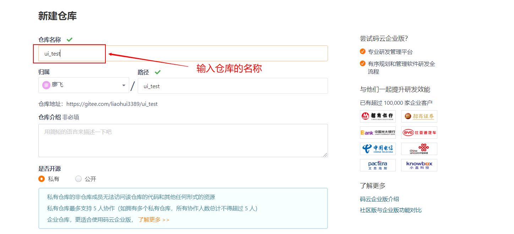
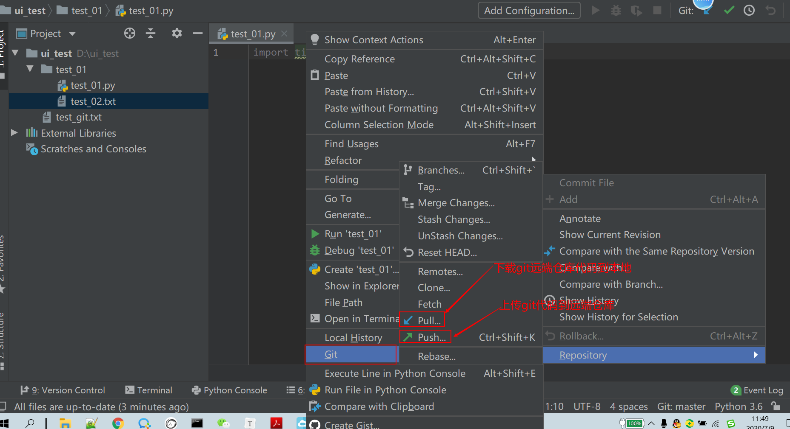

# ui自动化测试day13

持续集成概念：

* 持续集成的好处：

  * 提前发现错误
  * 防止分支与主干偏离
  * 更快速的发布更新

* 持续集成的流程及原理:

  

## 一、GIT工具介绍及使用

* git工具安装：

  直接运行exe文件进行安装，按默认的操作点击下一步就行了。

* 校验：

  在DOS命令行中输入: git --version

  如果能正常显示出对应的版本就是OK的

* 做初始化的配置:   为了提交代码时能够识别身份

  git config --global user.email "email@example.com"
  git config --global user.name "Your Name"

* 常见的代码托管平台:
  * github  全球最大的代码托管平台
  * gitee 码云，国内的代码托管平台
  * gitlab  私有的git代码托管平台，一般是由公司自己搭建。

### git基本使用命令

* 创建git仓库

  1、创建一个目录

  2、在DOS命令行中，进入到创建的目录下，然后输入 git init方法进行创建 。

  注意事项：

  通过git init创建项目后会在对应的目录下自动创建.git目录，.git目录主要用来存放git的相关操作信息。

  如果已经通过git init创建git仓库，不要再次使用git init去创建 

*  查看状态：git  status  用来查看git仓库的状态

* 添加文件到缓存区    git add 文件名 或者git add .   (.号代表的是所有文件)

* 添加到仓库   git commit -m "msg"

  注意：-m ”msg“   参数一定不能少。


### git 版本创建及切换

* 查看版本信息:    git branch
* 创建版本分支：  git branch  dev_branch    git branch test_branch
* 切换片本分支：  git checkout dev_branch   git checkout test_branch


### git恢复特定的版本

* git log  查看提交的历史版本     git reflog 来查看是全部的提交版本信息
* git reset hash值前6位


### 上传本地仓库到远端仓库

操作步骤:

​	1、在本地新建一个仓库

​	2、在远端新建一个仓库

​		




3、执行以下两条命令，可以将本地仓库上传到远端仓库

```
git remote add origin https://gitee.com/liaohui3389/ui_test.git
git push -u origin master    #  需要指定特定的分支版本， master表示的是主干分支
```


### 将远端的仓库下载的本地

* 命令行方式：

  git clone 远端仓库地址                   第一次执行时，会要求你输入远端仓库平台的用户名和密码

* 通过pycharm下载远端仓库

  * 在file-setting菜单中，搜索git

  * 在搜索之后的窗口中，设置git的执行文件的地址.

    

  * 

  * 


* 通过pycharm上传 和 下载新代码

  * 上传

    * 更新或者修改文件

    * 要通过pycharm 将对应的文件添加到缓存区

    * 通过pycharm将对应的文件添加到本地仓库

    * 通过pycharm上传本地仓库到远端

      

  * 下载远端仓库到本地

    直接右击 选择 git--pull就可以下载远端仓库


## 二、Jenkins工具介绍及使用

### jenkins安装

1、JDK

* 直接运行exe文件进行安装即可。如果有自动添加环境变量，不用手动添加，如果没有自动添加环境变量，需要添加以下两个环境变量： JAVA_HOME=C:\Program Files\Java\jdk1.8.0_151
  			在Path中添加:%JAVA_HOME%\bin;

* 校验：在DOS中输入 :  java -version 如果有显示正确的版本信息就是OK的

  

  

2、jenkins.war

* 在线安装： 获取jenkins.war

  1、通过java -jar jenkins.war 来启动jenkins

  2、需要获取到首次启动的密码，并将密码填入到  localhost:8080首次打开的页面中。

  

  3、进入到jenkins首次打开页面后，选择安装对应的插件。默认选择第一个就可以了。

  

  4、安装完插件之后，会提示设置并要求输入用户名和密码。确定用户名和密码之后就可以登录了。

* 离线安装方式：

  1、通过  java -jar jenkins.war来启动 jenkins（启动之后，在复制数据文件目录之前可以停止掉）

  2、将离线的数据文件包.jenkins复制到对应的 C:\users\用户名  目录下即可。

  3、重启jenkins即可。

### jenkins插件安装

* 在线安装方式：

  1. 进入 jenkins
  2. 点击 系统管理
  3. 点击 管理插件
  4. 点击 可选插件
  5. 搜索框中输入 allure
  6. 第一条选中点击 直接安装 即可

* 离线安装方式：

  1、从网上下载对应的插件文件，hpi结尾。

  2、进入 jenkins

  3、点击 系统管理

  4、点击 管理插件

  5、点击 高级

  6、在高级页签 中，点击上传插件中上传文件，选择下载的插件文件，点击打开就OK


### jenkins 系统配置

* 配置jenkins访问的地址及系统管理员邮箱地址


* 配置jenkins的扩展邮箱通知

  

* 邮件通知配置

  


### 在jenkins上面配置job

* 在jenkins页面当中，点击 ”新建item“

* 在新建的job页面，输入 job名称，选择 ”Fresstyle Project“，并点击确定

  

* 源码管理设置

  

* 触发器构建 设置

  

* 构建 设置
* 

* 构建后的操作  设置

  


