# ui自动化测试day13-day15

### 1、自动化测试流程

* 需求分析
* 挑选合适的功能做自动化测试
* 设计测试用例----可从手工用例挑选
* 搭建测试环境（可选）
* 设计自动化测试项目的架构（可选）
* 编写代码
* 执行测试用例
* 生成测试报告并分析结果

### 2、项目介绍

#### 2.1 负载均衡器

负载均衡器：负载均衡(Load Balance)可以将工作任务分摊到多个处理单元，从而提高并发处理能力。
负载均衡建立在现有网络结构之上，使用它可以实现扩展网络设备的带宽、增加吞吐量、加强网络数据处理能力、提高网络的灵活性和可用性。

负载均衡器在工作当中，要么使用nignx（软件的负载均衡）， 要么使用F5（硬件负载均衡设备），如果使用的阿里云或者是腾讯云，SLB负载均衡。

#### 2.2 消息队列

消息队列(Message Queue 简称MQ)：是在消息传输过程中保存消息的容器。
消息队列中间件是分布式系统中重要的组件，主要解决应用解耦、异步消息、流量削峰等问题，实现高性能、高可用、可伸缩和最终一致性架构。

* 异步处理
  将业务逻辑处理由串行方式变成并行方式(好友推荐、新闻推荐)
* 应用解耦
  订单系统-->库存系统
  发送短信验证码
* 流量削峰
  秒杀、抢购活动(一般会因为用户访问量过大，导致流量暴增、应用挂掉)
* 日志处理
  将消息队列用在日志处理中，解决大量日志传输的问题

### 3、项目搭建

uiAutoTestHmtt # 项目名称
├── base # 封装PO基类
├── page # 封装PO页面对象
├── script # 定义测试用例脚本
├── data # 存放测试数据
├── report # 存放生成的测试报告
├── log # 存放日志文件
├── img # 存放截图
├── config.py # 定义项目的配置信息
├── utils.py # 定义工具类
└── pytest.ini # pytest配置文件

### 4、allure测试报告

#### 4.1 allure安装

* 在线安装  pip install allure-pytest
* 离线安装  
* pycharm安装

#### 4.2 allure配置运行脚本生成结果文件

* allure使用步骤：
  * 要在pytest.ini配置文件的addopts项中，增加一项：  --alluredir  report     # report表示的是生成报告数据存放的目录
  * 在终端执行pytest 的命令，运行测试脚本
  * 通过allure在对应的目录下生成  测试报告的数据。  json或者xml开式存放的。

* 将allure测试报告数据生成HTML测试报告 

  allure转换工具安装

  * 解压allure-2.7.0工具包
  * 将解压的目录放到不经常移动的路径下面
  * 找到解压目录的bin目录，并将bin目录的路径添加到环境变量当中
  * 在命令行当中输入  allure，如果有以下提示信息，就说明是成功的。
  * 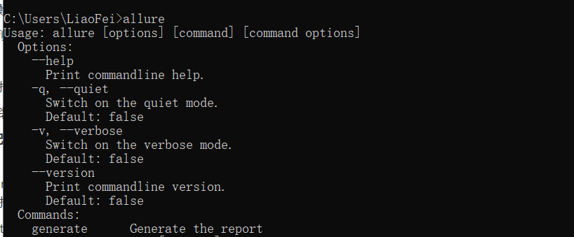

#### 4.3 通过allure命令将结果文件转换成html报告

allure生成HTML测试报告 

* 使用的命令： allure generate report  -o report/html --clean

  allure generate 表示的是生成测试报告 

  report 表示的是测试报告的数据目录

  -o   report/html  表示输出html测试报告的目录为 report/html

  --clean  表示的是清除之前  report/html里面的报告文件

### 5、allure与pytest结合

#### 5.1 添加测试步骤

* 使用的方法：

  @allure.step(title="步骤名称")

  title名称必须要带上。

```python
# 定义操作层
class LoginHandle(BaseHandle):
    def __init__(self):
        self.login_page = LoginPage()

    # 输入手机号码
    @allure.step(title="输入手机号码")
    def input_mobile(self, mobile):
        self.input_text(self.login_page.find_mobile(), mobile)

    # 输入验证码
    @allure.step(title="输入验证码")
    def input_code(self, code):
        self.input_text(self.login_page.find_code(), code)

    # 点击登录按钮
    @allure.step(title="点击登录按钮")
    def click_login_btn(self):
        self.login_page.find_login_btn().click()
```


#### 5.2 添加图片文件

* 通过allure添加截图实现

  allure.attach(driver.get_screenshot_as_png, "截图描述"， allure.attachment_type.PNG)

```python
 @pytest.mark.parametrize("username, code, expect", case_data)
    def test_login(self, username, code, expect):
        logging.info("用例的数据如下：用户名：{}， 验证码：{}， 预期结果：{}".format(username,
                                                              code, expect))
        print(username, code)
        self.login_proxy.login(username, code)   # 登录
        allure.attach(UtilsDriver.get_mp_driver().get_screenshot_as_png(), "登录截图", allure.attachment_type.PNG)
        username = self.home_proxy.get_username_msg()  # 获取登录后的用户名信息
        assert expect == username   # 根据获取到的用户名进行断言
```


#### 5.3 添加用例的严重级别

* allure添加用例的严重级别实现方法：

  @allure.severity(allure.severity_level.NORMAL)

  参数有五个，也对应不同的优先级，只需要将最后一个词替换即可。
  1. BLOCKER 最严重
  2. CRITICAL 严重
  3. NORMAL 普通
  4. MINOR 不严重
  5. TRIVIAL 最不严重

### 6、jenkins集成

* 安装allure插件

* 配置allure插件

  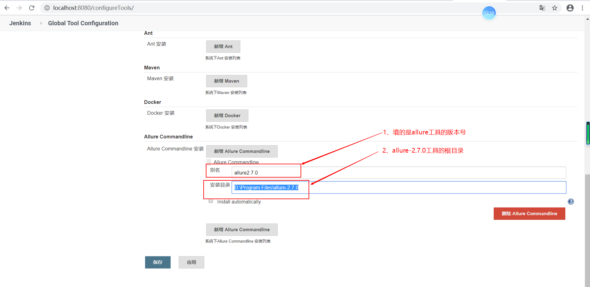

* 将自动化的代码上传到git服务器

  * 本地创建仓库  在当前项目的根目录下，执行   git init  为创建本地仓库

    * 初始化仓库之后，需要将本地的代码提交到本地仓库

      ```
      git add .   # 将本地的代码提交到缓存区
      git commit -m “提交信息”  # 将本地的代码提交到本地仓库
      ```

  * 创建远端仓库  

  * 将本地仓库代码上传到远端仓库

    ```
    git remote add origin https://gitee.com/liaohui3389/ui_auto_test.git
    git push -u origin master
    ```

* jenkins结合allure测试报告的 job创建

  * 在 jenkins页面当中，点击  “新建item”

  

  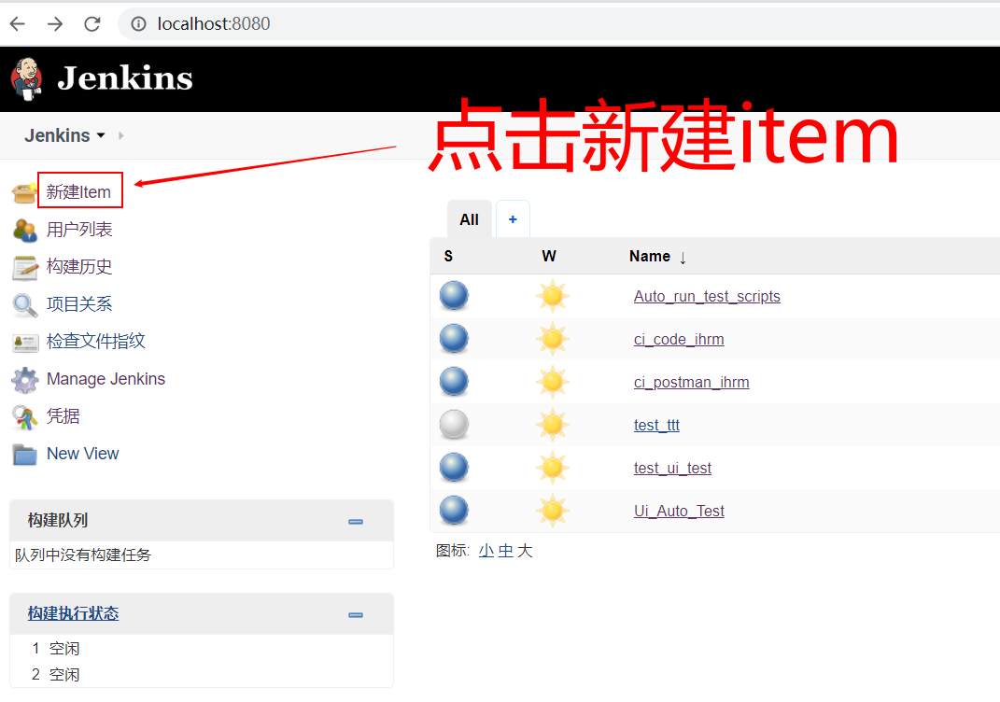

  * 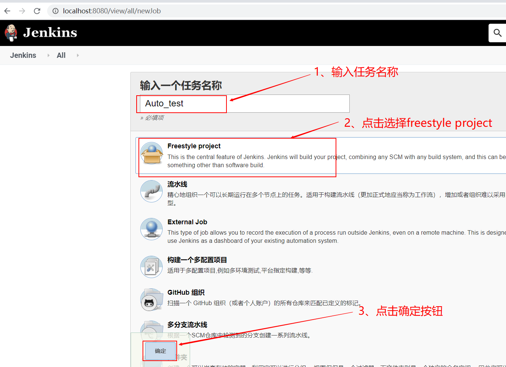

  * 输入描述信息

    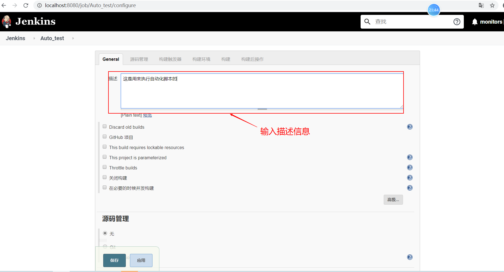

  * 在源码管中选择 git， 输入对应的远端仓库地址。

    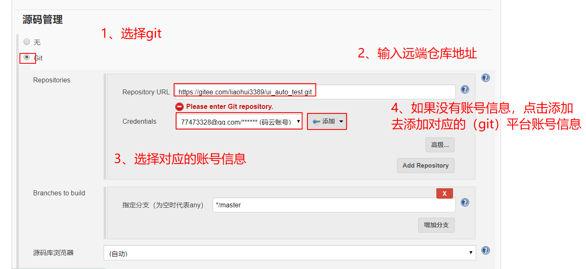

  * 构建触发器设置 

    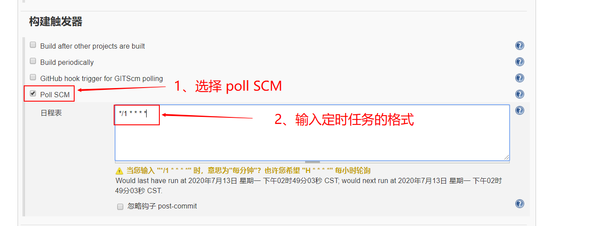

  * 构建的设置

    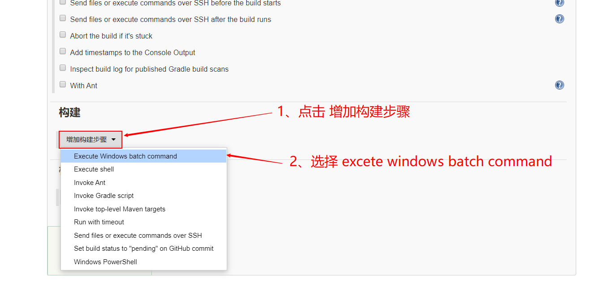

  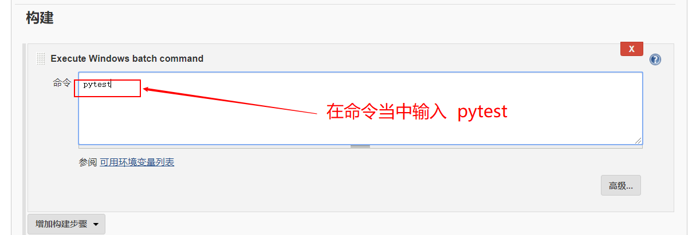

  * 点击 构建后操作步骤中，选择 Allure Report

    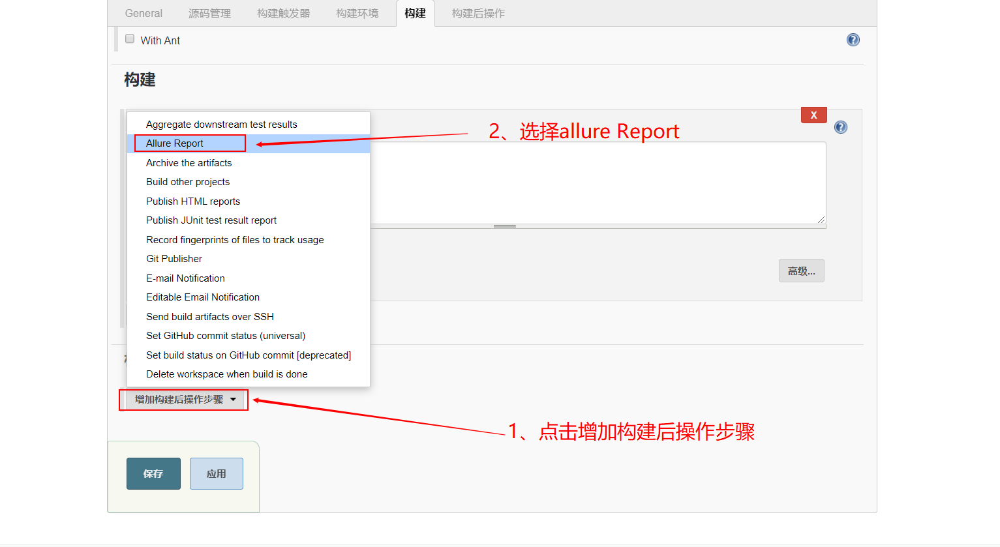

  * 配置allure测试报告

    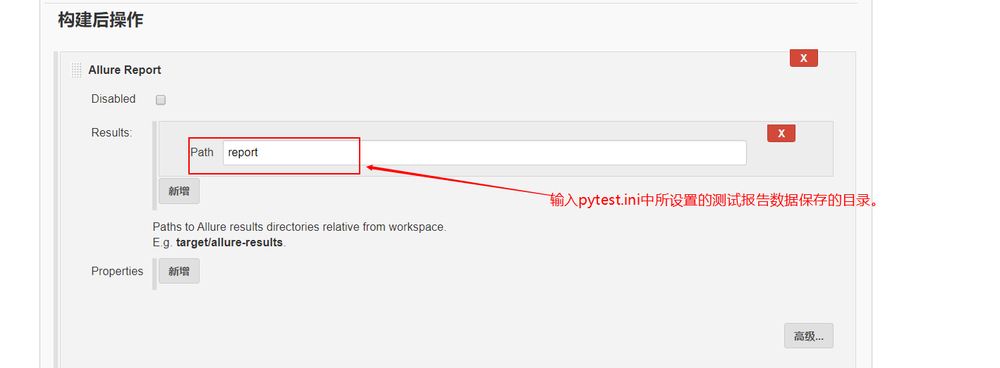

  * 配置邮件通知

    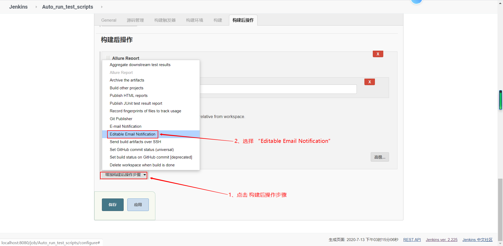

  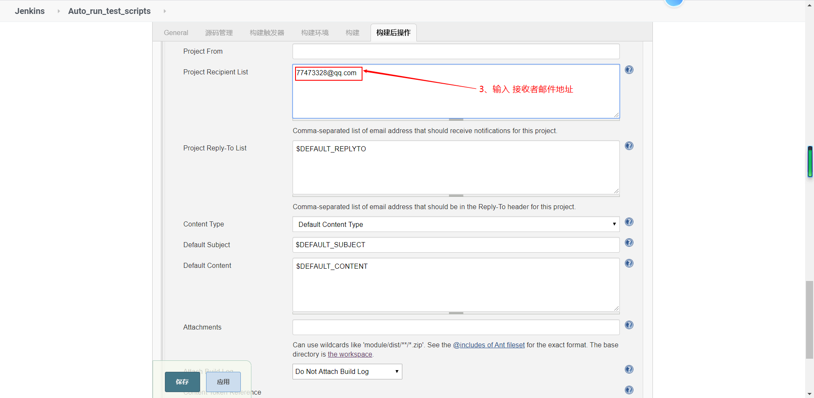

  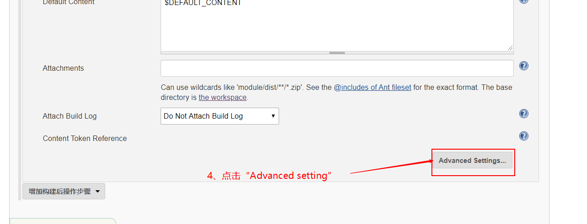

  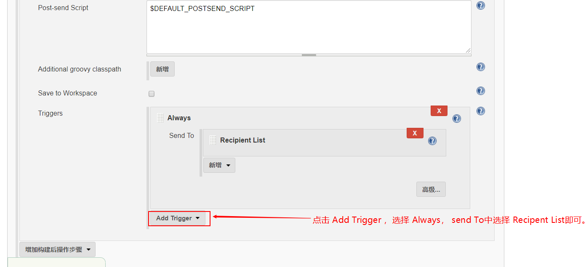

  * 最后点击应用并保存